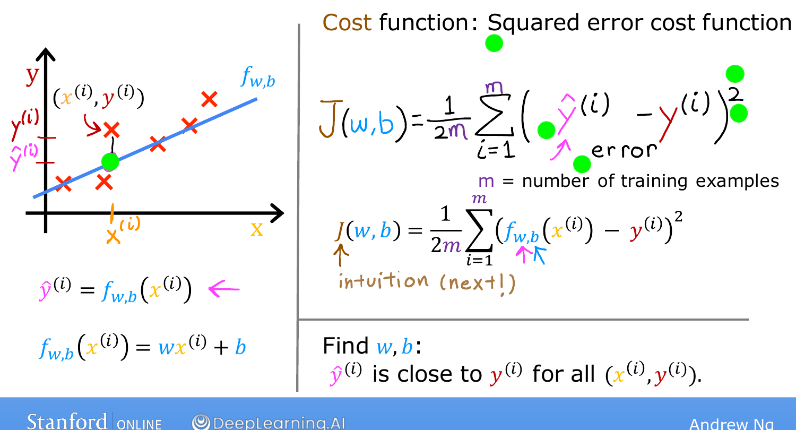
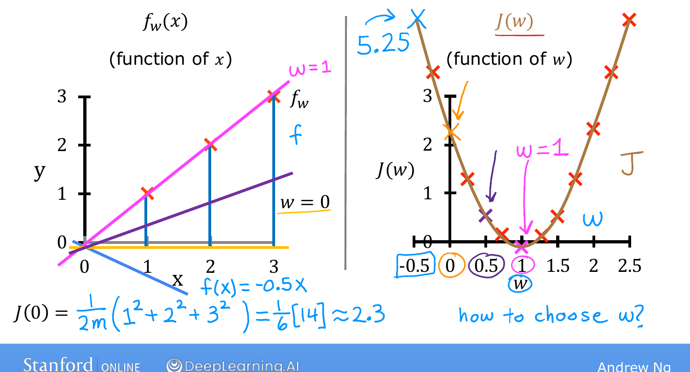
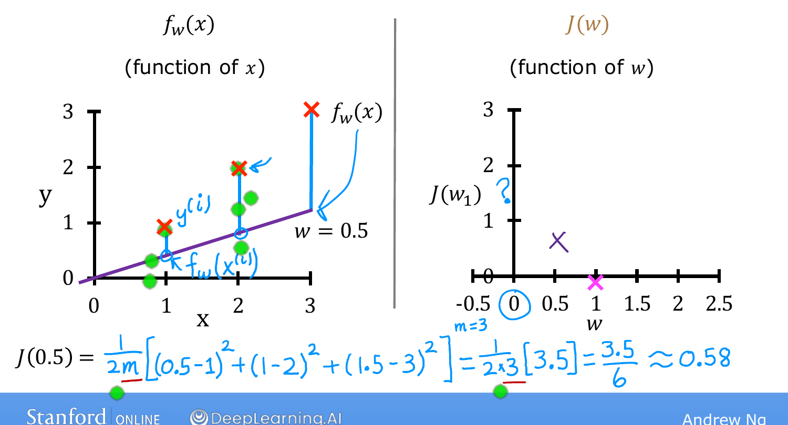

# Cost Function Intuition

> **Course 1 · Week 1** · _AI-generated study aid — not authoritative; trust the lecture & cited sources._

[← The Cost Function](../../course-1/week-1/cost-function.md){ .md-button }

[Visualizing the Cost Function →](../../course-1/week-1/visualizing-the-cost-function.md){ .md-button }

<iframe src="https://www.youtube-nocookie.com/embed/peNRqkfukYY" title="Lecture video" loading="lazy" allow="accelerometer; autoplay; clipboard-write; encrypted-media; gyroscope; picture-in-picture" allowfullscreen></iframe>

> 📄 **[Read the full lecture transcript](cost-function-intuition-transcript.md)**

We have the cost function's formula; now let's build intuition for what it's
actually *doing* by working through one example end to end. `[00:01]`

## The goal, restated `[00:22]`

You're fitting $f_{w,b}(x) = wx + b$, and different choices of $w, b$ give different
lines. The cost $J(w,b)$ measures the gap between the model's predictions and the
true $y$ values, and linear regression looks for the parameters that make it as
small as possible:

$$\min_{w,b} J(w,b).$$

## A simplified model: just $w$ `[01:37]`

To make $J$ easy to visualize, drop $b$ (set $b = 0$), so $f_w(x) = wx$ — a line
through the origin with one parameter. The cost becomes a function of $w$ alone,
$J(w)$, and the goal is simply to **find the $w$ that minimizes $J(w)$.** `[02:32]`

Use a tiny training set: the points $(1,1)$, $(2,2)$, $(3,3)$. Now watch $f_w$ (left)
and $J$ (right) together as $w$ changes — note the right-hand plot's axes are $w$
(horizontal) and $J$ (vertical), *not* $x$ and $y$. `[03:54]`

{ .slide }
_Andrew Ng's simplified one-parameter model slide (Stanford / DeepLearning.AI)._
{ .slide-cap }
## Computing the cost at a few values of $w$

- **$w = 1$.** The line passes exactly through all three points: for each, $f(x) =
  y$, so every error is $0$. Therefore $J(1) = 0$. `[06:45]`
- **$w = 0.5$.** Now the line under-predicts. The errors are the vertical gaps:
  $(0.5-1)$, $(1-2)$, $(1.5-3)$. Squaring and summing gives $3.5$, and
  $J(0.5) = \frac{1}{2 \cdot 3}(3.5) = \frac{3.5}{6} \approx 0.58$. `[10:05]`
- **$w = 0$.** The line is flat on the x-axis; errors are $1, 2, 3$, so
  $J(0) = \frac{1}{6}(1^2 + 2^2 + 3^2) = \frac{14}{6} \approx 2.33$. `[11:28]`
- **$w = -0.5$.** A downward line, even worse: $J(-0.5) \approx 5.25$. `[12:02]`

Each value of $w$ gives one line on the left and one point on the right. Trace out
enough of them and the right-hand plot fills in to a **U-shaped curve** — that's
$J(w)$. `[12:21]`

{ .slide }
_Andrew Ng's f-vs-J intuition slide (Stanford / DeepLearning.AI)._
{ .slide-cap }

{ .slide }
_Andrew Ng's the cost curve J(w) slide (Stanford / DeepLearning.AI)._
{ .slide-cap }
## Reading the picture `[13:49]`

How do you choose $w$? **Pick the $w$ that makes $J(w)$ smallest** — that's the line
whose squared errors are as small as possible. Here that's $w = 1$, which (no
surprise) is the line that passes right through the data. `[14:21]`

That's the whole idea of linear regression: vary the parameters, and when the line
passes close to the data the cost $J$ is small — so the goal is to find the $w$ (or,
in general, $w$ *and* $b$) giving the smallest possible $J$. `[15:18]`

Next we restore $b$ and visualize the *full* $J(w,b)$ — with some 3-D plots.
`[15:38]`

[← The Cost Function](../../course-1/week-1/cost-function.md){ .md-button }

[Visualizing the Cost Function →](../../course-1/week-1/visualizing-the-cost-function.md){ .md-button }

