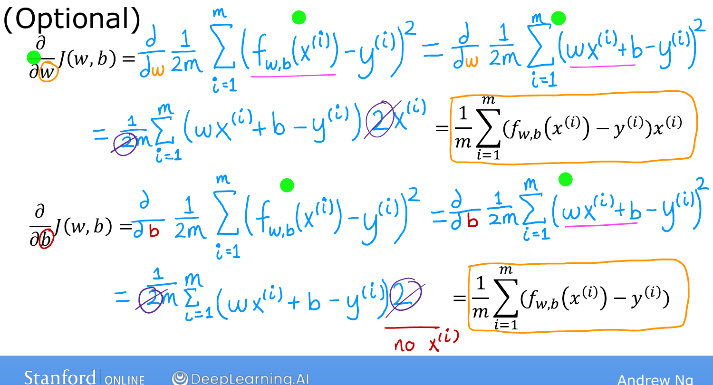
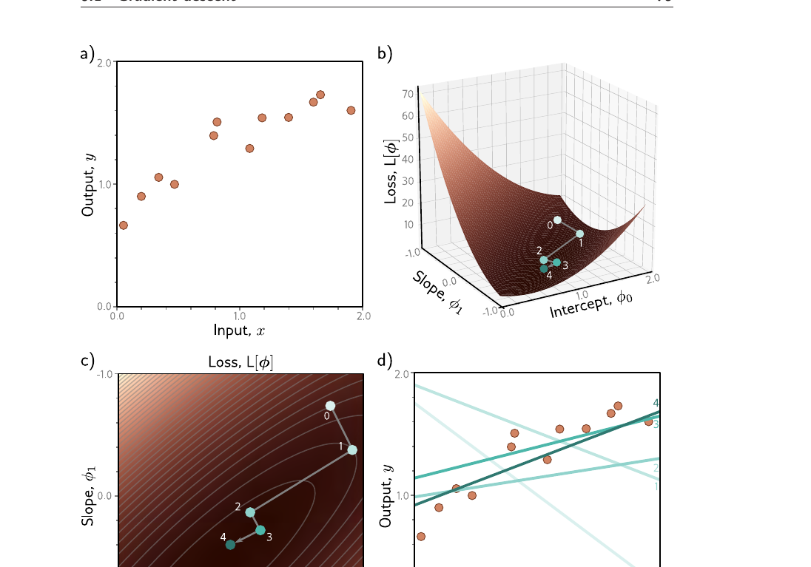
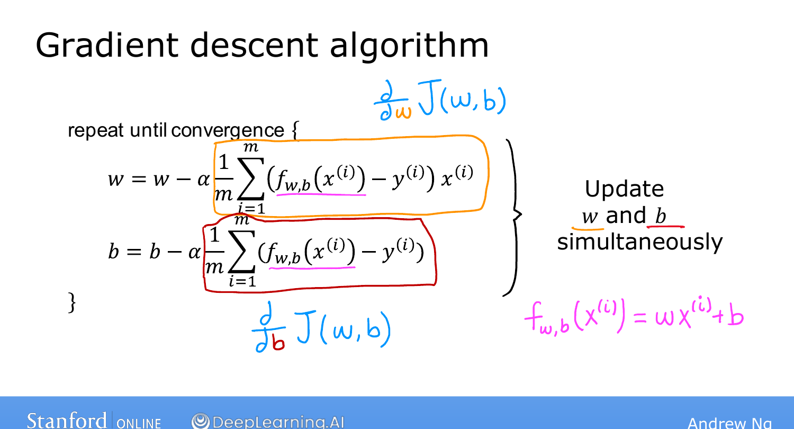
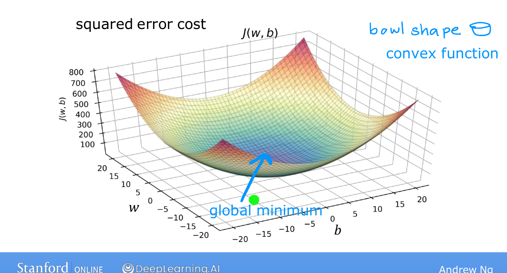

# Gradient Descent for Linear Regression

> **Course 1 · Week 1** · _AI-generated study aid — not authoritative; trust the lecture & cited sources._

[← Learning Rate](../../course-1/week-1/learning-rate.md){ .md-button }

[Running Gradient Descent →](../../course-1/week-1/running-gradient-descent.md){ .md-button }

<iframe src="https://www.youtube-nocookie.com/embed/RGL_XUjPkGo" title="Lecture video" loading="lazy" allow="accelerometer; autoplay; clipboard-write; encrypted-media; gyroscope; picture-in-picture" allowfullscreen></iframe>

> 📄 **[Read the full lecture transcript](gradient-descent-for-linear-regression-transcript.md)**

Now put the three pieces together — the linear model, the squared-error cost, and
gradient descent — to get your first complete learning algorithm. `[00:01]`

## The derivative terms `[00:27]`

Working out the derivatives of $J(w,b)$ for linear regression gives:

$$\frac{\partial}{\partial w} J(w,b) = \frac{1}{m} \sum_{i=1}^{m} \left( f_{w,b}(x^{(i)}) - y^{(i)} \right) x^{(i)},$$

$$\frac{\partial}{\partial b} J(w,b) = \frac{1}{m} \sum_{i=1}^{m} \left( f_{w,b}(x^{(i)}) - y^{(i)} \right).$$

The two are identical except the $\partial/\partial b$ version drops the trailing
$x^{(i)}$. (These come from calculus; you can take them as given — the course works
fine without the derivation.) `[01:15]`

This, by the way, is **why we defined the cost with the $\frac{1}{2m}$** earlier: the
$2$ from differentiating the square cancels the $\frac{1}{2}$, leaving these clean
expressions. `[03:22]`

{ .slide }
_Andrew Ng's the gradient terms slide (Stanford / DeepLearning.AI)._
{ .slide-cap }
## The algorithm `[04:07]`

Repeat until convergence, updating **simultaneously**:

$$w := w - \alpha \frac{1}{m} \sum_{i=1}^{m} \left( f_{w,b}(x^{(i)}) - y^{(i)} \right) x^{(i)}, \qquad
b := b - \alpha \frac{1}{m} \sum_{i=1}^{m} \left( f_{w,b}(x^{(i)}) - y^{(i)} \right),$$

with $f_{w,b}(x) = wx + b$. `[04:47]`

!!! abstract "Deeper — Prince, *Understanding Deep Learning*, Fig. 6.1"
    { .slide }

    Prince shows the whole process in one figure: the training set **(a)**, the
    bowl-shaped loss surface over the two parameters **(b)**, the **descent path**
    stepping down the loss contours toward the centre **(c)**, and the line it
    arrives at **(d)**. It's the same story as Ng's housing example, drawn as a
    trajectory across the cost surface.

{ .slide }
_Andrew Ng's gradient descent for linear regression slide (Stanford / DeepLearning.AI)._
{ .slide-cap }
## One global minimum `[04:54]`

Gradient descent can, in general, get stuck in a **local** minimum that isn't the
lowest point. But the squared-error cost for linear regression has a special shape:
it's **convex** — a single bowl — so it has **no local minima other than the one
global minimum**. As long as $\alpha$ is reasonable, gradient descent on a convex
cost **always converges to the global minimum.** `[06:09]`

You now know how to implement linear regression. The last topic of the week shows it
running. `[06:22]`

{ .slide }
_Andrew Ng's the convex cost bowl slide (Stanford / DeepLearning.AI)._
{ .slide-cap }

[← Learning Rate](../../course-1/week-1/learning-rate.md){ .md-button }

[Running Gradient Descent →](../../course-1/week-1/running-gradient-descent.md){ .md-button }

