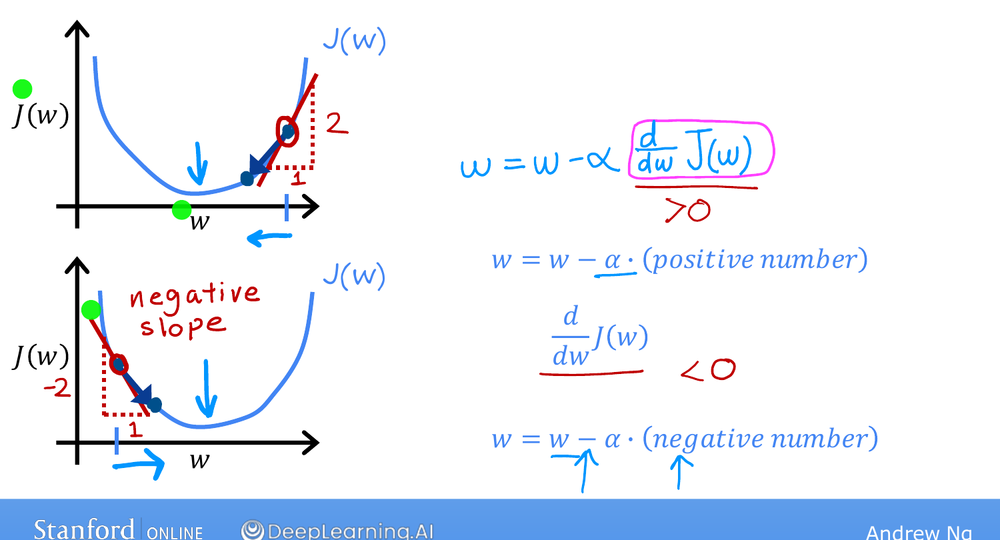
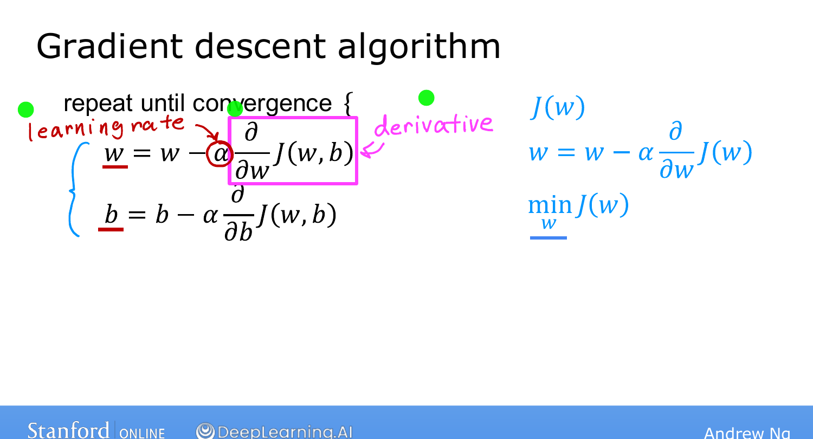

# Gradient Descent Intuition

> **Course 1 · Week 1** · _AI-generated study aid — not authoritative; trust the lecture & cited sources._

[← Implementing Gradient Descent](../../course-1/week-1/implementing-gradient-descent.md){ .md-button }

[Learning Rate →](../../course-1/week-1/learning-rate.md){ .md-button }

<iframe src="https://www.youtube-nocookie.com/embed/PKm61nrqpCA" title="Lecture video" loading="lazy" allow="accelerometer; autoplay; clipboard-write; encrypted-media; gyroscope; picture-in-picture" allowfullscreen></iframe>

> 📄 **[Read the full lecture transcript](gradient-descent-intuition-transcript.md)**

Why does the update $w := w - \alpha \frac{\partial}{\partial w} J(w,b)$ actually move
you toward the minimum? The key is what that **derivative term** is doing. (Strictly
it's a *partial* derivative, but we'll just call it a derivative — the distinction
doesn't matter for implementing the algorithm.) `[00:02]`

## A one-parameter picture `[01:16]`

Simplify to a cost $J(w)$ of a single number $w$, so the update is
$w := w - \alpha \frac{d}{dw} J(w)$ and we can plot $J$ against $w$ in 2-D — $w$
horizontal, $J(w)$ vertical. `[02:13]`

The derivative at a point is the **slope of the tangent line** there — the straight
line that just touches the curve. Draw a little triangle; slope = height ÷ width.
`[03:05]`

{ .slide }
_Andrew Ng's derivative-intuition slide (Stanford / DeepLearning.AI)._
{ .slide-cap }

{ .slide }
_Andrew Ng's the update rule slide (Stanford / DeepLearning.AI)._
{ .slide-cap }
## Case 1: starting on the right (positive slope) `[02:51]`

If the tangent points **up to the right**, the slope — and so the derivative — is a
**positive** number. The update is $w - \alpha \times (\text{positive})$, and since
$\alpha > 0$ always, $w$ gets **smaller**: you move **left** on the graph. That's
exactly right — moving left here decreases $J$ and heads toward the minimum. `[04:20]`

## Case 2: starting on the left (negative slope) `[04:25]`

Now the tangent slopes **down to the right**, so the derivative is **negative**. The
update subtracts a negative number — which is the same as *adding* a positive number
— so $w$ gets **bigger**: you move **right**, again toward the minimum and lower $J$.
`[06:03]`

Either way, the sign of the derivative automatically pushes $w$ in the direction that
decreases the cost. `[06:24]`

That's the derivative's role. The other key quantity is the learning rate $\alpha$ —
what happens when it's too small or too big — which is next. `[06:38]`

[← Implementing Gradient Descent](../../course-1/week-1/implementing-gradient-descent.md){ .md-button }

[Learning Rate →](../../course-1/week-1/learning-rate.md){ .md-button }

