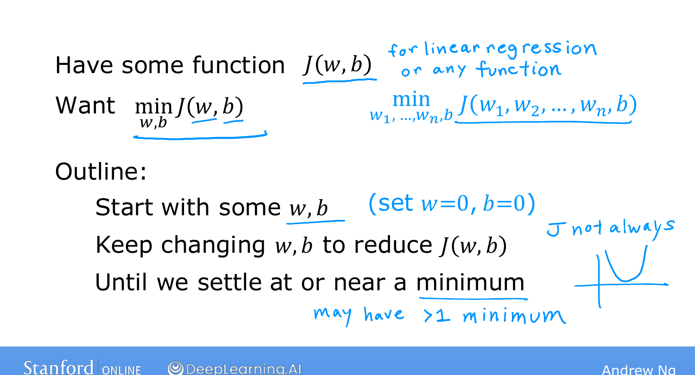
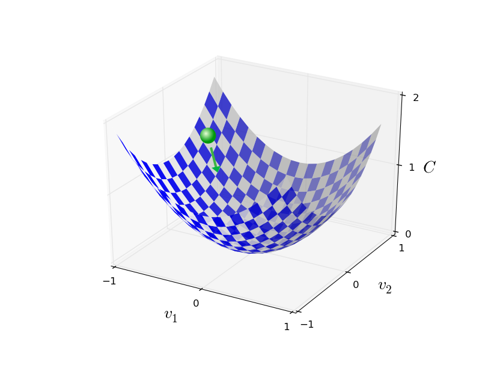
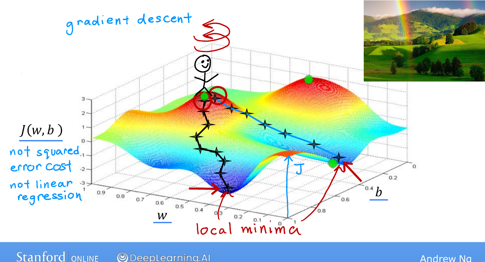

# Gradient Descent

> **Course 1 · Week 1** · _AI-generated study aid — not authoritative; trust the lecture & cited sources._

[← Visualization Examples](../../course-1/week-1/visualization-examples.md){ .md-button }

[Implementing Gradient Descent →](../../course-1/week-1/implementing-gradient-descent.md){ .md-button }

<iframe src="https://www.youtube-nocookie.com/embed/WtlvKq_zxPI" title="Lecture video" loading="lazy" allow="accelerometer; autoplay; clipboard-write; encrypted-media; gyroscope; picture-in-picture" allowfullscreen></iframe>

> 📄 **[Read the full lecture transcript](gradient-descent-transcript.md)**

We want a *systematic* way to find the $w, b$ that minimize $J(w,b)$, instead of
eyeballing a contour plot. The algorithm is **gradient descent**, and it's used
everywhere in machine learning — from linear regression to training the largest deep
neural networks. `[00:01]`

## It minimizes (almost) any function `[01:22]`

Gradient descent isn't special to the squared-error cost. Given any cost
$J(w_1, w_2, \dots, w_n, b)$, the goal is the same: pick parameters that make $J$ as
small as possible. The recipe:

1. **Start with initial guesses** for the parameters. For linear regression the
   starting point barely matters, so a common choice is $w = 0,\ b = 0$. `[02:21]`
2. **Repeatedly take a small step** that reduces $J$, nudging $w$ and $b$ each time,
   until $J$ settles at or near a minimum. `[02:47]`

{ .slide }
_Andrew Ng's the gradient-descent outline slide (Stanford / DeepLearning.AI)._
{ .slide-cap }
## The hill-walking picture `[03:13]`

Picture the surface $J(w,b)$ as a **hilly park** — high points are hills, low points
are valleys — and imagine you're standing somewhere on it, wanting to reach a valley
as efficiently as possible. At each step you spin 360°, ask *"which single baby step
takes me downhill fastest?"*, and step in that **direction of steepest descent**.
Repeat, and you walk down into a valley — a **local minimum**. `[06:00]`

!!! note "Deeper — Nielsen, *Neural Networks and Deep Learning*, Ch. 1"
    { .slide }

    Michael Nielsen frames the same idea as a ball rolling down the cost surface:
    each step moves it in the direction that decreases the cost most, until it
    reaches the bottom of a valley. The squared-error cost for linear regression is
    a single smooth bowl, so there's only one valley to reach.

## Local minima `[06:09]`

For a bowl-shaped (convex) cost there's just one minimum. But for surfaces with
several valleys — like the cost of a neural network — **where you start decides which
valley you land in.** Start at one point and you descend into the left valley; start
a couple of steps to the right and you descend into a *different* valley. These
bottoms are called **local minima**, and gradient descent stays in whichever basin
it began in. `[07:17]`

{ .slide }
_Andrew Ng's local minima slide (Stanford / DeepLearning.AI)._
{ .slide-cap }

Next: the actual mathematical update that makes each downhill step happen. `[07:47]`

[← Visualization Examples](../../course-1/week-1/visualization-examples.md){ .md-button }

[Implementing Gradient Descent →](../../course-1/week-1/implementing-gradient-descent.md){ .md-button }

