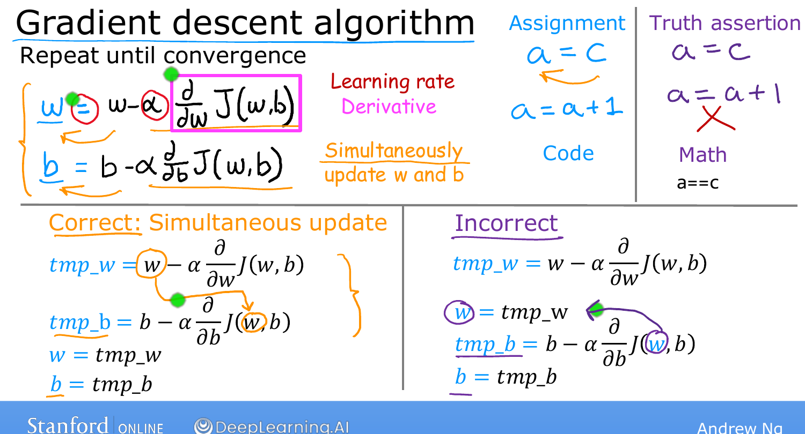

# Implementing Gradient Descent

> **Course 1 · Week 1** · _AI-generated study aid — not authoritative; trust the lecture & cited sources._

<div class="ep-nav" markdown>

[← Gradient Descent](../../course-1/week-1/gradient-descent.md){ .md-button }

[Gradient Descent Intuition →](../../course-1/week-1/gradient-descent-intuition.md){ .md-button }

</div>

<div class="video-wrap"><iframe src="https://www.youtube-nocookie.com/embed/w_2vCijLiiM" title="Lecture video" loading="lazy" allow="accelerometer; autoplay; clipboard-write; encrypted-media; gyroscope; picture-in-picture" allowfullscreen></iframe></div>

> 📄 **[Read the full lecture transcript](implementing-gradient-descent-transcript.md)**

Here is the gradient descent update for one parameter:

$$w := w - \alpha \frac{\partial}{\partial w} J(w,b).$$

It says: take the current $w$, and adjust it by a small amount — $\alpha$ times a
derivative term. Let's unpack every piece. `[00:13]`

## $:=$ is assignment, not equality `[00:57]`

That $:=$ is an **assignment operator** — "compute the right-hand side and store it
in $w$." In code, `a = a + 1` is perfectly sensible (increment $a$). That's different
from a **truth assertion** in maths, where $a = a + 1$ could never be true. Many
languages use `==` to *test* equality; here, read $:=$ as "becomes." `[02:22]`

## $\alpha$ — the learning rate `[02:39]`

$\alpha$ (Greek "alpha") is the **learning rate**, usually a small positive number
like $0.01$. It controls **how big a step** you take downhill: a large $\alpha$ means
aggressive, big steps; a small $\alpha$ means tiny baby steps. (How to choose it well
comes later.) `[03:05]`

## The derivative term `[03:26]`

$\frac{\partial}{\partial w} J(w,b)$ is the **derivative** of the cost. For now, think
of it as telling you *which direction* to step (and, together with $\alpha$, *how
far*). Derivatives come from calculus — but **you won't need calculus** for this
course; you'll get all the intuition you need. `[04:02]`

## Both parameters `[04:16]`

$b$ has its own, very similar update:

$$b := b - \alpha \frac{\partial}{\partial b} J(w,b).$$

You **repeat both updates until convergence** — the point where $w$ and $b$ stop
changing much with each step. `[04:50]`

## The one subtlety: simultaneous update `[05:16]`

Both parameters must be updated **simultaneously**. The correct implementation
computes both right-hand sides *first*, into temporaries, then assigns:

```text
tmp_w = w - α * dJ_dw(w, b)
tmp_b = b - α * dJ_db(w, b)
w = tmp_w
b = tmp_b
```

The pre-update $w$ is what feeds the derivative for $b$. An **incorrect** version
assigns the new $w$ *before* computing $b$'s derivative — so the already-updated $w$
leaks into $b$'s step, giving a subtly different algorithm. It might even "work" more
or less, but it isn't gradient descent. When people say gradient descent, they
**always** mean the simultaneous update — use it. `[09:00]`

{ .slide }
_Andrew Ng's gradient-descent-algorithm slide (Stanford / DeepLearning.AI)._
{ .slide-cap }

Next we look more closely at that derivative term — and what it's doing. `[09:13]`


<div class="ep-nav" markdown>

[← Gradient Descent](../../course-1/week-1/gradient-descent.md){ .md-button }

[Gradient Descent Intuition →](../../course-1/week-1/gradient-descent-intuition.md){ .md-button }

</div>
