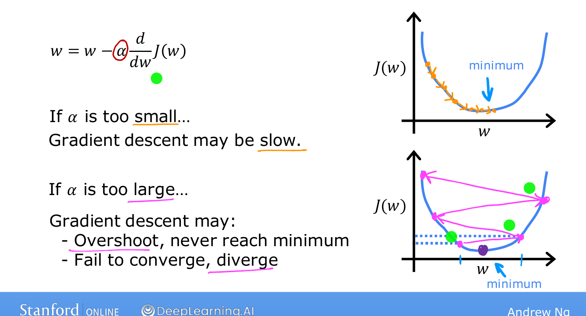
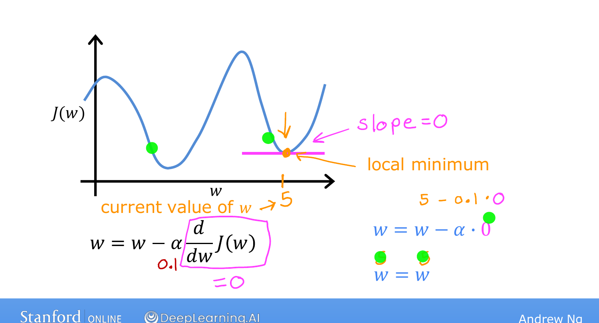
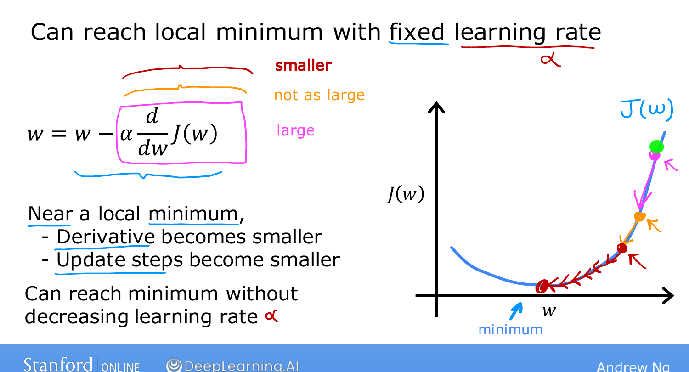

# Learning Rate

> **Course 1 · Week 1** · _AI-generated study aid — not authoritative; trust the lecture & cited sources._

[← Gradient Descent Intuition](../../course-1/week-1/gradient-descent-intuition.md){ .md-button }

[Gradient Descent for Linear Regression →](../../course-1/week-1/gradient-descent-for-linear-regression.md){ .md-button }

<iframe src="https://www.youtube-nocookie.com/embed/k0h8emRAAHE" title="Lecture video" loading="lazy" allow="accelerometer; autoplay; clipboard-write; encrypted-media; gyroscope; picture-in-picture" allowfullscreen></iframe>

> 📄 **[Read the full lecture transcript](learning-rate-transcript.md)**

The learning rate $\alpha$ has a huge impact on gradient descent — choose it badly
and the algorithm may be painfully slow, or may not work at all. `[00:01]`

## Too small `[00:46]`

If $\alpha$ is tiny (say $0.00001$), you multiply the derivative by a minuscule
number and take a **very small baby step**. Then another tiny step, and another.
Gradient descent *does* still decrease $J$ and reach the minimum — but **incredibly
slowly**, needing a great many steps. `[02:04]`

## Too large `[02:23]`

If $\alpha$ is too big, a single step can **overshoot** the minimum entirely and land
somewhere with *higher* cost. The next step overshoots again, even further out, and
you get **further and further from the minimum** — gradient descent may **fail to
converge, and even diverge.** `[04:09]`

{ .slide }
_Andrew Ng's learning-rate slide (Stanford / DeepLearning.AI)._
{ .slide-cap }

## What happens exactly at a minimum? `[04:33]`

Suppose $w$ already sits at a local minimum. The tangent there is **flat**, so its
slope — the derivative — is **$0$**. The update becomes
$w := w - \alpha \cdot 0 = w$: gradient descent leaves $w$ **unchanged**. That's
exactly what you want — it keeps the solution put at the minimum. `[06:06]`

{ .slide }
_Andrew Ng's behaviour at a minimum slide (Stanford / DeepLearning.AI)._
{ .slide-cap }
## Why a fixed $\alpha$ still converges `[06:46]`

Here's the elegant part: even with $\alpha$ held **constant**, the steps shrink
automatically as you approach a minimum. Far away the slope is steep, so the
derivative is large and the step is big; as you near the minimum the curve flattens,
the derivative gets smaller, and so the steps get smaller on their own — until you
settle right at the minimum. **No need to decrease $\alpha$ by hand.** `[08:13]`

So that's gradient descent, usable on *any* cost function. Next we plug in linear
regression's squared-error cost specifically — giving you your first complete
learning algorithm. `[08:41]`

{ .slide }
_Andrew Ng's why a fixed rate converges slide (Stanford / DeepLearning.AI)._
{ .slide-cap }

[← Gradient Descent Intuition](../../course-1/week-1/gradient-descent-intuition.md){ .md-button }

[Gradient Descent for Linear Regression →](../../course-1/week-1/gradient-descent-for-linear-regression.md){ .md-button }

