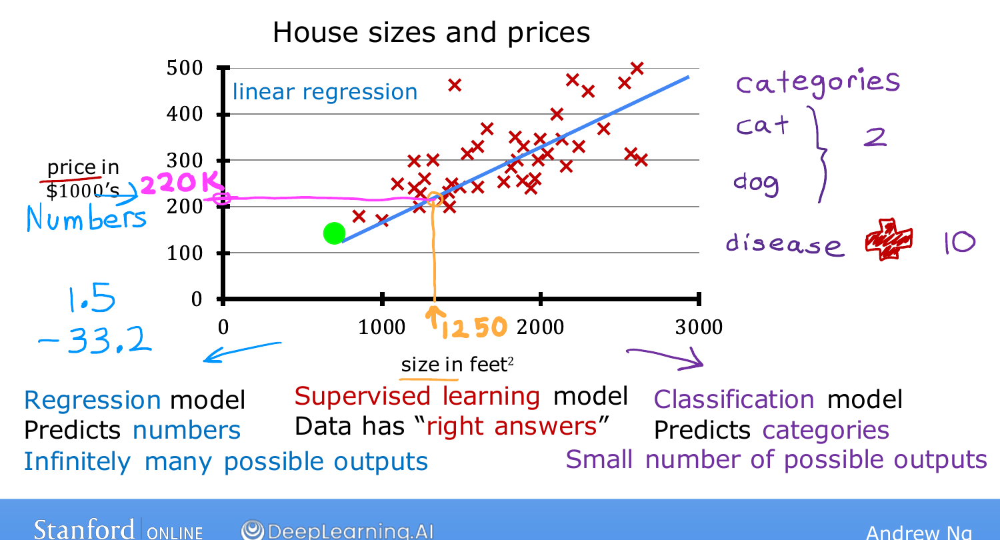
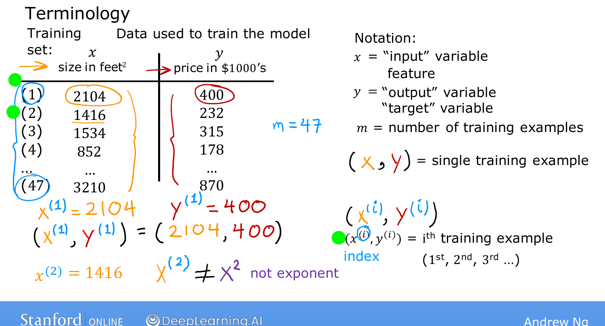

# Linear Regression Model, Part 1

> **Course 1 · Week 1** · _AI-generated study aid — not authoritative; trust the lecture & cited sources._

[← Jupyter Notebooks](../../course-1/week-1/jupyter-notebooks.md){ .md-button }

[Linear Regression Model, Part 2 →](../../course-1/week-1/linear-regression-model-part-2.md){ .md-button }

<iframe src="https://www.youtube-nocookie.com/embed/dLc-lfEEYss" title="Lecture video" loading="lazy" allow="accelerometer; autoplay; clipboard-write; encrypted-media; gyroscope; picture-in-picture" allowfullscreen></iframe>

> 📄 **[Read the full lecture transcript](linear-regression-model-part-1-transcript.md)**

The first model of the course is **linear regression** — fitting a straight line to
your data. It's probably the most widely used learning algorithm in the world, and
many concepts you meet here carry over to the more advanced models later. `[00:01]`

## The problem `[00:33]`

Predict the **price of a house from its size**, using a dataset of house sizes and
prices from **Portland**. Plot size (sq ft) on the horizontal axis and price
(\$1000s) on the vertical axis; each cross is a house that sold. As a real-estate
agent helping a client sell her **1,250 sq ft** house, you can fit a straight line
and read off the prediction where size 1,250 meets the line — about **\$220,000**.
`[02:09]`

This is a **supervised learning** model: you trained it on examples that include the
right answers (the price for every house). And because it predicts a **number**, it
is a **regression** model — as opposed to a **classification** model, which predicts
a small, discrete set of categories (cat vs dog, or which of 10 diseases). Linear
regression is one specific regression model; you'll meet others in Course 2.
`[03:48]`

{ .slide }
_Andrew Ng's house-price regression slide (Stanford / DeepLearning.AI)._
{ .slide-cap }
## Notation you'll use everywhere `[05:49]`

Two views of the same data: the **plot** on the left and a **data table** on the
right, whose two columns (size, price) are exactly the two axes. With 47 rows there
are 47 crosses — e.g. the first row, a 2,104 sq ft house that sold for \$400k, is one
point. `[05:22]`

The standard machine-learning notation — worth getting comfortable with, as it's
near-universal across AI:

- $x$ = the **input variable**, also called a **feature** (here, house size). For
  the first house, $x = 2104$.
- $y$ = the **output / target variable** you're predicting (here, price). For the
  first house, $y = 400$.
- $m$ = the **number of training examples** (here, $m = 47$).
- $(x, y)$ = a single training example.
- $(x^{(i)}, y^{(i)})$ = the **$i$-th** training example (the $i$-th row of the
  table). So $x^{(1)} = 2104$, $y^{(1)} = 400$.

{ .slide }
_Andrew Ng's training-set / notation slide (Stanford / DeepLearning.AI)._
{ .slide-cap }

⚠️ The superscript $(i)$ is an **index, not an exponent** — $x^{(2)}$ means the
second training example, *not* $x$ squared. `[09:59]`

The dataset used to train the model is called the **training set** (your client's
house isn't in it — it hasn't sold). Next we feed this training set to a learning
algorithm and see what it produces. `[10:13]`

[← Jupyter Notebooks](../../course-1/week-1/jupyter-notebooks.md){ .md-button }

[Linear Regression Model, Part 2 →](../../course-1/week-1/linear-regression-model-part-2.md){ .md-button }

