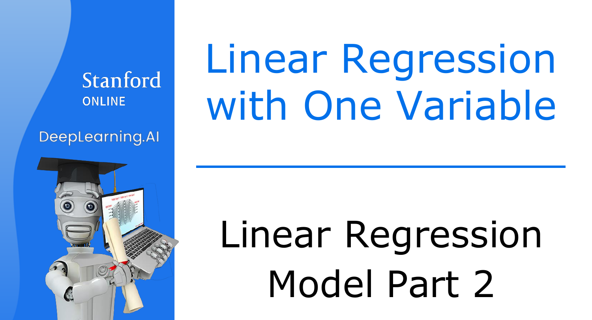
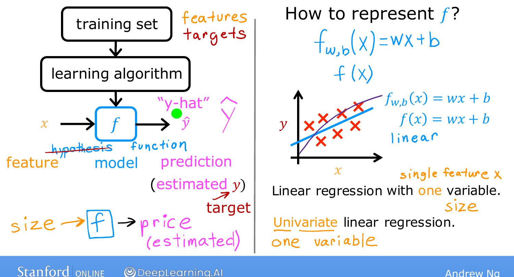

# Linear Regression Model, Part 2

> **Course 1 · Week 1** · _AI-generated study aid — not authoritative; trust the lecture & cited sources._

[← Linear Regression Model, Part 1](../../course-1/week-1/linear-regression-model-part-1.md){ .md-button }

[The Cost Function →](../../course-1/week-1/cost-function.md){ .md-button }

<iframe src="https://www.youtube-nocookie.com/embed/KWULpBYzIYk" title="Lecture video" loading="lazy" allow="accelerometer; autoplay; clipboard-write; encrypted-media; gyroscope; picture-in-picture" allowfullscreen></iframe>

> 📄 **[Read the full lecture transcript](linear-regression-model-part-2-transcript.md)**

How does supervised learning actually *work*? You feed a training set to a learning
algorithm, and it produces a **function**. `[00:01]`

## The model is a function $f$ `[00:39]`

The learning algorithm takes the training set — both input features and output
targets (the right answers to learn from) — and outputs a function $f$. (Historically
$f$ was called a *hypothesis*; here we just call it the **model**.) `[00:50]`

Its job: take a new input $x$ and output a **prediction**, written $\hat{y}$
("y-hat"). The distinction matters:

- $y$ = the **target** — the actual true value in the training set.
- $\hat{y} = f(x)$ = the model's **estimate** of $y$, which may or may not be
  correct. (When helping your client, the *true* sale price is unknown until the
  house sells; $\hat{y}$ is the model's best guess.) `[02:02]`

{ .slide }
_Andrew Ng's representing the model f slide (Stanford / DeepLearning.AI)._
{ .slide-cap }
## What is $f$? `[02:23]`

Designing the algorithm means choosing how to represent $f$ — the formula it
computes. Sticking with a straight line:

$$f_{w,b}(x) = w x + b.$$

$w$ and $b$ are numbers; the values chosen for them determine the prediction
$\hat{y}$ from the input $x$. You'll often see this written more simply as $f(x)$,
dropping the $w,b$ subscript — it means the same thing. `[03:23]`

{ .slide }
_Andrew Ng's linear-model slide (Stanford / DeepLearning.AI)._
{ .slide-cap }

## Why a straight line — and its name `[04:24]`

Why a **linear** function (a fancy term for a straight line) rather than a curve?
Sometimes you *do* want to fit nonlinear curves, but a line is simple and easy to
work with, and serves as the foundation for the more complex models later. `[04:57]`

This model has a name: **linear regression with one variable** — "one variable"
meaning a single input feature $x$ (house size). Another name is **univariate linear
regression** (*uni* = one, *variate* = variable). Later you'll see versions that
predict from several features (bedrooms, and more). `[05:31]`

To make linear regression work, the key next step is to construct a **cost
function** — one of the most universal and important ideas in all of machine
learning. `[06:20]`

[← Linear Regression Model, Part 1](../../course-1/week-1/linear-regression-model-part-1.md){ .md-button }

[The Cost Function →](../../course-1/week-1/cost-function.md){ .md-button }

