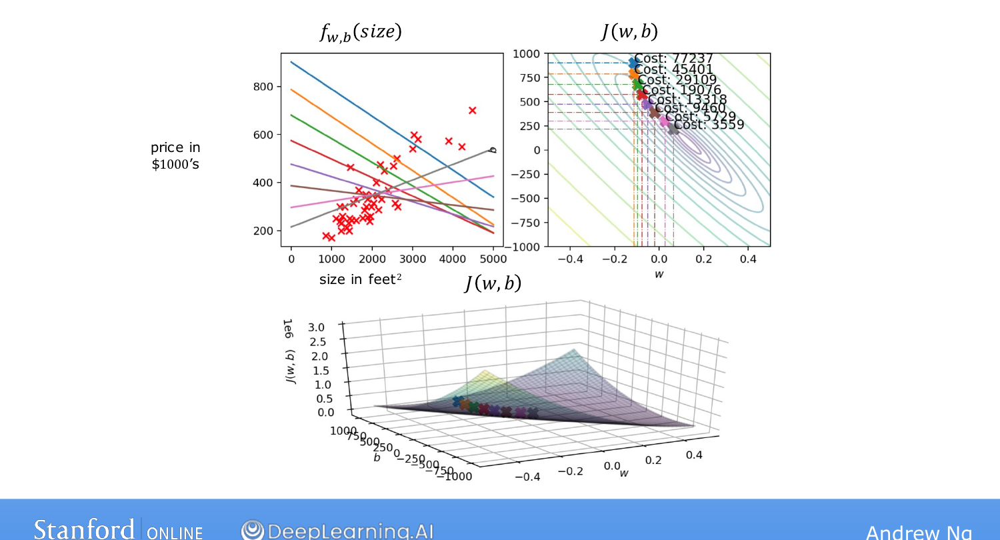
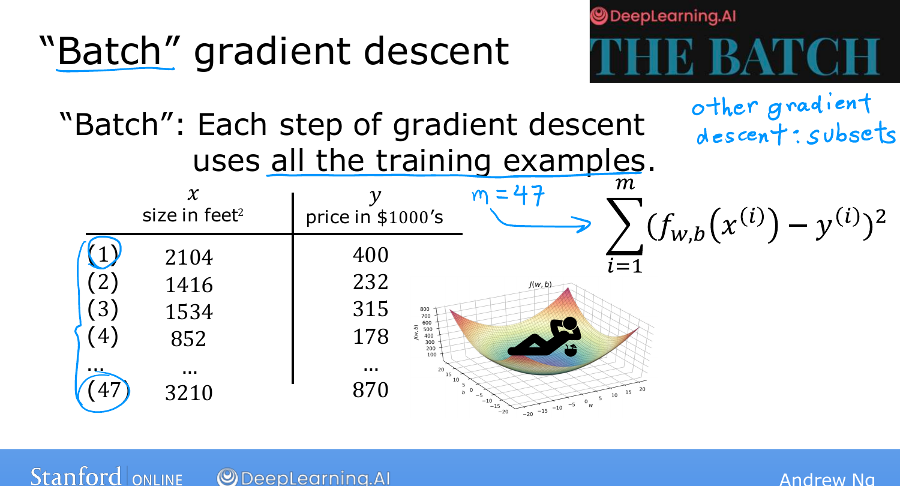

# Running Gradient Descent

> **Course 1 · Week 1** · _AI-generated study aid — not authoritative; trust the lecture & cited sources._

[← Gradient Descent for Linear Regression](../../course-1/week-1/gradient-descent-for-linear-regression.md){ .md-button }

[Multiple Features →](../../course-1/week-2/multiple-features.md){ .md-button }

<iframe src="https://www.youtube-nocookie.com/embed/tHDDbqYfflM" title="Lecture video" loading="lazy" allow="accelerometer; autoplay; clipboard-write; encrypted-media; gyroscope; picture-in-picture" allowfullscreen></iframe>

> 📄 **[Read the full lecture transcript](running-gradient-descent-transcript.md)**

Let's watch gradient descent actually fit the line. `[00:01]`

## The algorithm in action `[00:08]`

Three views side by side: the model and data (upper left), the cost contour (upper
right), and the cost surface (bottom). Initialize — for this demo — at $w = -0.1,\
b = 900$, i.e. $f(x) = -0.1x + 900$, a poor fit. `[00:32]`

Take one gradient-descent step and the cost point slides **down and to the right** on
the contour, and the line on the left shifts to fit a little better. Step again — cost
drops further, line improves again. The parameters trace a **trajectory** inward, the
fit getting better and better, until they reach the **global minimum**, where the
line is a good fit to the data. `[01:35]`

{ .slide }
_Andrew Ng's gradient-descent-in-action slide (Stanford / DeepLearning.AI)._
{ .slide-cap }

With the fitted model you can now predict: a friend's **1,250 sq ft** house might sell
for about **\$250,000**. `[02:14]`

## "Batch" gradient descent `[02:22]`

The precise name for what we did is **batch gradient descent** — at *every* step it
looks at **all $m$ training examples** (that's the $\sum_{i=1}^{m}$ in the
derivatives), the whole "batch," rather than a subset. There are other variants that
use only small subsets per step, but for linear regression we use batch. (DeepLearning.AI's
newsletter *The Batch* is named after this idea.) `[03:18]`

{ .slide }
_Andrew Ng's batch gradient descent slide (Stanford / DeepLearning.AI)._
{ .slide-cap }
## Week 1 done `[03:34]`

That's your **first machine-learning model** — linear regression with one variable,
trained by gradient descent. Next week makes linear regression far more powerful:
**many features** instead of one, **non-linear curves**, and practical tips for
getting it to work on real applications. `[05:19]`

[← Gradient Descent for Linear Regression](../../course-1/week-1/gradient-descent-for-linear-regression.md){ .md-button }

[Multiple Features →](../../course-1/week-2/multiple-features.md){ .md-button }

