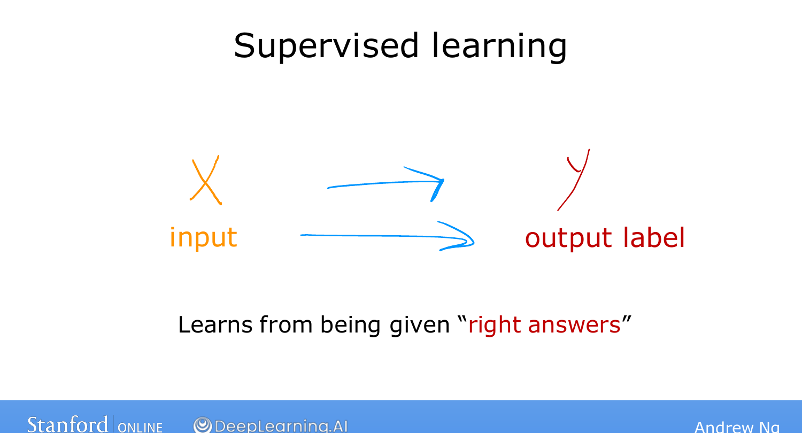
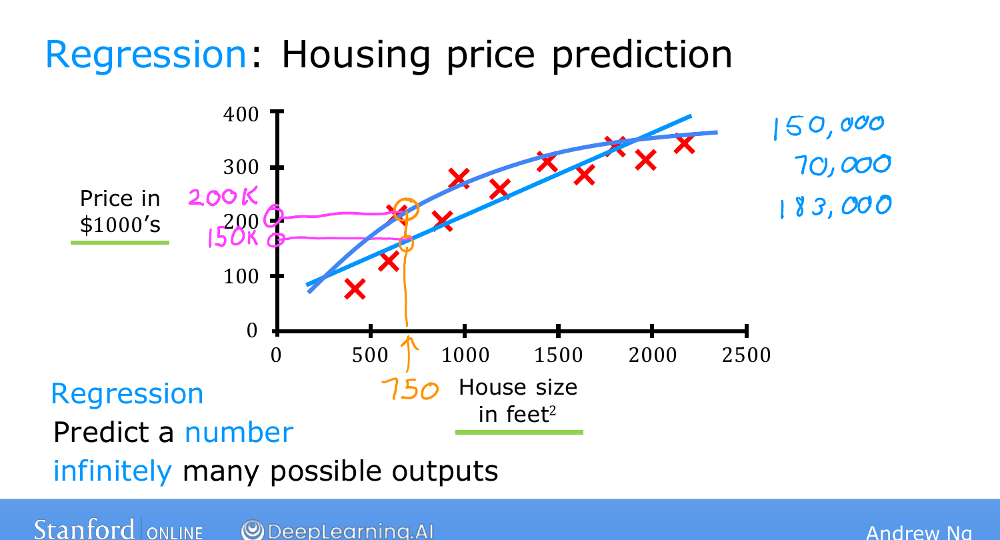
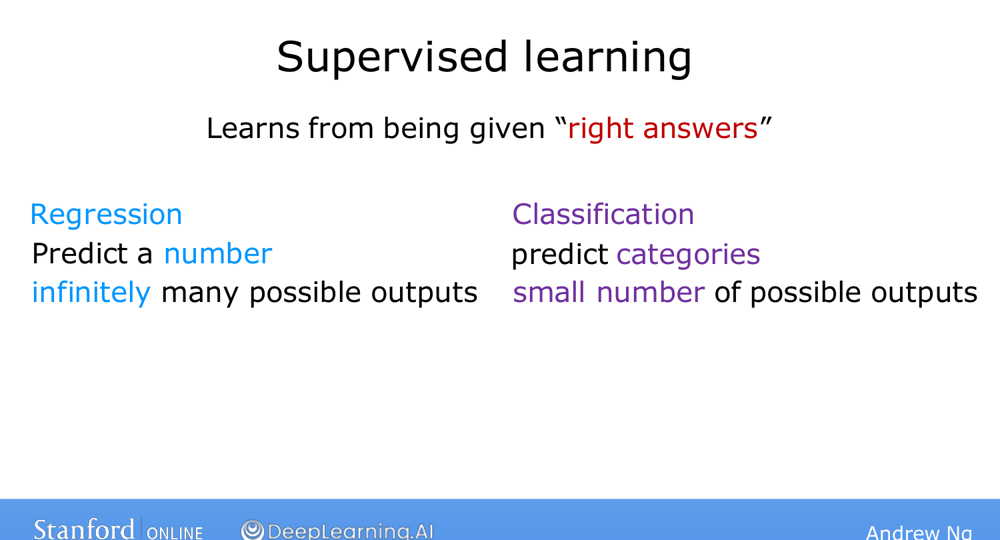

# Supervised Learning, Part 1

> **Course 1 · Week 1** · _AI-generated study aid — not authoritative; trust the lecture & cited sources._

[← What is Machine Learning?](../../course-1/week-1/what-is-machine-learning.md){ .md-button }

[Supervised Learning, Part 2 →](../../course-1/week-1/supervised-learning-part-2.md){ .md-button }

<iframe src="https://www.youtube-nocookie.com/embed/sca5rQ9x1cA" title="Lecture video" loading="lazy" allow="accelerometer; autoplay; clipboard-write; encrypted-media; gyroscope; picture-in-picture" allowfullscreen></iframe>

> 📄 **[Read the full lecture transcript](supervised-learning-part-1-transcript.md)**

By Ng's estimate, about **99% of the economic value** created by machine learning
today comes from a single type: **supervised learning**. So it's worth understanding
it precisely. `[00:01]`

## The core idea: learn an input → output mapping `[00:17]`

Supervised learning refers to algorithms that learn an **$X \to Y$ (input to
output) mapping**. Its defining feature: you train the algorithm on examples that
include the **right answers** — the correct label $Y$ for each input $X$. By seeing
enough correct $(X, Y)$ pairs, the algorithm learns to take a *new* input $X$ on its
own and produce a reasonably accurate prediction of $Y$. `[00:45]`

That single pattern covers a remarkable range of applications: `[01:02]`

| Input $X$ | Output $Y$ | Application |
|---|---|---|
| email | spam / not spam | spam filtering |
| audio clip | text transcript | speech recognition |
| English text | another language | machine translation |
| ad + user info | will click? | online advertising |
| image + sensor data | positions of other cars | self-driving |
| photo of a product | defect? | visual inspection |

In every case you first **train** the model on inputs $X$ with their right answers
$Y$; once trained, it takes a brand-new $X$ it has never seen and produces the
corresponding $Y$. `[03:34]`

{ .slide }
_Andrew Ng's input→output mapping slide (Stanford / DeepLearning.AI)._
{ .slide-cap }
## A worked example: housing prices `[03:40]`

Say you want to predict **housing prices** from house size. You plot your data —
size in square feet on the horizontal axis, price in thousands of dollars on the
vertical axis — and a friend asks what their **750 sq ft** house might sell for.

One thing the algorithm could do is **fit a straight line** to the data; reading off
that line gives roughly **\$150,000**. But a straight line isn't the only option — it
might fit a **curve** instead, which here would predict closer to **\$200,000**. A
key skill you'll build later is how to **systematically** decide whether a line, a
curve, or something more complex is the right fit — *not* simply picking whichever
gives the nicest answer. `[05:08]`

{ .slide }
_Andrew Ng's housing-price regression slide (Stanford / DeepLearning.AI)._
{ .slide-cap }

## Why this is "supervised," and what "regression" means `[05:38]`

This is supervised learning because every example came with the **right answer** —
the correct price $Y$ for each house — and the algorithm's job is to produce more of
those right answers for new houses.

This particular flavour is called **regression**: predicting a **number from
infinitely many possible numbers** (a price could be \$150,000, \$70,000, \$183,000,
or anything in between). `[06:21]`

Regression is one of the two major kinds of supervised learning. The other —
predicting *categories* — is **classification**, next. `[06:45]`

{ .slide }
_Andrew Ng's regression vs. classification slide (Stanford / DeepLearning.AI)._
{ .slide-cap }

[← What is Machine Learning?](../../course-1/week-1/what-is-machine-learning.md){ .md-button }

[Supervised Learning, Part 2 →](../../course-1/week-1/supervised-learning-part-2.md){ .md-button }

