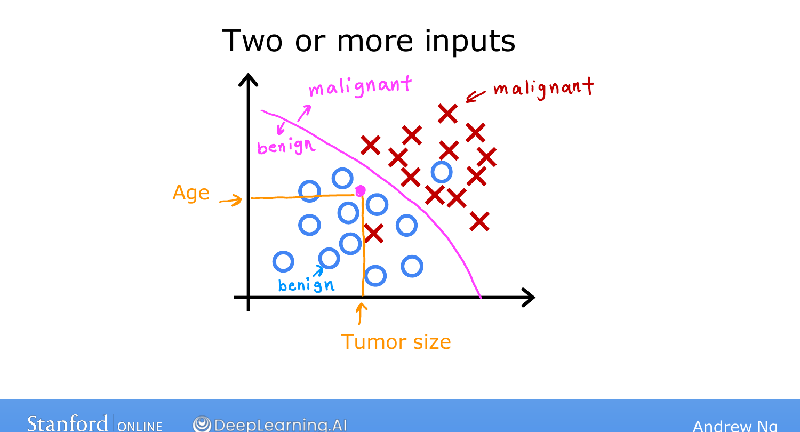

# Supervised Learning, Part 2

> **Course 1 · Week 1** · _AI-generated study aid — not authoritative; trust the lecture & cited sources._

[← Supervised Learning, Part 1](../../course-1/week-1/supervised-learning-part-1.md){ .md-button }

[Unsupervised Learning, Part 1 →](../../course-1/week-1/unsupervised-learning-part-1.md){ .md-button }

<iframe src="https://www.youtube-nocookie.com/embed/hh6gE0LxfO8" title="Lecture video" loading="lazy" allow="accelerometer; autoplay; clipboard-write; encrypted-media; gyroscope; picture-in-picture" allowfullscreen></iframe>

> 📄 **[Read the full lecture transcript](supervised-learning-part-2-transcript.md)**

Supervised learning still means learning an $X \to Y$ mapping from the right
answers. Part 1 covered **regression** — predicting a number from infinitely many.
The second major type is **classification**, where the algorithm predicts a
**category** instead. `[00:08]`

## A worked example: breast-cancer detection `[00:27]`

Imagine building a diagnostic tool that helps doctors detect breast cancer — early
detection can save lives. From a patient's records, the system tries to decide
whether a tumour (a lump) is **malignant** (cancerous, dangerous) or **benign** (not
cancerous). Label the two: **benign = 0**, **malignant = 1**.

Plot tumour size on the horizontal axis and that 0/1 label on the vertical axis.
What makes this *not* regression: we're predicting only a **small, finite set of
possible outputs** — here just two — rather than any number along a continuum.
That's the essence of classification. `[01:47]`

## Categories, in general `[03:04]`

- Classification can have **more than two** categories. If a malignant tumour might
  be one of two cancer types, the algorithm now has three possible outputs. (The
  terms **class** and **category** are used interchangeably.)
- Categories **don't have to be numbers** — a classifier might output "cat" vs
  "dog." When they *are* numbers (0, 1, 2), the distinguishing feature from
  regression is still that classification predicts a **small finite set**, never the
  in-between values like 0.5 or 1.7. `[04:19]`

## More than one input `[04:37]`

Real problems rarely have a single input. Add the patient's **age** alongside
**tumour size**, and each example is now a point in a 2-D plot — circles (O) for
benign, crosses (×) for malignant. Given a new patient, the learning algorithm finds
a **boundary** that separates the malignant points from the benign ones, and which
side of that boundary the new point falls on guides the diagnosis. `[05:32]`

{ .slide }
_Andrew Ng's classification slide (Stanford / DeepLearning.AI)._
{ .slide-cap }

Real breast-cancer systems use **many** more inputs than two — clump thickness,
uniformity of cell size, uniformity of cell shape, and so on. `[05:57]`

{ .slide }
_Andrew Ng's two-input classification slide (Stanford / DeepLearning.AI)._
{ .slide-cap }
## Recap `[06:28]`

Supervised learning maps input $X$ to output $Y$, learning from the right answers.
Its two major types:

- **Regression** — predict a number from infinitely many (e.g. house prices).
- **Classification** — predict a category from a small finite set (e.g.
  benign/malignant).

Next we turn to a different kind of learning entirely — **unsupervised learning**,
where the data has no labels. `[07:06]`

[← Supervised Learning, Part 1](../../course-1/week-1/supervised-learning-part-1.md){ .md-button }

[Unsupervised Learning, Part 1 →](../../course-1/week-1/unsupervised-learning-part-1.md){ .md-button }

