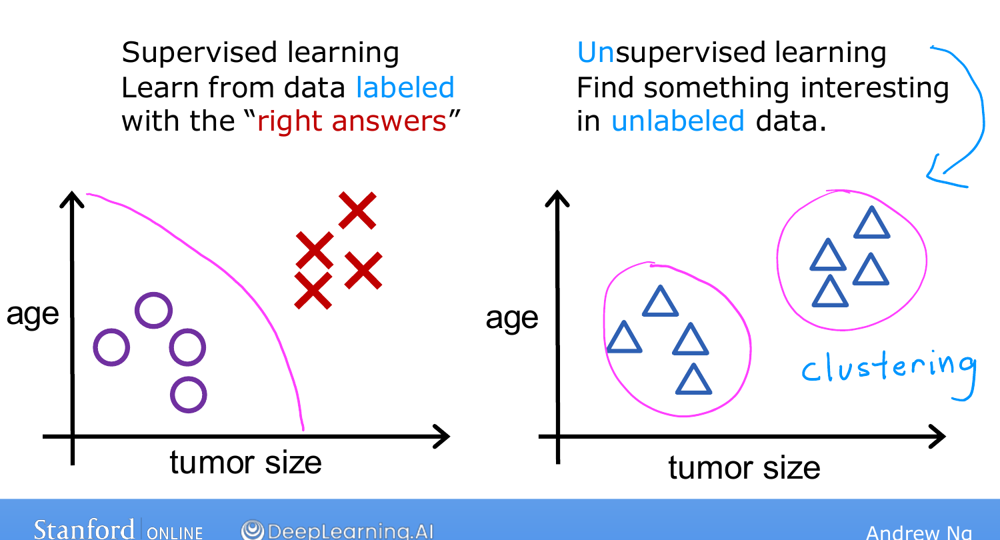
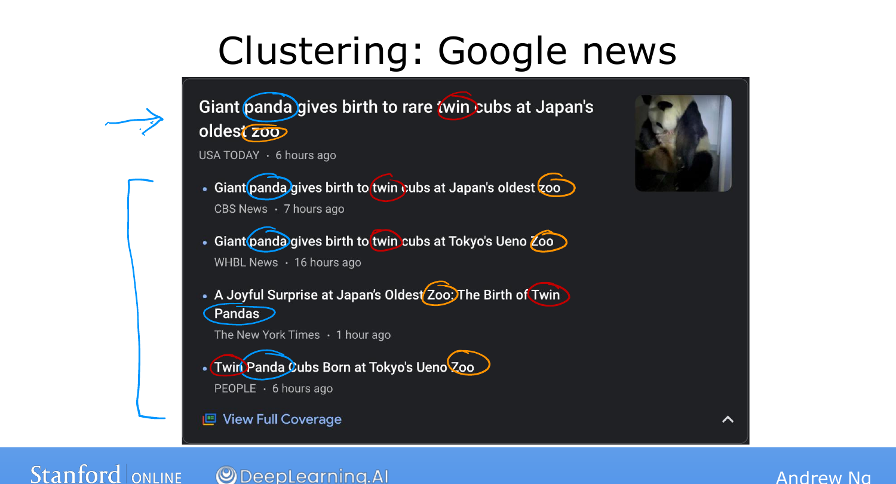

# Unsupervised Learning, Part 1

> **Course 1 · Week 1** · _AI-generated study aid — not authoritative; trust the lecture & cited sources._

[← Supervised Learning, Part 2](../../course-1/week-1/supervised-learning-part-2.md){ .md-button }

[Unsupervised Learning, Part 2 →](../../course-1/week-1/unsupervised-learning-part-2.md){ .md-button }

<iframe src="https://www.youtube-nocookie.com/embed/gG_wI_uGfIE" title="Lecture video" loading="lazy" allow="accelerometer; autoplay; clipboard-write; encrypted-media; gyroscope; picture-in-picture" allowfullscreen></iframe>

> 📄 **[Read the full lecture transcript](unsupervised-learning-part-1-transcript.md)**

After supervised learning, the most widely used form of machine learning is
**unsupervised learning** — and despite the name, Ng insists it's "just as super."
`[00:02]`

## What makes it "unsupervised" `[00:41]`

In supervised learning every example came with an output label $Y$ (benign or
malignant, the O's and ×'s). In **unsupervised learning the data has inputs $X$ but
no output labels $Y$.** Given, say, patients' tumour size and age but *no*
diagnosis, we're not asked to predict a label — instead the algorithm's job is to
**find some structure, pattern, or something interesting** in the data, entirely on
its own. We call it unsupervised because we never hand it the "right answers."
`[01:23]`

{ .slide }
_Andrew Ng's what unsupervised learning is slide (Stanford / DeepLearning.AI)._
{ .slide-cap }
## Clustering `[01:40]`

One major kind of unsupervised learning is **clustering**: the algorithm decides on
its own that the data falls into groups. With the unlabelled tumour data, it might
discover two clusters. Three real examples make it concrete:

- **Google News.** Every day it scans hundreds of thousands of articles and groups
  related stories. A cluster around "Giant panda gives birth to rare twin cubs"
  forms because the algorithm notices the words *panda*, *twin*, and *zoo* recurring
  across articles — **nobody at Google tells it to look for those words.** The news
  changes daily and at this scale no human could curate it, so the algorithm must
  find the clusters by itself. `[02:16]`
- **DNA microarrays.** Each column is one person's genetic activity, each row a
  gene (eye colour, height — researchers have even linked genes to disliking
  broccoli). Running clustering groups individuals into types of people, **without
  anyone defining the types in advance.** `[04:23]`
- **Market segmentation.** Companies group customers automatically. DeepLearning.AI
  ran this on its own community and found distinct motivations — growing skills,
  developing a career, staying updated on how AI affects one's field — discovered,
  not pre-specified. `[06:39]`

So a clustering algorithm **takes unlabelled data and automatically groups it into
clusters.** Clustering is only one type of unsupervised learning — the next topic
covers the others. `[08:21]`

{ .slide }
_Andrew Ng's clustering (Google News) slide (Stanford / DeepLearning.AI)._
{ .slide-cap }

[← Supervised Learning, Part 2](../../course-1/week-1/supervised-learning-part-2.md){ .md-button }

[Unsupervised Learning, Part 2 →](../../course-1/week-1/unsupervised-learning-part-2.md){ .md-button }

