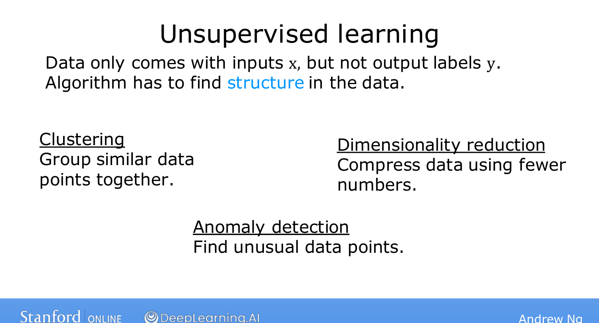
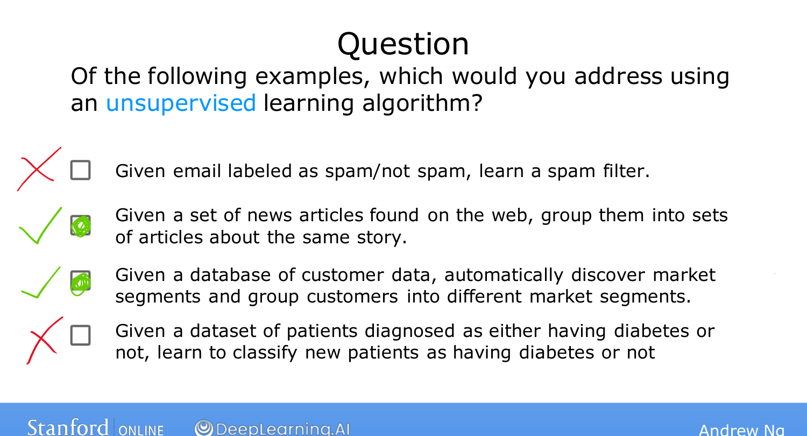

# Unsupervised Learning, Part 2

> **Course 1 · Week 1** · _AI-generated study aid — not authoritative; trust the lecture & cited sources._

[← Unsupervised Learning, Part 1](../../course-1/week-1/unsupervised-learning-part-1.md){ .md-button }

[Jupyter Notebooks →](../../course-1/week-1/jupyter-notebooks.md){ .md-button }

<iframe src="https://www.youtube-nocookie.com/embed/_0bhZBqtCCs" title="Lecture video" loading="lazy" allow="accelerometer; autoplay; clipboard-write; encrypted-media; gyroscope; picture-in-picture" allowfullscreen></iframe>

> 📄 **[Read the full lecture transcript](unsupervised-learning-part-2-transcript.md)**

A slightly more formal definition, and the other kinds of unsupervised learning
beyond clustering. `[00:01]`

## The definition `[00:17]`

- **Supervised:** the data comes with both inputs $X$ **and** output labels $Y$.
- **Unsupervised:** the data comes with inputs $X$ **only** — no labels — and the
  algorithm must find structure, a pattern, or something interesting in it. `[00:30]`

## Three kinds you'll meet `[00:46]`

This specialization covers clustering plus two more:

- **Clustering** — group similar data points together (the previous topic).
- **Anomaly detection** — find **unusual events**. Crucial for *fraud detection* in
  finance, where an unusual transaction can signal fraud. `[00:53]`
- **Dimensionality reduction** — take a big dataset and "almost magically" compress
  it to a much smaller one while **losing as little information as possible.**
  `[01:13]`

(If the latter two don't fully land yet, that's fine — they're covered in depth
later in the specialization.) `[01:27]`

{ .slide }
_Andrew Ng's kinds of unsupervised learning slide (Stanford / DeepLearning.AI)._
{ .slide-cap }
## A quick gut-check `[01:43]`

Ng poses four scenarios; two are supervised, two unsupervised:

| Problem | Type | Why |
|---|---|---|
| Spam filtering (emails labelled spam / not-spam) | **Supervised** | labelled data → learn $X\to Y$ |
| Grouping related news stories | **Unsupervised** | clustering, no labels |
| Market segmentation | **Unsupervised** | discover segments automatically |
| Diagnosing diabetes (diabetes / not) | **Supervised** | just like benign/malignant — labelled |

The tell: if the examples carry the *right answer*, it's supervised; if you're
asking the algorithm to find structure unaided, it's unsupervised. `[03:11]`

{ .slide }
_Andrew Ng's unsupervised gut-check slide (Stanford / DeepLearning.AI)._
{ .slide-cap }

Next, Ng introduces a tool you'll use throughout — the Jupyter notebook. `[03:28]`

[← Unsupervised Learning, Part 1](../../course-1/week-1/unsupervised-learning-part-1.md){ .md-button }

[Jupyter Notebooks →](../../course-1/week-1/jupyter-notebooks.md){ .md-button }

