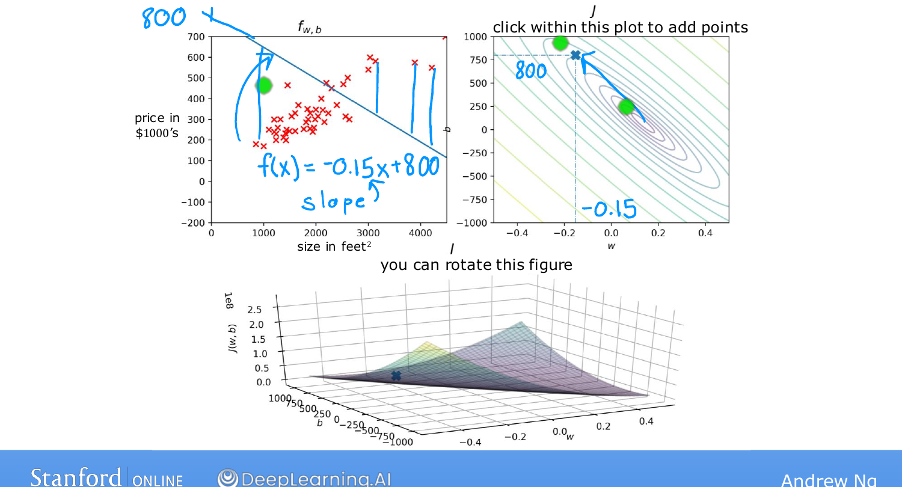

# Visualization Examples

> **Course 1 · Week 1** · _AI-generated study aid — not authoritative; trust the lecture & cited sources._

[← Visualizing the Cost Function](../../course-1/week-1/visualizing-the-cost-function.md){ .md-button }

[Gradient Descent →](../../course-1/week-1/gradient-descent.md){ .md-button }

<iframe src="https://www.youtube-nocookie.com/embed/L5INhX5cbWU" title="Lecture video" loading="lazy" allow="accelerometer; autoplay; clipboard-write; encrypted-media; gyroscope; picture-in-picture" allowfullscreen></iframe>

> 📄 **[Read the full lecture transcript](visualization-examples-transcript.md)**

A few concrete $(w, b)$ choices, each shown as a line $f(x)$ on the left and a single
point on the cost contour on the right — to cement how the two views connect.
`[00:03]`

{ .slide }
_Andrew Ng's linking the line and the cost contour slide (Stanford / DeepLearning.AI)._
{ .slide-cap }

- **$w \approx -0.15,\ b \approx 800$.** A downward-sloping line crossing the axis at
  800 — a poor fit whose predictions sit far from the data. Its cost point lands
  **far from the minimum**, high up the bowl. `[00:30]`
- **$w = 0,\ b \approx 360$.** A flat line ($f(x) = 0\cdot x + 360$). Still bad, but
  its cost point is a bit closer in. `[01:57]`
- **Another choice** — further from the minimum again (the minimum being the centre
  of the smallest ellipse). `[02:18]`
- **A good fit.** Here the line passes nicely through the data, and its cost point
  sits **very close to the centre** of the smallest ellipse — near the minimum
  possible sum of squared errors. `[02:56]`

The pattern to internalize: **better-fitting lines correspond to cost points closer
to the minimum of $J(w,b)$.** `[03:45]`

The optional lab lets you click anywhere on an interactive contour plot to see the
corresponding line and a dot on the 3-D surface, and spin the surface around.
`[04:01]`

But reading a contour by eye to pick the best $w, b$ isn't a real procedure — and it
won't scale at all to more complex models. What we want is an **efficient algorithm**
that finds the parameters minimizing $J$ automatically. That algorithm is **gradient
descent** — one of the most important algorithms in all of machine learning, next.
`[05:07]`

[← Visualizing the Cost Function](../../course-1/week-1/visualizing-the-cost-function.md){ .md-button }

[Gradient Descent →](../../course-1/week-1/gradient-descent.md){ .md-button }

