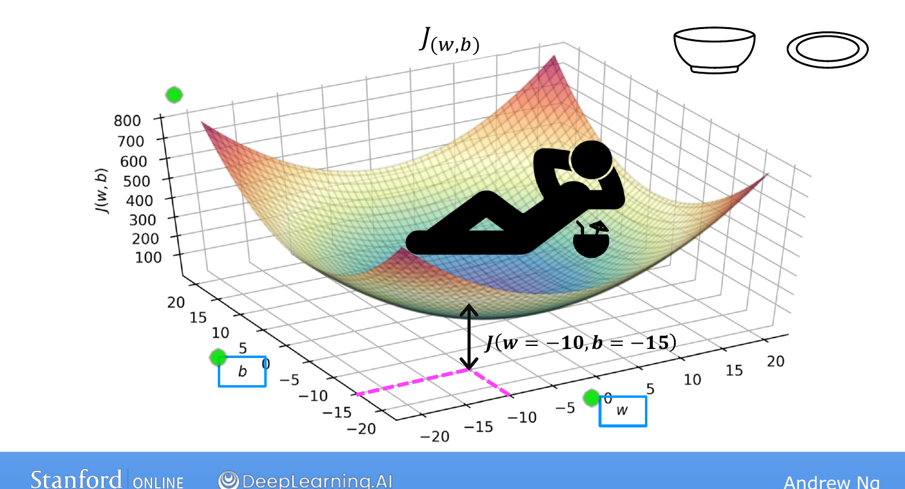
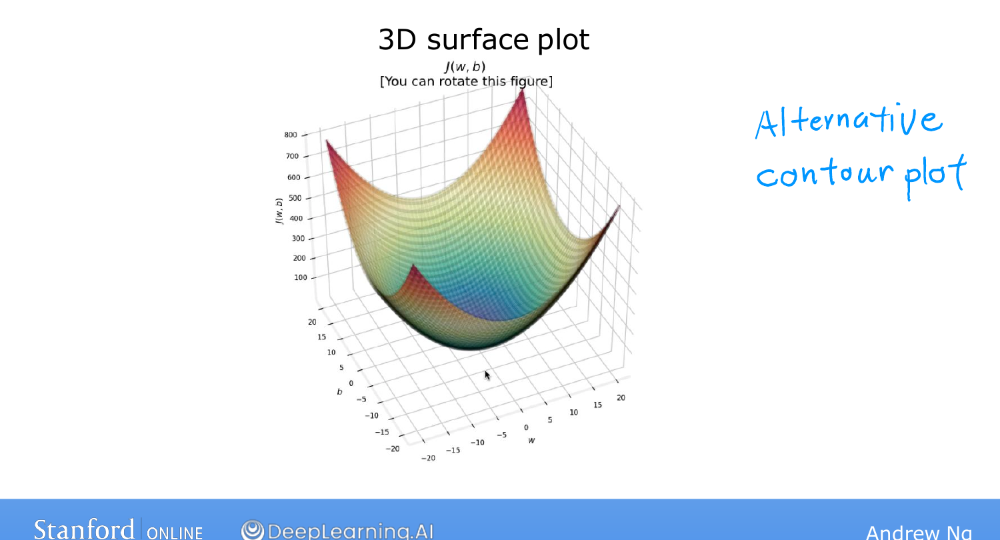

# Visualizing the Cost Function

> **Course 1 · Week 1** · _AI-generated study aid — not authoritative; trust the lecture & cited sources._

[← Cost Function Intuition](../../course-1/week-1/cost-function-intuition.md){ .md-button }

[Visualization Examples →](../../course-1/week-1/visualization-examples.md){ .md-button }

<iframe src="https://www.youtube-nocookie.com/embed/bFNz2u0hl9E" title="Lecture video" loading="lazy" allow="accelerometer; autoplay; clipboard-write; encrypted-media; gyroscope; picture-in-picture" allowfullscreen></iframe>

> 📄 **[Read the full lecture transcript](visualizing-the-cost-function-transcript.md)**

The previous topic visualized $J$ with $b$ temporarily set to $0$. Now restore both
parameters and build a richer picture of $J(w,b)$. `[00:01]`

## From a curve to a surface `[00:42]`

With the full model $f_{w,b}(x) = wx + b$ on the housing data, pick a poor fit — say
$w = 0.06,\ b = 50$, a line that consistently underestimates prices — and ask what
$J(w,b)$ looks like. `[01:28]`

With one parameter, $J(w)$ was a **U-shaped curve** ("a soup bowl"). With two
parameters it becomes that same bowl shape, but in **three dimensions**: a 3-D
surface whose two floor axes are $w$ and $b$, and whose height above any point is the
cost $J(w,b)$ for that choice. Any single point on the surface is one particular
$(w,b)$; e.g. above $w=-10,\ b=-15$ the surface height is $J(-10,-15)$. `[03:34]`

{ .slide }
_Andrew Ng's the 3-D cost surface slide (Stanford / DeepLearning.AI)._
{ .slide-cap }
## Contour plots: the bowl seen from above `[03:57]`

Staring at a 3-D bowl is awkward, so there's a flatter way to see the *same*
function $J$: a **contour plot**. Think of a topographic map of a mountain — like one
of **Mount Fuji** seen from directly overhead. Each contour line connects points at
the **same height**. `[04:42]`

Do the same to the cost surface: slice it horizontally and each slice projects down
to an **ellipse** (oval). Every point on one ellipse has the **same value of $J$**,
even though $w$ and $b$ differ. `[06:15]` So three points on the same oval correspond
to three *different* lines $f$ — all equally (and, in that example, equally badly)
fitting the data. `[06:53]`

{ .slide }
_Andrew Ng's surface + contour slide (Stanford / DeepLearning.AI)._
{ .slide-cap }

The key landmark: the **minimum of $J$** sits at the **centre of the concentric
ovals** — the bottom of the bowl. Picture the bowl growing straight up out of your
screen lying flat on a desk; the smallest oval is directly below the lowest point.
`[07:50]`

So a contour plot is a convenient way to see the 3-D cost function in just 2-D — and
it's the view we'll use next to see how specific choices of $w$ and $b$ map to the
straight line they produce. `[08:14]`

[← Cost Function Intuition](../../course-1/week-1/cost-function-intuition.md){ .md-button }

[Visualization Examples →](../../course-1/week-1/visualization-examples.md){ .md-button }

