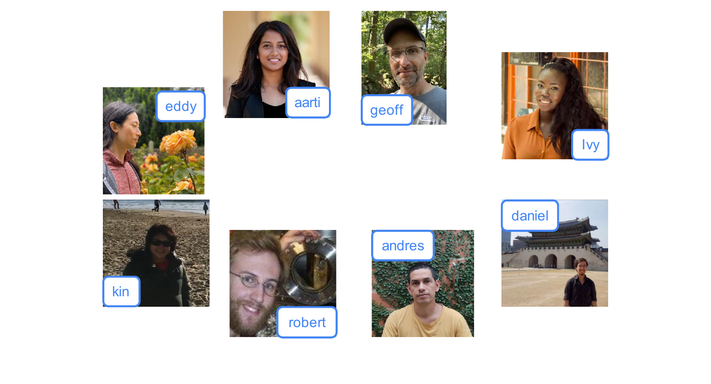

# Welcome to Machine Learning

> **Course 1 · Week 1** · _AI-generated study aid — not authoritative; trust the lecture & cited sources._

[Applications of Machine Learning →](../../course-1/week-1/applications-of-machine-learning.md){ .md-button }

<iframe src="https://www.youtube-nocookie.com/embed/vStJoetOxJg" title="Lecture video" loading="lazy" allow="accelerometer; autoplay; clipboard-write; encrypted-media; gyroscope; picture-in-picture" allowfullscreen></iframe>

> 📄 **[Read the full lecture transcript](welcome-to-machine-learning-transcript.md)**

You almost certainly use machine learning many times a day without noticing it.
`[00:08]`

- **Web search.** Ask "how do I make a sushi roll?" on Google, Bing, or Baidu and
  it works because ML software has learned how to rank web pages. `[00:12]`
- **Photo tagging.** Instagram and Snapchat recognize your friends in your
  pictures and label them. `[00:27]`
- **Recommendations.** Finish a Star Wars movie on a streaming service and it
  suggests similar films you might like. `[00:42]`
- **Speech.** Voice-to-text, "Hey Siri, play a song," "OK Google, show me Indian
  restaurants near me" — all ML. `[00:56]`
- **Spam filtering.** "Congratulations, you've won a million dollars" gets flagged
  for you. `[01:12]`

It reaches well beyond consumer apps. Ng points to ML already optimizing **wind
turbine** power generation, helping doctors make **accurate diagnoses** in
hospitals, and running **computer-vision inspection** on factory lines to catch
defects coming off the assembly line. `[01:28]`

{ .slide }
_Andrew Ng's everyday ML applications slide (Stanford / DeepLearning.AI)._
{ .slide-cap }

A working definition to carry forward: machine learning is **the science of getting
computers to learn without being explicitly programmed.** `[02:11]` In this course you
don't just learn about it — you implement it in code yourself. (The earlier version
of this course is the one that led to the founding of Coursera.) `[02:23]`

Let's get started. `[02:40]`

[Applications of Machine Learning →](../../course-1/week-1/applications-of-machine-learning.md){ .md-button }

