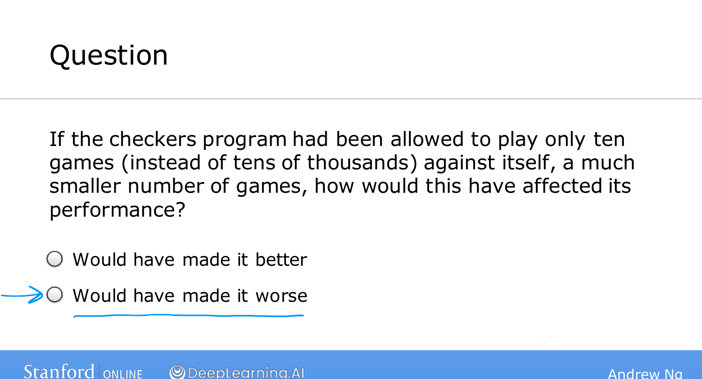
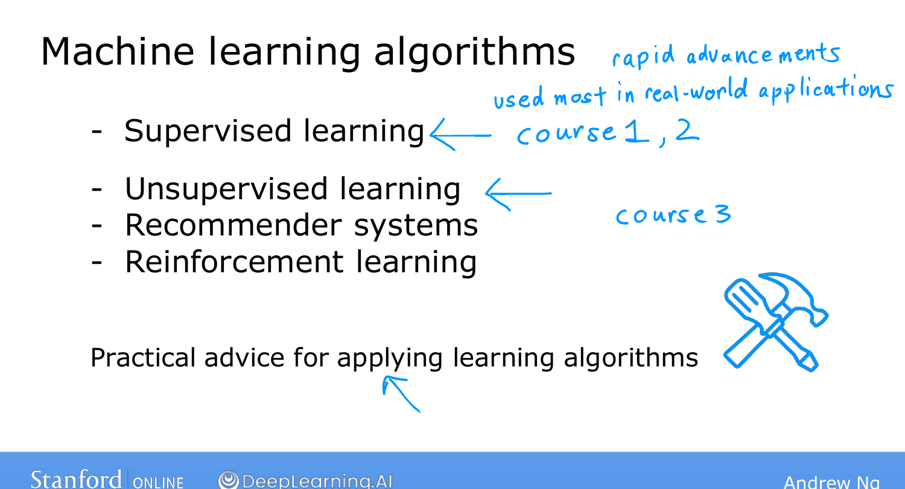

# What is Machine Learning?

> **Course 1 · Week 1** · _AI-generated study aid — not authoritative; trust the lecture & cited sources._

[← Applications of Machine Learning](../../course-1/week-1/applications-of-machine-learning.md){ .md-button }

[Supervised Learning, Part 1 →](../../course-1/week-1/supervised-learning-part-1.md){ .md-button }

<iframe src="https://www.youtube-nocookie.com/embed/XtlwSmJfUs4" title="Lecture video" loading="lazy" allow="accelerometer; autoplay; clipboard-write; encrypted-media; gyroscope; picture-in-picture" allowfullscreen></iframe>

> 📄 **[Read the full lecture transcript](what-is-machine-learning-transcript.md)**

The definition most people start with comes from **Arthur Samuel**: machine
learning is *the field of study that gives computers the ability to learn without
being explicitly programmed.* `[00:11]`

## The checkers story `[00:24]`

Samuel's claim to fame, back in the **1950s**, was a checkers-playing program — and
the striking part is that Samuel himself wasn't a strong checkers player. Instead
of hand-coding good moves, he had the computer play **tens of thousands of games
against itself**. By watching which board positions tended to lead to wins and
which to losses, the program gradually learned what good and bad positions look
like, and by steering toward the good ones it got better and better. Because it had
the patience to play far more games than any human, it eventually became a
*better* player than Samuel himself. `[01:13]`

That story also gives the first bit of intuition you'll lean on all course: **the
more opportunities you give a learning algorithm to learn — more data, more games —
the better it tends to perform.** Had the program played only a handful of games,
it would have ended up worse. `[01:45]`

{ .slide }
_Andrew Ng's checkers learning slide (Stanford / DeepLearning.AI)._
{ .slide-cap }
## The two main types `[02:20]`

Samuel's definition is informal. More practically, almost everything in this course
falls into one of two kinds of learning:

- **Supervised learning** — by far the most used in real-world applications, and
  where the most rapid recent progress has happened.
- **Unsupervised learning** — finding structure in data that has no labels.

The next two topics define each precisely and give you a feel for *when* to reach
for which. This three-course specialization spends Courses 1 and 2 on supervised
learning, and Course 3 on unsupervised learning, recommender systems, and
reinforcement learning — the most widely used families of learning algorithms
today. `[03:06]`

{ .slide }
_Andrew Ng's ML algorithm types slide (Stanford / DeepLearning.AI)._
{ .slide-cap }
## Tools *and* how to use them `[03:12]`

One thing Ng emphasizes strongly: teaching learning algorithms is like handing
someone a set of tools, and knowing *how to apply* them well matters as much as
having them. A state-of-the-art drill doesn't build a house on its own. He
describes seeing experienced teams spend **six months** pushing on an approach that
was never going to work, when a different way of applying the same tools would have
given them a far better shot. `[04:20]`

So alongside the algorithms, this course teaches the **best practices** for building
machine-learning systems that actually work — the skills that separate people who
*know about* ML from those who can reliably *build* with it. `[04:54]`

Next, we make "supervised learning" concrete. `[05:07]`

[← Applications of Machine Learning](../../course-1/week-1/applications-of-machine-learning.md){ .md-button }

[Supervised Learning, Part 1 →](../../course-1/week-1/supervised-learning-part-1.md){ .md-button }

