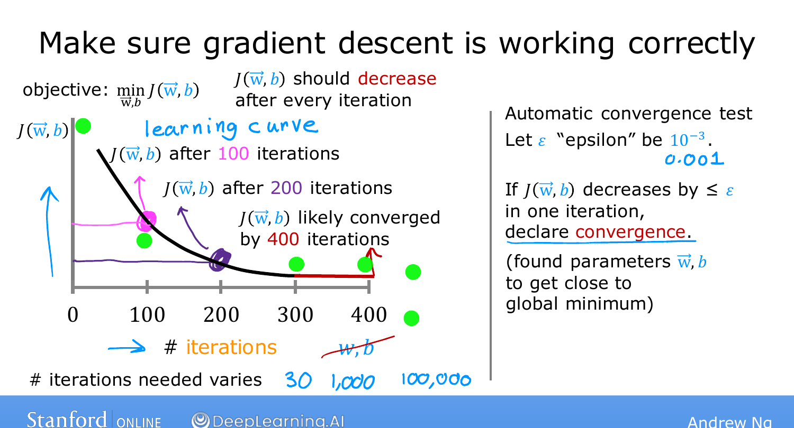

# Checking Gradient Descent for Convergence

> **Course 1 · Week 2** · _AI-generated study aid — not authoritative; trust the lecture & cited sources._

[← Feature Scaling, Part 2](../../course-1/week-2/feature-scaling-part-2.md){ .md-button }

[Choosing the Learning Rate →](../../course-1/week-2/choosing-the-learning-rate.md){ .md-button }

<iframe src="https://www.youtube-nocookie.com/embed/5g4H5_gsTpU" title="Lecture video" loading="lazy" allow="accelerometer; autoplay; clipboard-write; encrypted-media; gyroscope; picture-in-picture" allowfullscreen></iframe>

> 📄 **[Read the full lecture transcript](checking-gradient-descent-for-convergence-transcript.md)**

How do you tell whether gradient descent is actually **converging** — finding parameters
close to the minimum of $J$? The trick is a single, very useful plot. `[00:01]`

## The learning curve `[00:37]`

Plot the **cost $J$** (computed on the training set) on the vertical axis against the
**number of iterations** of gradient descent on the horizontal axis. Each point is the
cost *after* that many simultaneous updates of $\vec{w}$ and $b$. This is called a
**learning curve**. `[01:46]`

{ .slide }
_Andrew Ng's convergence slide — cost vs. iterations, the learning curve (Stanford / DeepLearning.AI)._
{ .slide-cap }

Note the horizontal axis is **iterations, not a parameter** $w$ or $b$ — different from
the cost-vs-parameter curves you saw earlier. `[01:43]`

## Reading it `[02:48]`

- If gradient descent works properly, **$J$ decreases after *every* iteration**. `[02:53]`
- If $J$ ever **goes up** after an iteration, that's a red flag: usually $\alpha$ is
  **too large**, or there's a **bug** in the code. `[03:08]`
- When the curve **flattens out** (here, by ~300–400 iterations) and $J$ is barely
  decreasing, gradient descent has more or less **converged**. `[03:32]`

The number of iterations needed varies enormously between problems — 30 for one
application, 100,000 for another — and is **very hard to predict in advance**, which is
exactly why the plot is worth drawing. `[04:10]`

## Automatic convergence test `[04:23]`

Alternatively: pick a small number $\varepsilon$ (epsilon), say $10^{-3}$. If $J$
decreases by **less than $\varepsilon$** in one iteration, declare convergence. `[04:56]`

Ng's own preference: he **looks at the curve** rather than relying on the automatic
test, because choosing a good $\varepsilon$ threshold is hard — and the curve also gives
early warning when gradient descent is misbehaving. `[05:19]`

With this read on convergence, the next topic uses the same plot to **choose the
learning rate**. `[05:32]`

[← Feature Scaling, Part 2](../../course-1/week-2/feature-scaling-part-2.md){ .md-button }

[Choosing the Learning Rate →](../../course-1/week-2/choosing-the-learning-rate.md){ .md-button }

