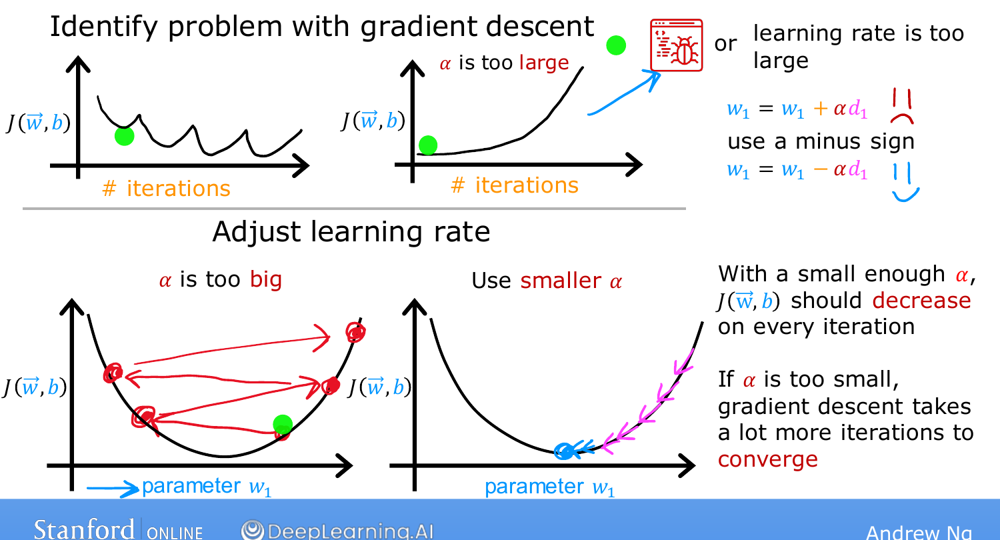

# Choosing the Learning Rate

> **Course 1 · Week 2** · _AI-generated study aid — not authoritative; trust the lecture & cited sources._

[← Checking Gradient Descent for Convergence](../../course-1/week-2/checking-gradient-descent-for-convergence.md){ .md-button }

[Feature Engineering →](../../course-1/week-2/feature-engineering.md){ .md-button }

<iframe src="https://www.youtube-nocookie.com/embed/P_9hNBVRldM" title="Lecture video" loading="lazy" allow="accelerometer; autoplay; clipboard-write; encrypted-media; gyroscope; picture-in-picture" allowfullscreen></iframe>

> 📄 **[Read the full lecture transcript](choosing-the-learning-rate-transcript.md)**

The learning rate $\alpha$ makes a big difference: **too small** and gradient descent
crawls; **too large** and it may never converge. Here's how to pick a good one. `[00:01]`

## Diagnosing a bad $\alpha$ `[00:16]`

If the cost-vs-iterations plot **bounces up and down**, or **consistently increases**,
gradient descent is not working properly — usually because $\alpha$ is **too large**
(or there's a bug). `[00:30]`

The picture: with $\alpha$ too big, an update step **overshoots** the minimum, lands on
the far side, overshoots again on the way back, and the cost climbs instead of falling.
The fix is a **smaller $\alpha$**, so each step moves steadily downhill. `[01:12]`

{ .slide }
_Andrew Ng's learning-rate slide — a too-big $\alpha$ makes steps overshoot the minimum (Stanford / DeepLearning.AI)._
{ .slide-cap }

## Bug vs. learning rate `[01:47]`

A cost that **always rises** can also be a bug — e.g. writing
$w_1 := w_1 \,{\color{red}+}\, \alpha \frac{\partial}{\partial w_1}J$ (a **plus**
instead of a minus), which moves *away* from the minimum. The update must be a
**minus**: $w_1 := w_1 - \alpha \frac{\partial}{\partial w_1}J$. `[02:20]`

**Debugging tip:** with a **small enough $\alpha$**, $J$ should decrease on *every*
iteration. So set $\alpha$ to something tiny and check — if $J$ *still* sometimes rises,
there's a bug. (A tiny $\alpha$ is a debugging step only; it's far too slow for real
training.) `[03:04]`

## Picking the value `[03:15]`

Try a **range** of values, each roughly **3× the previous**, running a handful of
iterations and plotting $J$ each time:

$$0.001 \;\to\; 0.003 \;\to\; 0.01 \;\to\; 0.03 \;\to\; 0.1 \;\to\; \dots$$

Find the value that's **too small** (slow) *and* the one that's **too large** (cost
rises), then pick the **largest reasonable $\alpha$** — or just slightly smaller than
it. That decreases the cost rapidly **and** consistently. `[04:57]`

The optional lab lets you watch how feature scaling and different $\alpha$ values change
training. Next, two ideas that make linear regression far more powerful: **feature
engineering** and fitting **curves**. `[05:50]`

{ .slide }
_Andrew Ng's values of α to try slide (Stanford / DeepLearning.AI)._
{ .slide-cap }

[← Checking Gradient Descent for Convergence](../../course-1/week-2/checking-gradient-descent-for-convergence.md){ .md-button }

[Feature Engineering →](../../course-1/week-2/feature-engineering.md){ .md-button }

