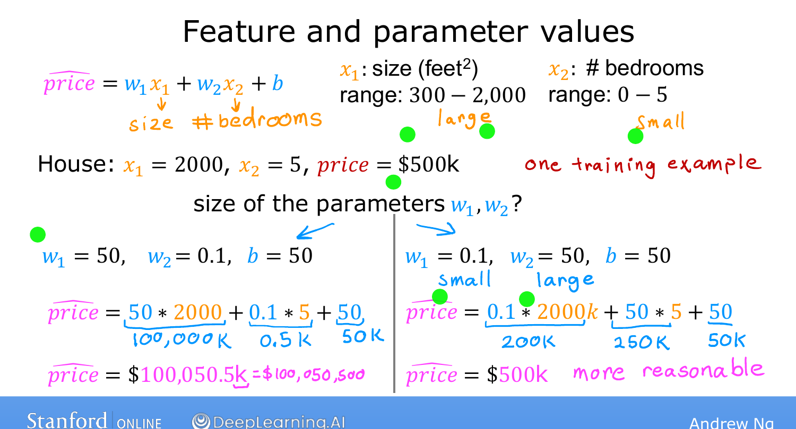
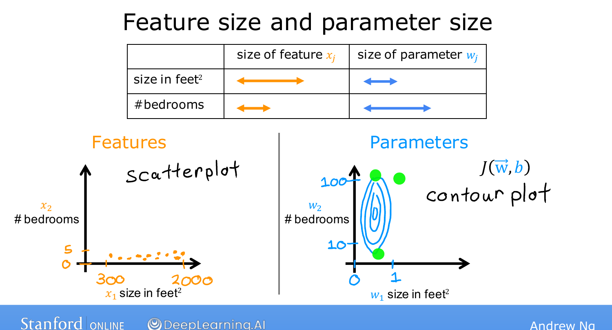
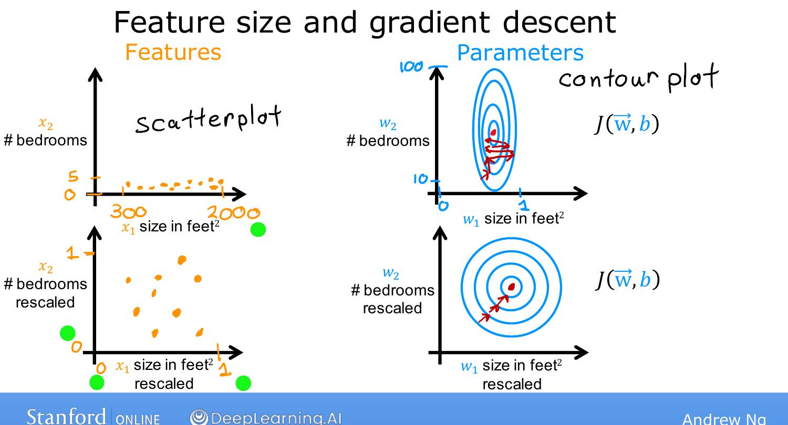

# Feature Scaling, Part 1

> **Course 1 · Week 2** · _AI-generated study aid — not authoritative; trust the lecture & cited sources._

[← Gradient Descent for Multiple Linear Regression](../../course-1/week-2/gradient-descent-for-multiple-linear-regression.md){ .md-button }

[Feature Scaling, Part 2 →](../../course-1/week-2/feature-scaling-part-2.md){ .md-button }

<iframe src="https://www.youtube-nocookie.com/embed/YVtP5UGdgXg" title="Lecture video" loading="lazy" allow="accelerometer; autoplay; clipboard-write; encrypted-media; gyroscope; picture-in-picture" allowfullscreen></iframe>

> 📄 **[Read the full lecture transcript](feature-scaling-part-1-transcript.md)**

A simple technique — **feature scaling** — can make gradient descent run **much
faster**. The idea starts with the relationship between the *size* of a feature and the
*size* of its parameter. `[00:02]`

## Big feature → small parameter (and vice-versa) `[00:15]`

Predict house price from two features: $x_1$ = size (ranges ~**300 to 2,000** sq ft) and
$x_2$ = number of bedrooms (ranges **0 to 5**). Take one house: 2,000 sq ft, 5 bedrooms,
true price \$500k. Which parameters fit? `[00:57]`

- Try $w_1 = 50,\ w_2 = 0.1,\ b = 50$: predicted price $= 50\cdot 2000 + 0.1\cdot 5 + 50
  \approx \$100{,}000\text{k}$ — wildly too high. **Bad fit.** `[01:32]`
- Try $w_1 = 0.1,\ w_2 = 50,\ b = 50$: predicted $= 0.1\cdot 2000 + 50\cdot 5 + 50 =
  200 + 250 + 50 = \$500\text{k}$ — **exactly right.** `[02:44]`

The pattern: when a feature takes a **large range** of values (size, up to 2,000), a good
model gives it a **small parameter** (0.1); when a feature has a **small range**
(bedrooms, 0–5), its parameter tends to be **large** (50). `[03:24]`

{ .slide }
_Andrew Ng's feature vs. parameter size slide (Stanford / DeepLearning.AI)._
{ .slide-cap }
## Why this slows gradient descent `[03:32]`

Plot the two features against each other: the size axis spans a huge range, the bedrooms
axis a tiny one. The cost-function **contour plot** then comes out as **tall, skinny
ovals** — because a tiny change in $w_1$ (multiplied by the large size values) swings the
cost a lot, while $w_2$ needs a big change to move the cost at all. `[04:41]`

{ .slide }
_Andrew Ng's feature-scaling slide: unscaled features produce tall, skinny contours (Stanford / DeepLearning.AI)._
{ .slide-cap }

On those skinny contours gradient descent **bounces back and forth** for a long time
before reaching the minimum. `[05:16]`

## The fix: rescale `[05:16]`

**Scale** the features so both $x_1$ and $x_2$ range over, say, **0 to 1**. The contours
become **circles** instead of skinny ovals, and gradient descent takes a **direct path**
to the minimum. `[06:00]`

> When features take very different ranges, gradient descent runs slowly; rescaling them
> to comparable ranges can speed it up significantly.

*How* exactly you rescale — divide by the max, mean normalization, or z-score
normalization — is the next topic. `[06:31]`

{ .slide }
_Andrew Ng's rescaled contours slide (Stanford / DeepLearning.AI)._
{ .slide-cap }

[← Gradient Descent for Multiple Linear Regression](../../course-1/week-2/gradient-descent-for-multiple-linear-regression.md){ .md-button }

[Feature Scaling, Part 2 →](../../course-1/week-2/feature-scaling-part-2.md){ .md-button }

