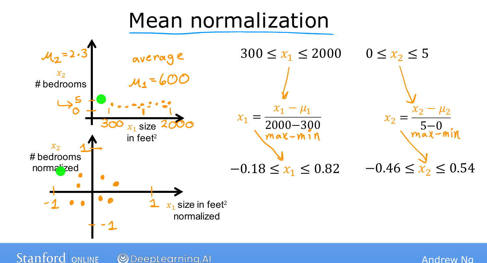
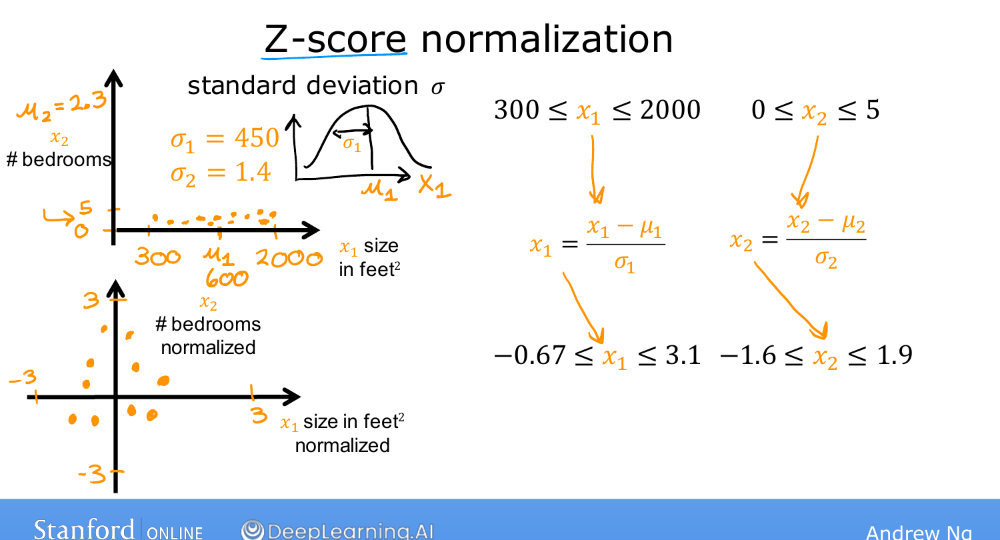

# Feature Scaling, Part 2

> **Course 1 · Week 2** · _AI-generated study aid — not authoritative; trust the lecture & cited sources._

[← Feature Scaling, Part 1](../../course-1/week-2/feature-scaling-part-1.md){ .md-button }

[Checking Gradient Descent for Convergence →](../../course-1/week-2/checking-gradient-descent-for-convergence.md){ .md-button }

<iframe src="https://www.youtube-nocookie.com/embed/gmJqLGrUscg" title="Lecture video" loading="lazy" allow="accelerometer; autoplay; clipboard-write; encrypted-media; gyroscope; picture-in-picture" allowfullscreen></iframe>

> 📄 **[Read the full lecture transcript](feature-scaling-part-2-transcript.md)**

Three concrete ways to actually rescale features so they take comparable ranges.
`[00:01]`

## 1. Divide by the maximum `[00:11]`

Take each value and divide by the range's **maximum**.

- $x_1 \in [300, 2000] \Rightarrow x_{1,\text{scaled}} = \dfrac{x_1}{2000} \in [0.15, 1]$.
- $x_2 \in [0, 5] \Rightarrow x_{2,\text{scaled}} = \dfrac{x_2}{5} \in [0, 1]$. `[00:52]`

## 2. Mean normalization `[00:58]`

Re-center each feature around **0** so it takes both negative and positive values
(usually between $-1$ and $1$). Subtract the **mean** $\mu_j$, then divide by the
range (max $-$ min):

$$x_{j,\text{norm}} = \frac{x_j - \mu_j}{\max_j - \min_j}.$$

E.g. with $\mu_1 = 600$: $x_1 \to \dfrac{x_1 - 600}{2000 - 300}$, giving a range of
$[-0.18, 0.82]$. With $\mu_2 = 2.3$: $x_2 \to \dfrac{x_2 - 2.3}{5 - 0}$, giving
$[-0.46, 0.54]$. `[02:40]`

{ .slide }
_Andrew Ng's mean normalization slide (Stanford / DeepLearning.AI)._
{ .slide-cap }
## 3. Z-score normalization `[02:48]`

Subtract the **mean** $\mu_j$ and divide by the **standard deviation** $\sigma_j$ of
each feature:

$$x_{j,\text{z}} = \frac{x_j - \mu_j}{\sigma_j}.$$

(The standard deviation measures spread — the width of the bell-shaped normal
distribution. You don't need the statistics background for this course.) With
$\mu_1 = 600, \sigma_1 = 450$ you might get $x_1 \in [-0.67, 3.1]$; with
$\mu_2 = 2.3, \sigma_2 = 1.4$, $x_2 \in [-1.6, 1]$. `[04:33]`

{ .slide }
_Andrew Ng's z-score-normalization slide (Stanford / DeepLearning.AI)._
{ .slide-cap }

{ .slide }
_Andrew Ng's z-score normalization slide (Stanford / DeepLearning.AI)._
{ .slide-cap }
## Rule of thumb `[04:43]`

Aim for each feature to land **roughly $-1$ to $+1$** — but it's loose. Ranges like
$[-3, 3]$ or $[-0.3, 0.3]$ are all fine; no need to touch a feature already in those
bands. **Do** rescale when a feature is far outside, e.g.:

- $x_3 \in [-100, 100]$ — too wide, rescale toward $[-1, 1]$.
- $x_4 \in [-0.001, 0.001]$ — too small, rescale up.
- body temperature $\in [98.6, 105]$ — values near 100 are large relative to scaled
  features and will slow gradient descent, so rescale. `[06:41]`

There's almost **never any harm** in rescaling, so when in doubt, do it. `[06:53]`

![Rule of thumb: aim for each feature roughly in [-1, 1]; rescale when a range is much larger or smaller](feature-scaling-ranges.png){ .slide }
_Andrew Ng's acceptable feature ranges slide (Stanford / DeepLearning.AI)._
{ .slide-cap }
## Try it — z-score normalize a feature matrix `[06:53]`

Implement z-score normalization the way the assignments do it: per-column mean and
standard deviation, returning the normalized matrix plus the $\mu$ and $\sigma$ you'd
reuse on new data. **Run**, then **Validate**:

{{ IDE('zscore-normalize_exo') }}

With features scaled, the next question is practical: how do you **check** that gradient
descent is actually converging? That's next. `[07:24]`

[← Feature Scaling, Part 1](../../course-1/week-2/feature-scaling-part-1.md){ .md-button }

[Checking Gradient Descent for Convergence →](../../course-1/week-2/checking-gradient-descent-for-convergence.md){ .md-button }

