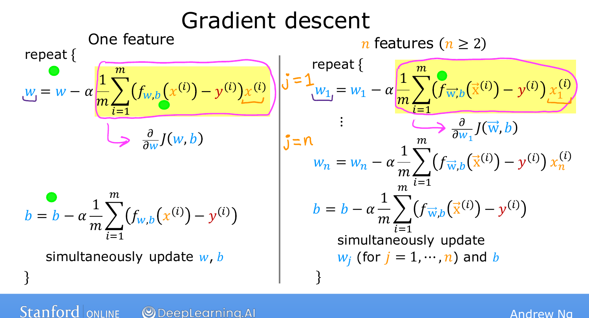
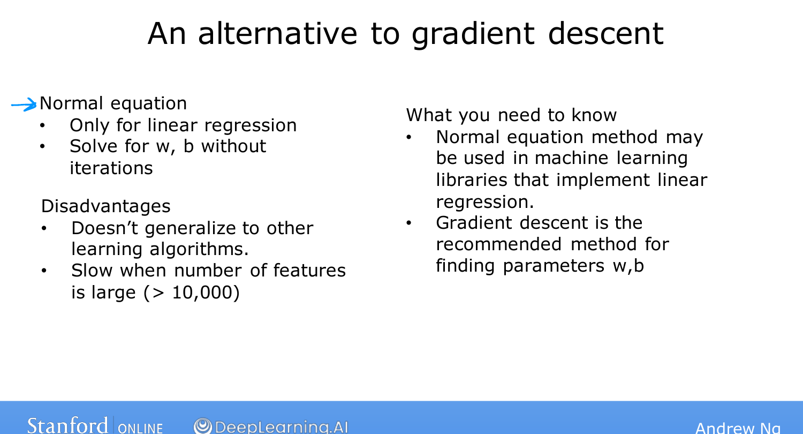

# Gradient Descent for Multiple Linear Regression

> **Course 1 · Week 2** · _AI-generated study aid — not authoritative; trust the lecture & cited sources._

[← Vectorization, Part 2](../../course-1/week-2/vectorization-part-2.md){ .md-button }

[Feature Scaling, Part 1 →](../../course-1/week-2/feature-scaling-part-1.md){ .md-button }

<iframe src="https://www.youtube-nocookie.com/embed/YjpCQof9tI8" title="Lecture video" loading="lazy" allow="accelerometer; autoplay; clipboard-write; encrypted-media; gyroscope; picture-in-picture" allowfullscreen></iframe>

> 📄 **[Read the full lecture transcript](gradient-descent-for-multiple-linear-regression-transcript.md)**

Now we **put it all together** — gradient descent, multiple linear regression, and
vectorization — into the algorithm that's probably the single most widely used
learning algorithm in the world today. `[00:02]`

## The model in vector form `[00:15]`

Instead of treating $w_1, \dots, w_n$ as $n$ separate parameters, collect them into a
single **vector $\vec{w}$ of length $n$**; $b$ stays a single number. The model is then

$$f_{\vec{w},b}(\vec{x}) = \vec{w}\cdot\vec{x} + b,$$

and the cost becomes $J(\vec{w}, b)$ — a function of the parameter **vector** $\vec{w}$
and the number $b$, returning a single number. `[00:54]`

## The update rule with $n$ features `[01:48]`

Gradient descent repeats, for every $j = 1, \dots, n$:

$$w_j := w_j - \alpha \,\frac{\partial}{\partial w_j} J(\vec{w}, b), \qquad
  b := b - \alpha \,\frac{\partial}{\partial b} J(\vec{w}, b).$$

Writing out the derivative for one feature, the multi-feature update looks **almost
identical to the single-feature case** from Week 1:

$$w_j := w_j - \alpha \,\frac{1}{m}\sum_{i=1}^{m}
  \big(f_{\vec{w},b}(\vec{x}^{(i)}) - y^{(i)}\big)\,x_j^{(i)}.$$

{ .slide }
_Andrew Ng's gradient-descent-for-multiple-regression slide (Stanford / DeepLearning.AI)._
{ .slide-cap }

The two differences from one feature: (1) the **error term**
$f_{\vec{w},b}(\vec{x}^{(i)}) - y^{(i)}$ now uses the vector dot product inside $f$, and
(2) it's multiplied by $x_j^{(i)}$ — the $j$-th feature of the $i$-th example — so each
$w_j$ has its own update, while $b$ updates exactly as before. `[04:23]`

{ .slide }
_Andrew Ng's the n-feature update rule slide (Stanford / DeepLearning.AI)._
{ .slide-cap }
## An aside: the normal equation `[04:34]`

There's *one* alternative that solves for $\vec{w}, b$ **in a single step with no
iterations** — the **normal equation**, which uses a linear-algebra library to solve
directly. Caveats worth knowing for interviews: `[05:11]`

- It works **only for linear regression** — it does not generalize to logistic
  regression, neural networks, or anything else in the specialization. `[05:32]`
- It's **slow when $n$ is large** (many features). `[05:46]`

Almost no one implements it by hand, but a mature ML library *may* use it on the back
end. So if you hear "normal equation" in an interview, that's what it means — but
**gradient descent is the more general and usually better tool**. `[06:08]`

{ .slide }
_Andrew Ng's the normal equation slide (Stanford / DeepLearning.AI)._
{ .slide-cap }
## What the optional lab adds `[06:32]`

The lab that follows shows how to define a multiple-regression model in NumPy, compute
the prediction $f(\vec{x})$, compute the cost, and implement this exact gradient
descent — good practice before the graded assignment. `[07:09]`

You now know **multiple linear regression**. Two small tricks — **feature scaling** and
**choosing the learning rate well** — make it work dramatically better. Those are next.
`[07:21]`

[← Vectorization, Part 2](../../course-1/week-2/vectorization-part-2.md){ .md-button }

[Feature Scaling, Part 1 →](../../course-1/week-2/feature-scaling-part-1.md){ .md-button }

