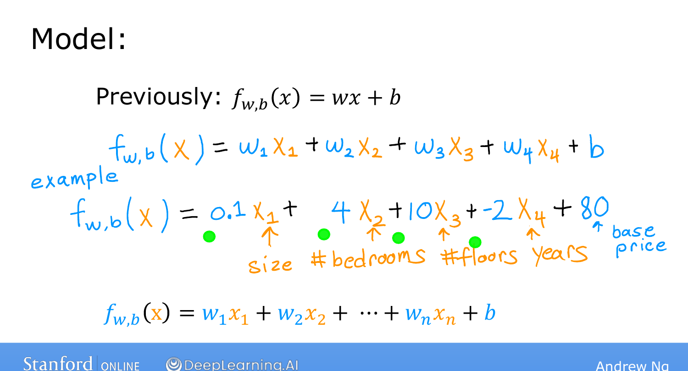
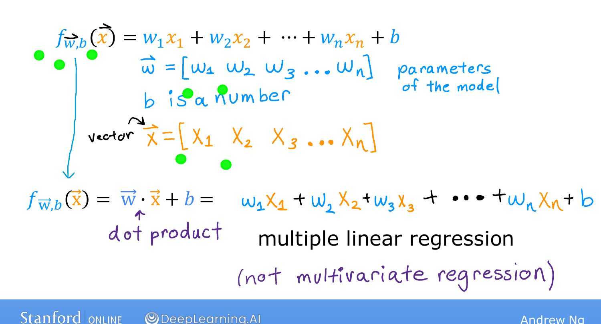

# Multiple Features

> **Course 1 · Week 2** · _AI-generated study aid — not authoritative; trust the lecture & cited sources._

[← Running Gradient Descent](../../course-1/week-1/running-gradient-descent.md){ .md-button }

[Vectorization, Part 1 →](../../course-1/week-2/vectorization-part-1.md){ .md-button }

<iframe src="https://www.youtube-nocookie.com/embed/jXg0vU0y1ak" title="Lecture video" loading="lazy" allow="accelerometer; autoplay; clipboard-write; encrypted-media; gyroscope; picture-in-picture" allowfullscreen></iframe>

> 📄 **[Read the full lecture transcript](multiple-features-transcript.md)**

Week 2 makes linear regression **faster and far more powerful**. The first upgrade:
predict from **many features**, not just one. `[00:02]`

## From one feature to many `[00:23]`

The original model used a single feature $x$ (house size): $f_{w,b}(x) = wx + b$. But
you might also know the **number of bedrooms, number of floors, and the age** of the
home — much more to predict the price with. `[00:59]`

Notation for $n$ features:

- $x_1, x_2, \dots, x_n$ are the features; **$x_j$** denotes the $j$-th one. $n$ is the
  **number of features** (here $n = 4$).
- $\vec{x}^{(i)}$ is the **vector** of all features for the $i$-th training example.
  E.g. $\vec{x}^{(2)} = [1416,\ 3,\ 2,\ 40]$.
- $x^{(i)}_j$ is the $j$-th feature of the $i$-th example — so $x^{(2)}_3 = 2$ (the
  number of floors in the second example). `[03:00]`

(The little arrow on $\vec{x}$ just emphasizes it's a vector — a list of numbers —
not a single number; it's optional notation.) `[03:30]`

## The model with $n$ features `[03:35]`

$$f_{w,b}(\vec{x}) = w_1 x_1 + w_2 x_2 + \dots + w_n x_n + b.$$

A concrete housing model might be
$\text{price} = 0.1\,x_1 + 4\,x_2 + 10\,x_3 - 2\,x_4 + 80$. Reading the parameters:
$b = 80$ is a **base price** (~\$80k); $0.1$ adds ~\$100 per square foot; $+4$ adds
~\$4k per bedroom; $+10$ adds ~\$10k per floor; $-2$ *subtracts* ~\$2k per year of
age (the parameter is negative). `[05:31]`

{ .slide }
_Andrew Ng's the multiple-feature model slide (Stanford / DeepLearning.AI)._
{ .slide-cap }
## Vector notation `[05:51]`

Collect the parameters into a vector $\vec{w} = [w_1, \dots, w_n]$ (and $b$ stays a
single number), and the features into $\vec{x} = [x_1, \dots, x_n]$. Then the model
compresses to:

$$f_{w,b}(\vec{x}) = \vec{w} \cdot \vec{x} + b,$$

where $\cdot$ is the **dot product**: multiply corresponding pairs and sum them,
$\vec{w}\cdot\vec{x} = w_1 x_1 + w_2 x_2 + \dots + w_n x_n$ — exactly the expression
above. `[08:22]`

{ .slide }
_Andrew Ng's multiple-features slide (Stanford / DeepLearning.AI)._
{ .slide-cap }

This model — linear regression with multiple input features — is called **multiple
linear regression** (*not* "multivariate regression," which is a different thing).
`[09:23]`

To implement it cleanly and quickly, there's a neat trick: **vectorization**, next.
`[09:34]`

[← Running Gradient Descent](../../course-1/week-1/running-gradient-descent.md){ .md-button }

[Vectorization, Part 1 →](../../course-1/week-2/vectorization-part-1.md){ .md-button }

