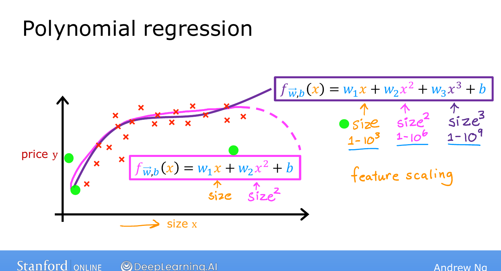

# Polynomial Regression

> **Course 1 · Week 2** · _AI-generated study aid — not authoritative; trust the lecture & cited sources._

[← Feature Engineering](../../course-1/week-2/feature-engineering.md){ .md-button }

[Motivations →](../../course-1/week-3/classification-motivations.md){ .md-button }

<iframe src="https://www.youtube-nocookie.com/embed/IFkRKJ5iBDE" title="Lecture video" loading="lazy" allow="accelerometer; autoplay; clipboard-write; encrypted-media; gyroscope; picture-in-picture" allowfullscreen></iframe>

> 📄 **[Read the full lecture transcript](polynomial-regression-transcript.md)**

Combine multiple linear regression with feature engineering and you get **polynomial
regression** — fitting **curves**, not just straight lines, to your data. `[00:03]`

## Fitting a curve `[00:18]`

Suppose house price vs. size doesn't look linear. You could fit a **quadratic**, adding
a squared feature:

$$f_{\vec{w},b}(x) = w_1 x + w_2 x^2 + b.$$

But a quadratic eventually **comes back down** — and we don't expect price to fall as
size grows. So a **cubic** often fits better, because it rises again:

$$f_{\vec{w},b}(x) = w_1 x + w_2 x^2 + w_3 x^3 + b.$$

Both are polynomial regression: you take a single feature $x$ and raise it to powers
(here the features are $x$, $x^2$, $x^3$). `[01:23]`

{ .slide }
_Andrew Ng's polynomial-regression slide — fitting a curve with a squared feature (Stanford / DeepLearning.AI)._
{ .slide-cap }

_Slide the polynomial degree up and down to watch the curve go from underfitting to hugging every point — a hands-on feel for overfitting._
{ .mlw-caption }

## Feature scaling becomes essential `[01:44]`

When you create power features, their ranges **explode**: if size spans 1–1,000, then
$x^2$ spans 1–1,000,000 and $x^3$ spans 1–1,000,000,000. These are wildly different
scales, so **feature scaling is important** to bring them into comparable ranges for
gradient descent. `[02:32]`

## Other feature choices `[02:32]`

Powers aren't the only option. A **square root** feature is another reasonable choice:

$$f_{\vec{w},b}(x) = w_1 x + w_2 \sqrt{x} + b,$$

which grows but flattens gently and **never comes back down**. `[03:07]`

How do you *decide* which features to use? Course 2 gives a systematic process for
**measuring how well different models perform** so you can choose. For now: you have a
**choice** of features, and feature engineering + polynomials can produce a far better
model. `[03:43]`

{ .slide }
_Andrew Ng's choice of features slide (Stanford / DeepLearning.AI)._
{ .slide-cap }
## Labs & the practice assignment `[03:47]`

The optional labs implement polynomial regression by hand and then with **scikit-learn**
— a very widely used, few-lines-of-code ML library. Ng's view: learn to implement linear
regression yourself (not just call a black box), *and* know the library. The **graded
practice lab** for this week has you implement linear regression end-to-end. `[05:00]`

That's the end of Week 2. Next week goes **beyond regression** to the first
**classification** algorithm — predicting categories, not numbers. `[05:38]`

!!! abstract "You might want to try it out in code"
    You now know everything this week's Coding Lab needs — many features at once, feature
    scaling, and bending the line into a curve with polynomial features. The **[C1W2 Coding
    Lab →](../../coding-labs/C1W2.md)** turns all of it into working code: vectorized multiple
    linear regression, z-score scaling, and polynomial fits. Entirely optional, and you can do
    it in any order you like — but this is the moment it'll click.

[← Feature Engineering](../../course-1/week-2/feature-engineering.md){ .md-button }

[Motivations →](../../course-1/week-3/classification-motivations.md){ .md-button }

