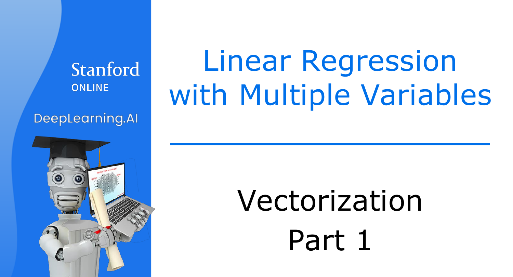

# Vectorization, Part 1

> **Course 1 · Week 2** · _AI-generated study aid — not authoritative; trust the lecture & cited sources._

<div class="ep-nav" markdown>

[← Multiple Features](../../course-1/week-2/multiple-features.md){ .md-button }

[Vectorization, Part 2 →](../../course-1/week-2/vectorization-part-2.md){ .md-button }

</div>

<div class="video-wrap"><iframe src="https://www.youtube-nocookie.com/embed/U6zuBcmLxSg" title="Lecture video" loading="lazy" allow="accelerometer; autoplay; clipboard-write; encrypted-media; gyroscope; picture-in-picture" allowfullscreen></iframe></div>

> 📄 **[Read the full lecture transcript](vectorization-part-1-transcript.md)**

**Vectorization** makes your learning-algorithm code both **shorter** and **much
faster** — and it lets you tap modern numerical-linear-algebra libraries and even GPU
hardware. It's one of the most useful techniques in all of ML implementation.
`[00:02]`

## Setup `[00:43]`

Take parameters $\vec{w}$ and features $\vec{x}$, each a vector of three numbers
($n = 3$). A wrinkle worth pinning down: **linear algebra counts from 1**
($w_1, x_1$), but **Python/NumPy count from 0** — so in code the first entry is
`w[0]`, then `w[1]`, `w[2]`. We'll use **NumPy**, by far the most widely used
numerical library in Python ML. `[02:00]`

## Three ways to compute $f = \vec{w}\cdot\vec{x} + b$ `[02:14]`

1. **Spell it out:** `f = w[0]*x[0] + w[1]*x[1] + w[2]*x[2] + b`. Fine for $n=3$,
   hopeless when $n$ is 100 or 100,000. `[02:34]`
2. **A `for` loop:** sum `w[j]*x[j]` over `j in range(n)`, then add `b`. Better to
   write, but still computes one term at a time — **not** vectorized. `[04:04]`
3. **Vectorized:** one line —

   ```python
   f = np.dot(w, x) + b
   ```

   `np.dot` computes the dot product of the two vectors in a single, optimized call.
   `[04:46]`


{ .slide }
_Andrew Ng's computing the model three ways slide (Stanford / DeepLearning.AI)._
{ .slide-cap }
## Why vectorization wins `[05:06]`

Two distinct benefits: the code is **one line** (easier to write and read), and it
**runs much faster**. The speed comes from NumPy using your computer's **parallel
hardware** behind the scenes — whether a normal CPU or a GPU — instead of a
sequential loop. With large $n$ that's a dramatic difference. `[06:04]`

## Try it `[06:30]`

Implement `predict` using a vectorized dot product (no loop), then **Run** and
**Validate**:

{{ IDE('vectorized-prediction_exo') }}

The next topic looks at *why* the vectorized version is so much faster — what the
hardware is actually doing. `[06:48]`


<div class="ep-nav" markdown>

[← Multiple Features](../../course-1/week-2/multiple-features.md){ .md-button }

[Vectorization, Part 2 →](../../course-1/week-2/vectorization-part-2.md){ .md-button }

</div>
