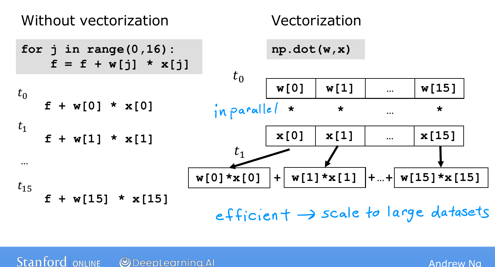
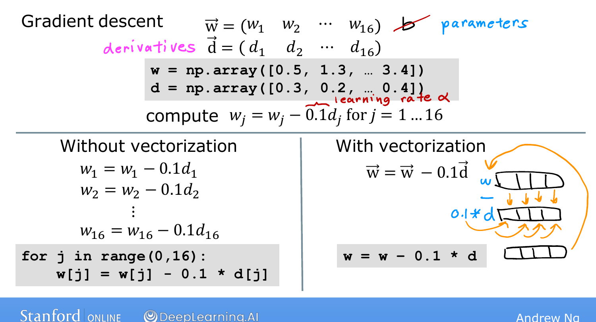

# Vectorization, Part 2

> **Course 1 · Week 2** · _AI-generated study aid — not authoritative; trust the lecture & cited sources._

<div class="ep-nav" markdown>

[← Vectorization, Part 1](../../course-1/week-2/vectorization-part-1.md){ .md-button }

[Gradient Descent for Multiple Linear Regression →](../../course-1/week-2/gradient-descent-for-multiple-linear-regression.md){ .md-button }

</div>

<div class="video-wrap"><iframe src="https://www.youtube-nocookie.com/embed/uvTL1N02f04" title="Lecture video" loading="lazy" allow="accelerometer; autoplay; clipboard-write; encrypted-media; gyroscope; picture-in-picture" allowfullscreen></iframe></div>

> 📄 **[Read the full lecture transcript](vectorization-part-2-transcript.md)**

Ng recalls being amazed, when first learning this, that the *same* algorithm
vectorized ran so much faster — "almost like a magic trick." Here's how the trick
works. `[00:02]`

## Sequential vs. parallel `[00:37]`

A **`for` loop** runs **one operation after another**. If $j$ goes from 0 to 15, at
time step $t_0$ it handles index 0, at $t_1$ index 1, and so on — 16 steps in
sequence. `[01:11]`

A **vectorized** NumPy call uses **parallel hardware**: it grabs *all* the values of
$\vec{w}$ and $\vec{x}$ and multiplies each pair **at the same time, in a single
step**. Then specialized hardware adds the results together efficiently, instead of
16 separate additions. The result: far less time — and the gap grows with the size of
your data and models. `[02:03]`

{ .slide }
_Andrew Ng's behind-the-scenes vectorization slide (Stanford / DeepLearning.AI)._
{ .slide-cap }

## Why it matters for gradient descent `[02:39]`

Say you have 16 parameters $w_1,\dots,w_{16}$ with 16 computed derivatives stored in
a NumPy array `d`. The update $w_j := w_j - 0.1\, d_j$ for all $j$ becomes, without
vectorization, a 16-step loop. With vectorization it's a single line:

```python
w = w - 0.1 * d
```

and the hardware applies all 16 updates **in parallel, at once**. `[05:00]`

With only 16 features the speedup is modest, but with **thousands of features and
large training sets** it's the difference between an algorithm finishing in **a
minute or two versus many hours.** That's why vectorization has been a key step in
making learning algorithms scale to modern datasets. `[05:25]`

{ .slide }
_Andrew Ng's vectorized gradient descent slide (Stanford / DeepLearning.AI)._
{ .slide-cap }


Next we combine vectorization with the multiple-linear-regression math to implement
gradient descent for it. `[06:41]`


<div class="ep-nav" markdown>

[← Vectorization, Part 1](../../course-1/week-2/vectorization-part-1.md){ .md-button }

[Gradient Descent for Multiple Linear Regression →](../../course-1/week-2/gradient-descent-for-multiple-linear-regression.md){ .md-button }

</div>
