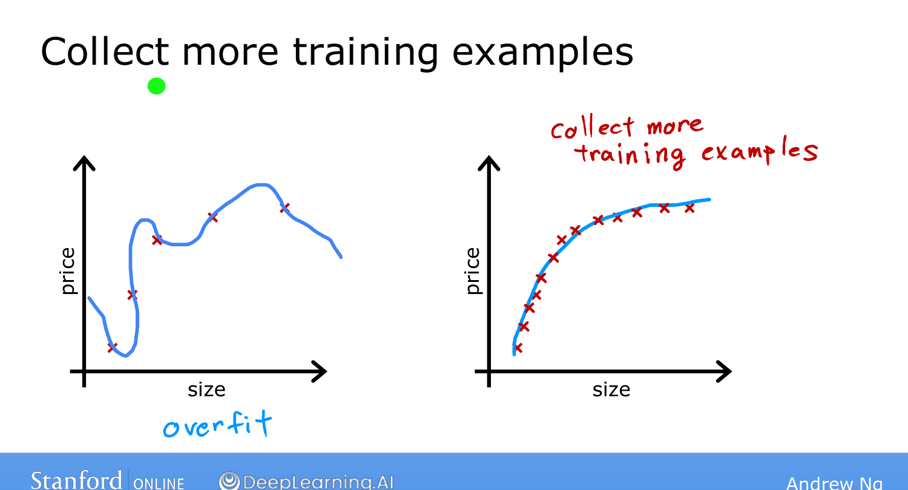
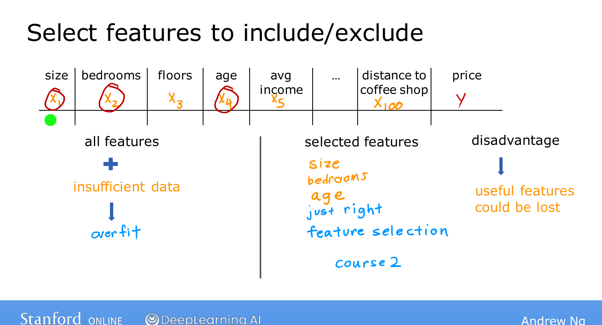
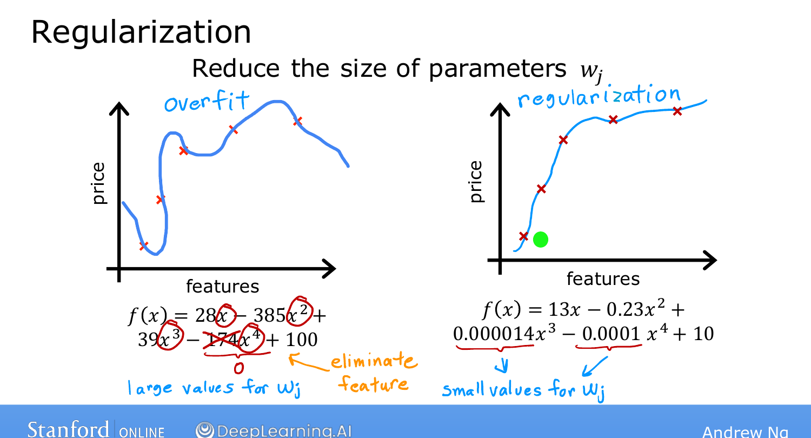

# Addressing Overfitting

> **Course 1 · Week 3** · _AI-generated study aid — not authoritative; trust the lecture & cited sources._

[← The Problem of Overfitting](../../course-1/week-3/the-problem-of-overfitting.md){ .md-button }

[Cost Function with Regularization →](../../course-1/week-3/cost-function-with-regularization.md){ .md-button }

<iframe src="https://www.youtube-nocookie.com/embed/1kgcON0Eauc" title="Lecture video" loading="lazy" allow="accelerometer; autoplay; clipboard-write; encrypted-media; gyroscope; picture-in-picture" allowfullscreen></iframe>

> 📄 **[Read the full lecture transcript](addressing-overfitting-transcript.md)**

Three practical ways to fix an overfit (high-variance) model. `[00:02]`

## 1. Collect more training data `[00:22]`

The **number-one tool**. With more examples, even a high-order polynomial is forced to
fit a **less wiggly**, smoother function — the extra data pins the curve down. The catch:
more data isn't always available (only so many houses have sold). `[01:24]`

{ .slide }
_Andrew Ng's collect more data slide (Stanford / DeepLearning.AI)._
{ .slide-cap }
## 2. Use fewer features (feature selection) `[01:24]`

If you have many features but little data, the model can overfit. Picking a **subset of
the most relevant** features — say size, bedrooms, age out of 100 — often stops the
overfitting. This is **feature selection**. `[02:50]`

The downside: by dropping features you **throw away information** that might have been
useful. (Course 2 covers algorithms that choose features automatically.) `[03:35]`

{ .slide }
_Andrew Ng's feature selection slide (Stanford / DeepLearning.AI)._
{ .slide-cap }
## 3. Regularization `[03:35]`

The key insight: in an overfit model, the parameters are often **large**. Setting a
parameter to exactly zero is the same as **deleting** its feature — but that's harsh.

> **Regularization** gently **shrinks** the parameters toward zero *without* forcing them
> to be exactly zero — so you **keep all your features** but stop any one of them from
> having an outsized effect.

Even with a high-order polynomial, if the weights $w_1, \dots, w_n$ are kept small, the
fit comes out much smoother and generalizes better. `[05:05]`

{ .slide }
_Andrew Ng's slide — shrinking parameters keeps all features but tames the fit (Stanford / DeepLearning.AI)._
{ .slide-cap }

By convention you regularize **only the weights $w_1 \dots w_n$**, not the bias $b$ — in
practice it makes very little difference. `[05:41]`

Regularization is used constantly in real ML — including for **neural networks** later in
the specialization. The next topic makes it precise with a modified **cost function**.
`[06:38]`

[← The Problem of Overfitting](../../course-1/week-3/the-problem-of-overfitting.md){ .md-button }

[Cost Function with Regularization →](../../course-1/week-3/cost-function-with-regularization.md){ .md-button }

