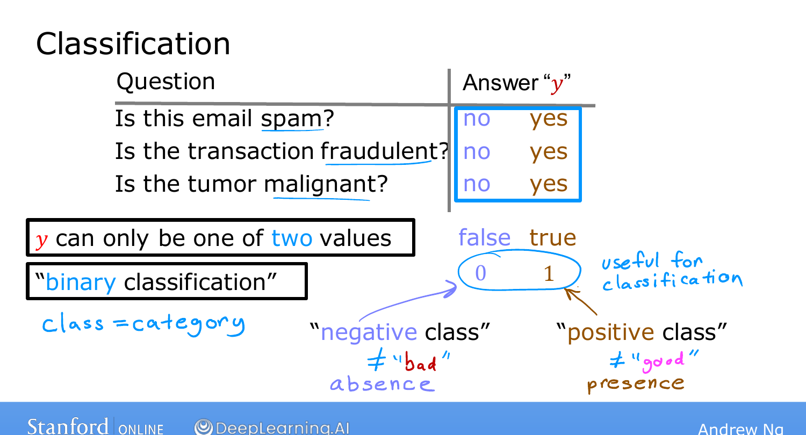
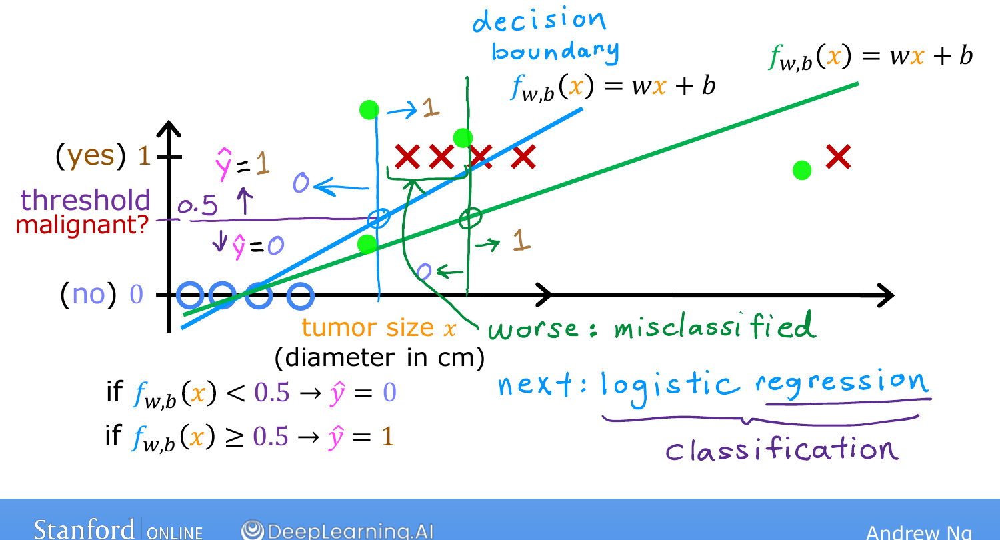

# Motivations

> **Course 1 · Week 3** · _AI-generated study aid — not authoritative; trust the lecture & cited sources._

[← Polynomial Regression](../../course-1/week-2/polynomial-regression.md){ .md-button }

[Logistic Regression →](../../course-1/week-3/logistic-regression.md){ .md-button }

<iframe src="https://www.youtube-nocookie.com/embed/p-ltr1C7u2o" title="Lecture video" loading="lazy" allow="accelerometer; autoplay; clipboard-write; encrypted-media; gyroscope; picture-in-picture" allowfullscreen></iframe>

> 📄 **[Read the full lecture transcript](classification-motivations-transcript.md)**

Week 3 — the last of Course 1 — moves from **regression** (predict a number) to
**classification**, where the output $y$ takes only one of a small handful of values.
The key result up front: **linear regression is a bad fit for classification**, which
motivates **logistic regression** — one of the most widely used algorithms today.
`[00:00]`

## Binary classification `[00:43]`

Examples where the answer is **no/yes**:

- Is this email **spam**?
- Is this financial transaction **fraudulent**?
- Is this tumor **malignant**?

When there are only **two** possible outputs, it's **binary classification** ("binary" =
two classes). The two classes get written interchangeably as **no/yes**, **false/true**,
or — the convention we'll use — **0 / 1**. `[01:58]`

The **0/false** class is the **negative class**; the **1/true** class is the **positive
class**. "Negative" and "positive" don't mean bad/good — they mean the **absence vs.
presence** of the thing you're detecting (spaminess, fraud, malignancy). Which side is
labelled 1 is somewhat arbitrary. `[03:43]`

{ .slide }
_Andrew Ng's binary classification examples slide (Stanford / DeepLearning.AI)._
{ .slide-cap }
## Why linear regression fails here `[04:34]`

Take a tumor dataset: size on the horizontal axis, label $y \in \{0, 1\}$ on the
vertical. Fit a straight line with linear regression and pick a **threshold of 0.5** —
predict malignant when $f(x) \ge 0.5$. The threshold crosses the line at one point,
giving a vertical **dividing line** (decision boundary) that looks reasonable. `[06:30]`

{ .slide }
_Andrew Ng's motivation slide — linear regression with a 0.5 threshold on tumor data (Stanford / DeepLearning.AI)._
{ .slide-cap }

But add **one more example far to the right** (a clearly large, malignant tumor). It
*shouldn't* change the boundary — yet the best-fit line **tilts toward it**, the 0.5
crossing **shifts right**, and now some genuinely malignant tumors get classified as
benign. A single, "obvious" data point breaks the model. `[07:57]`

## Enter logistic regression `[08:21]`

The fix is **logistic regression**, whose output always lies **between 0 and 1** and
avoids this problem. Confusingly, despite "regression" in the name, it is used for
**classification** — the name is historical. `[08:53]`

Next we look at the **decision boundary** and the logistic-regression model itself.
`[09:36]`

[← Polynomial Regression](../../course-1/week-2/polynomial-regression.md){ .md-button }

[Logistic Regression →](../../course-1/week-3/logistic-regression.md){ .md-button }

