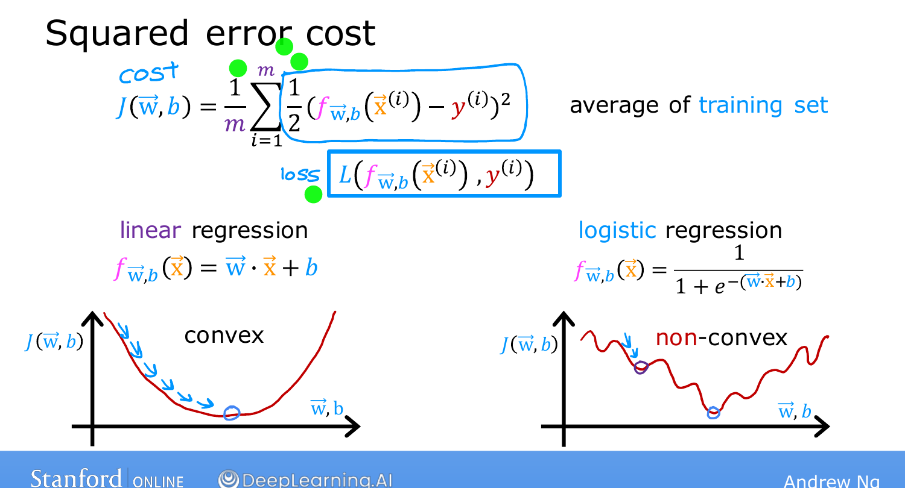
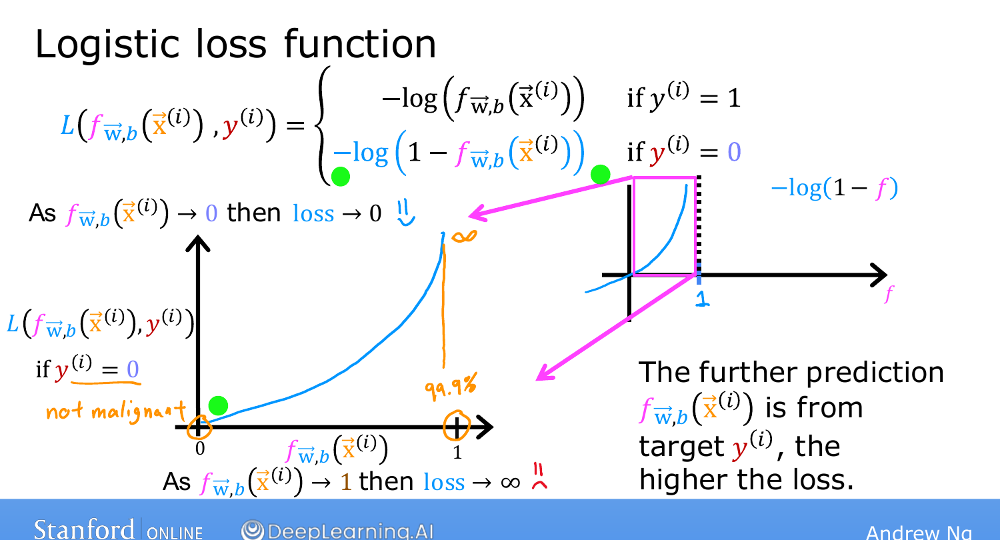
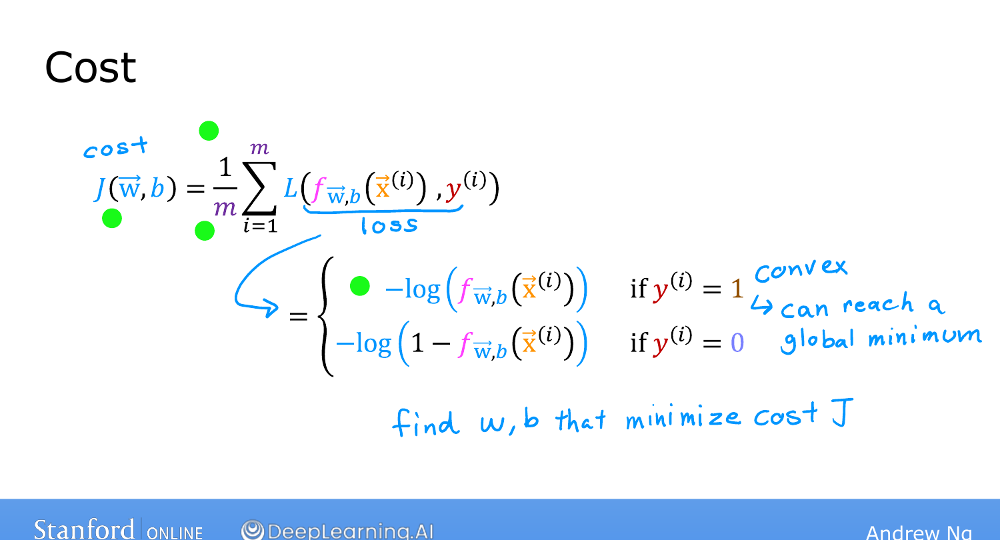

# Cost Function for Logistic Regression

> **Course 1 · Week 3** · _AI-generated study aid — not authoritative; trust the lecture & cited sources._

[← Decision Boundary](../../course-1/week-3/decision-boundary.md){ .md-button }

[Simplified Cost Function for Logistic Regression →](../../course-1/week-3/simplified-cost-function.md){ .md-button }

<iframe src="https://www.youtube-nocookie.com/embed/vq4Ie5xWhww" title="Lecture video" loading="lazy" allow="accelerometer; autoplay; clipboard-write; encrypted-media; gyroscope; picture-in-picture" allowfullscreen></iframe>

> 📄 **[Read the full lecture transcript](cost-function-for-logistic-regression-transcript.md)**

The cost function measures how well a set of parameters fits the data, so you can choose
better ones. The squared-error cost — great for linear regression — turns out to be a
**bad fit for logistic regression**. Here's why, and what replaces it. `[00:01]`

## Why squared error fails `[01:24]`

For linear regression the squared-error cost is **convex** — a single bowl — so gradient
descent slides straight to the global minimum. But plug the sigmoid
$f(\vec{x}) = \frac{1}{1+e^{-(\vec{w}\cdot\vec{x}+b)}}$ into that same squared-error cost
and it becomes **non-convex**: a wiggly surface with **many local minima** gradient
descent can get stuck in. `[02:43]`

{ .slide }
_Andrew Ng's slide — squared error is convex for linear regression but non-convex for logistic (Stanford / DeepLearning.AI)._
{ .slide-cap }

## The logistic loss `[03:11]`

Define the **loss** $L\big(f(\vec{x}), y\big)$ on a *single* example. For logistic
regression:

$$L\big(f(\vec{x}), y\big) =
\begin{cases}
-\log\big(f(\vec{x})\big) & \text{if } y = 1,\\[4pt]
-\log\big(1 - f(\vec{x})\big) & \text{if } y = 0.
\end{cases}$$

**Why this makes sense** (remember $f \in (0,1)$):

- **$y = 1$:** loss $= -\log(f)$. If the model predicts $f$ close to **1**, loss
  $\approx 0$ (you nailed it). As $f \to 0$ — confidently wrong — the loss shoots toward
  **$\infty$**. `[07:23]`
- **$y = 0$:** loss $= -\log(1-f)$. If $f$ is close to **0**, loss $\approx 0$; as
  $f \to 1$ — confidently wrong — loss $\to \infty$. `[08:45]`

{ .slide }
_Andrew Ng's loss-intuition slide for the $y=1$ case — built from $-\log(f)$ (Stanford / DeepLearning.AI)._
{ .slide-cap }

In both cases, the **further the prediction is from the true label, the higher the
loss** — and a confidently-wrong prediction is penalized severely. `[09:16]`

{ .slide }
_Andrew Ng's logistic loss, both cases slide (Stanford / DeepLearning.AI)._
{ .slide-cap }
## From loss to cost `[10:08]`

The **cost** is the average loss over all $m$ examples:

$$J(\vec{w}, b) = \frac{1}{m}\sum_{i=1}^{m} L\big(f(\vec{x}^{(i)}), y^{(i)}\big).$$

With this logistic loss, the overall cost is **convex** again, so gradient descent
reliably reaches the global minimum. (Proving convexity is beyond this course.) `[10:53]`

{ .slide }
_Andrew Ng's loss to cost slide (Stanford / DeepLearning.AI)._
{ .slide-cap }

Next: a neat trick to write this loss as a **single line** — which makes the gradient
descent implementation cleaner. `[11:45]`

[← Decision Boundary](../../course-1/week-3/decision-boundary.md){ .md-button }

[Simplified Cost Function for Logistic Regression →](../../course-1/week-3/simplified-cost-function.md){ .md-button }

