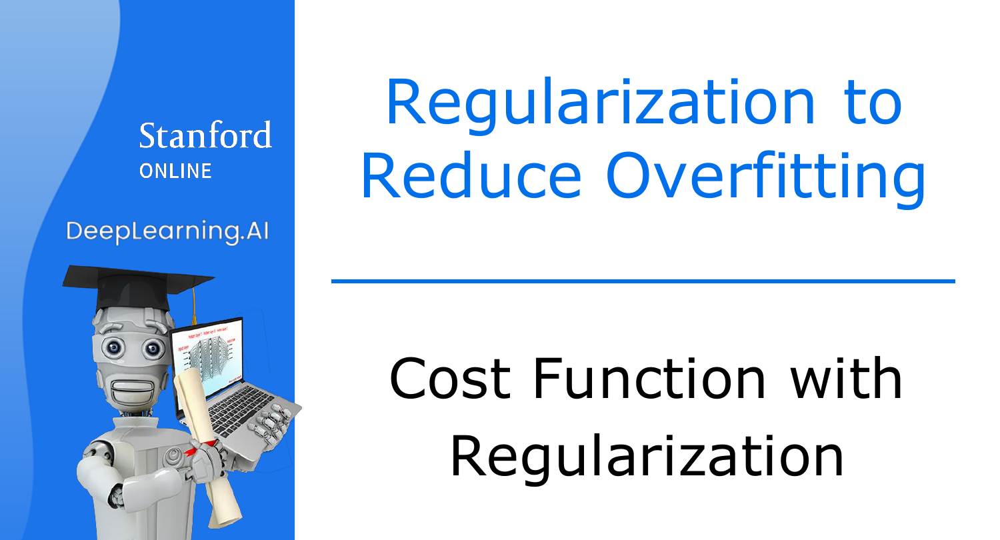
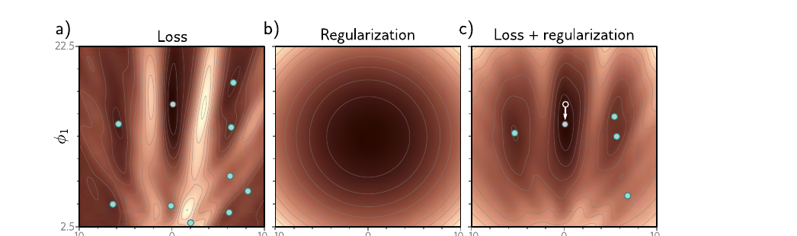
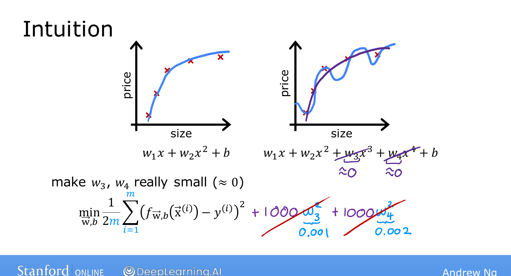
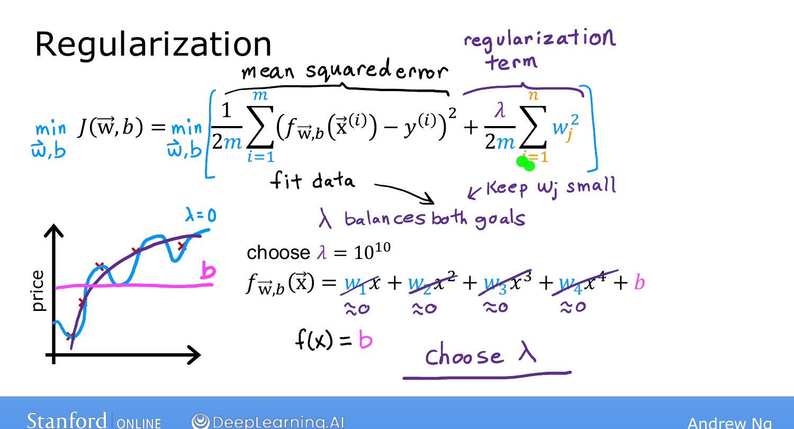

# Cost Function with Regularization

> **Course 1 · Week 3** · _AI-generated study aid — not authoritative; trust the lecture & cited sources._

[← Addressing Overfitting](../../course-1/week-3/addressing-overfitting.md){ .md-button }

[Regularized Linear Regression →](../../course-1/week-3/regularized-linear-regression.md){ .md-button }

<iframe src="https://www.youtube-nocookie.com/embed/NIiZZY7nlfU" title="Lecture video" loading="lazy" allow="accelerometer; autoplay; clipboard-write; encrypted-media; gyroscope; picture-in-picture" allowfullscreen></iframe>

> 📄 **[Read the full lecture transcript](cost-function-with-regularization-transcript.md)**

How to turn "keep the parameters small" into an actual objective gradient descent can
minimize. `[00:01]`

## The intuition: penalize big parameters `[00:41]`

Take the overfit quadratic-vs-4th-order example. Suppose you wanted $w_3$ and $w_4$
forced toward zero. You could **add a penalty** to the cost:

$$\min_{\vec{w},b}\ \underbrace{\frac{1}{2m}\sum_{i=1}^{m}\big(f(\vec{x}^{(i)}) - y^{(i)}\big)^2}_{\text{fit the data}}
\;+\; 1000\,w_3^2 + 1000\,w_4^2.$$

The only way to make this small is to drive $w_3, w_4 \approx 0$ — effectively cancelling
the $x^3$ and $x^4$ terms and recovering the smooth quadratic-like fit. `[02:27]`

{ .slide }
_Andrew Ng's penalising big parameters slide (Stanford / DeepLearning.AI)._
{ .slide-cap }
## Generalize: penalize all the weights `[02:33]`

With many features you don't know *which* to shrink, so penalize **all** of $w_1 \dots
w_n$. The regularized cost is:

$$J(\vec{w},b) = \frac{1}{2m}\sum_{i=1}^{m}\big(f(\vec{x}^{(i)}) - y^{(i)}\big)^2
\;+\; \frac{\lambda}{2m}\sum_{j=1}^{n} w_j^2.$$

- $\lambda \ge 0$ is the **regularization parameter** (like $\alpha$, you choose it).
- We scale the penalty by $\frac{\lambda}{2m}$ — the **same** $\frac{1}{2m}$ as the first
  term — so a $\lambda$ that works keeps working as the training set grows. `[05:11]`
- By convention we **don't** penalize $b$. `[05:47]`

The two terms pull in different directions: the first wants to **fit the data**, the
second wants to **keep weights small**. $\lambda$ sets the **trade-off**. `[06:26]`

!!! abstract "Deeper — Prince, *Understanding Deep Learning* §9.1"
    Prince visualizes exactly this trade-off. The data **loss** alone (left) is a rough
    surface with **many minima** — the overfitting hazard. The **regularization** term
    (middle) is a single smooth bowl centred on small parameters. Their **sum** (right) is
    the regularized objective gradient descent actually optimizes — the penalty smooths
    away spurious minima and pulls the solution toward smaller, simpler parameters.

    { .slide }
    _Prince, *Understanding Deep Learning*, Fig. 9.1 — Loss, Regularization, and Loss + regularization._
    {ponytail: external figure, used verbatim from the named source}

{ .slide }
_Andrew Ng's penalising all weights slide (Stanford / DeepLearning.AI)._
{ .slide-cap }
## What $\lambda$ does, at the extremes `[06:42]`

- **$\lambda = 0$:** no penalty → back to the **overfit**, wiggly curve. `[07:08]`
- **$\lambda$ enormous** (e.g. $10^{10}$): the penalty dominates → all $w_j \approx 0$,
  so $f(\vec{x}) \approx b$, a flat horizontal line → **underfit**. `[08:00]`
- **$\lambda$ just right:** keep all the features but fit a sensible, smooth curve.
  `[08:36]`

{ .slide }
_Andrew Ng's slide — the two-term cost and what $\lambda=0$ vs $\lambda=10^{10}$ do to the weights (Stanford / DeepLearning.AI)._
{ .slide-cap }

Next: applying this to **linear regression**, then **logistic regression**, with gradient
descent. `[08:43]`

[← Addressing Overfitting](../../course-1/week-3/addressing-overfitting.md){ .md-button }

[Regularized Linear Regression →](../../course-1/week-3/regularized-linear-regression.md){ .md-button }

