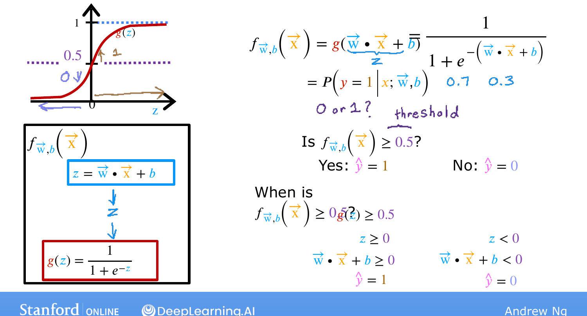
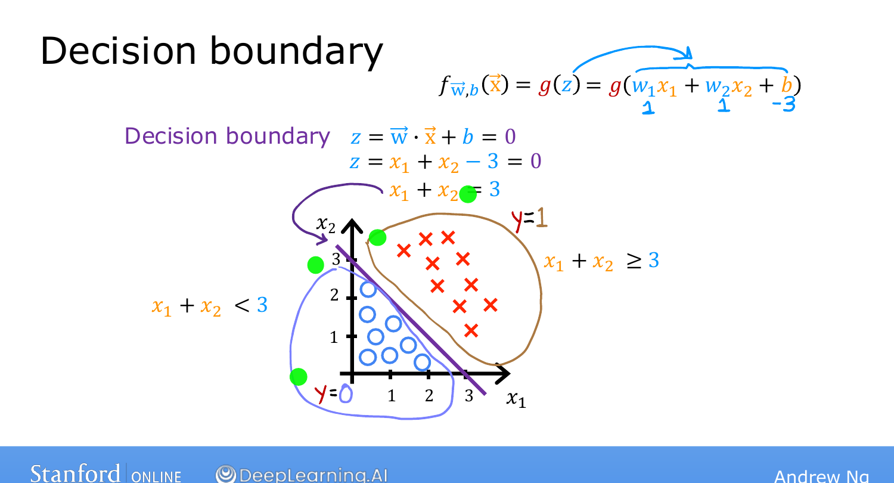
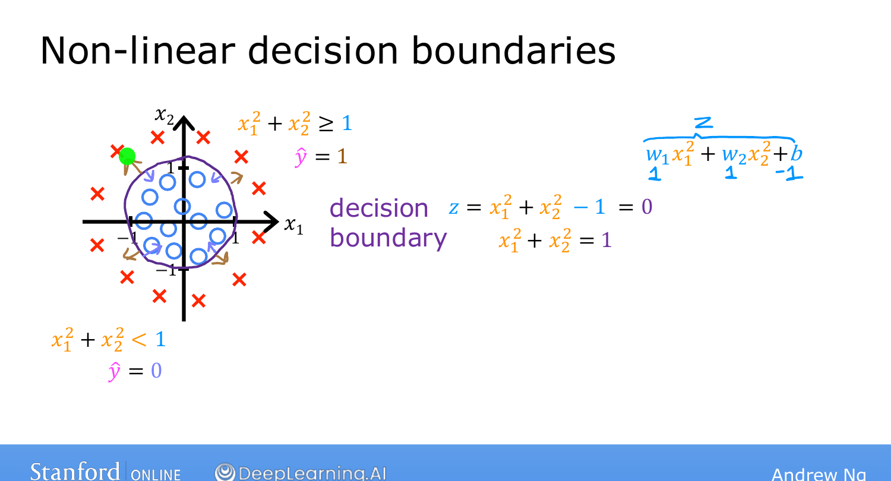

# Decision Boundary

> **Course 1 · Week 3** · _AI-generated study aid — not authoritative; trust the lecture & cited sources._

[← Logistic Regression](../../course-1/week-3/logistic-regression.md){ .md-button }

[Cost Function for Logistic Regression →](../../course-1/week-3/cost-function-for-logistic-regression.md){ .md-button }

<iframe src="https://www.youtube-nocookie.com/embed/0az8RjxLLPQ" title="Lecture video" loading="lazy" allow="accelerometer; autoplay; clipboard-write; encrypted-media; gyroscope; picture-in-picture" allowfullscreen></iframe>

> 📄 **[Read the full lecture transcript](decision-boundary-transcript.md)**

The **decision boundary** is the line (or curve) where logistic regression flips between
predicting 0 and 1 — the cleanest way to see *how* the model decides. `[00:01]`

## From probability to a 0/1 prediction `[00:24]`

The model outputs $f(\vec{x}) = g(z)$ with $z = \vec{w}\cdot\vec{x} + b$ — a number like
0.7 or 0.3. To turn that into a hard prediction $\hat{y}$, pick a **threshold**, commonly
**0.5**:

$$\hat{y} = 1 \ \text{if } f(\vec{x}) \ge 0.5, \qquad \hat{y} = 0 \ \text{if } f(\vec{x}) < 0.5.$$

{ .slide }
_Andrew Ng's the decision threshold slide (Stanford / DeepLearning.AI)._
{ .slide-cap }

_Move the weights and bias to swing the decision boundary across the plane and see which points get classified as 0 versus 1._
{ .mlw-caption }

## When does it predict 1? `[02:15]`

Chase the threshold back through the model:

- $f(\vec{x}) \ge 0.5 \iff g(z) \ge 0.5$,
- and the sigmoid satisfies $g(z) \ge 0.5 \iff z \ge 0$,
- and $z = \vec{w}\cdot\vec{x} + b$.

So the model predicts **$\hat{y}=1$ exactly when $\vec{w}\cdot\vec{x} + b \ge 0$**, and
$\hat{y}=0$ when it's $< 0$. The **decision boundary** is the set where
$\vec{w}\cdot\vec{x} + b = 0$ — there the model is neutral between the two classes.
`[03:43]`

## A linear example `[03:49]`

With two features and $w_1 = 1, w_2 = 1, b = -3$, the boundary $z=0$ is

$$x_1 + x_2 - 3 = 0 \;\Longrightarrow\; x_1 + x_2 = 3,$$

a straight line. Points to one side predict 1, the other side predict 0. `[06:07]`

{ .slide }
_Andrew Ng's decision-boundary slide — the linear boundary $x_1 + x_2 = 3$ (Stanford / DeepLearning.AI)._
{ .slide-cap }

## Non-linear boundaries with polynomial features `[06:42]`

Just like linear regression, you can feed **polynomial features** into logistic
regression. With $z = w_1 x_1^2 + w_2 x_2^2 + b$ and $w_1 = w_2 = 1, b = -1$, the
boundary $z = 0$ becomes

$$x_1^2 + x_2^2 = 1,$$

a **circle**: predict 1 *outside* it, 0 *inside*. Higher-order terms ($x_1 x_2$, etc.)
yield **ellipses** and still more complex shapes — logistic regression can fit quite
intricate data. `[08:58]`

{ .slide }
_Andrew Ng's non-linear decision-boundary slide — a circular boundary from squared features (Stanford / DeepLearning.AI)._
{ .slide-cap }

If you use **only** the raw features $x_1, x_2, \dots$ (no higher powers), the boundary
is **always a straight line**. `[10:00]`

Now that you've seen what logistic regression *can* compute, the next videos cover how to
**train** it — starting with its **cost function**. `[10:32]`

[← Logistic Regression](../../course-1/week-3/logistic-regression.md){ .md-button }

[Cost Function for Logistic Regression →](../../course-1/week-3/cost-function-for-logistic-regression.md){ .md-button }

