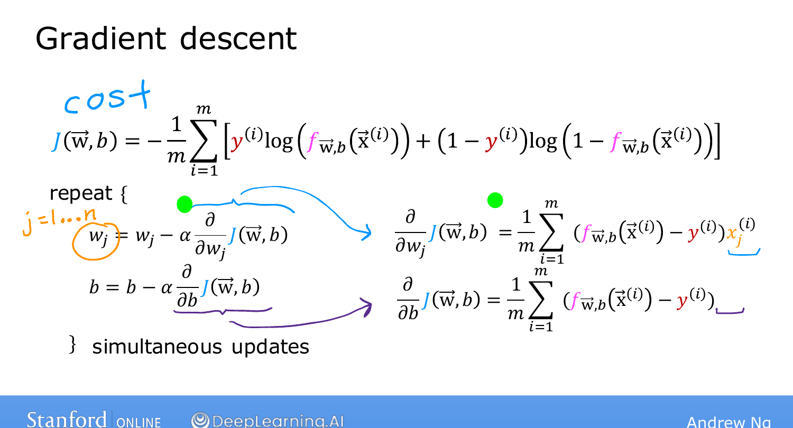
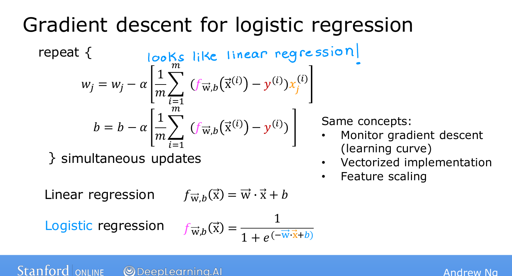

# Gradient Descent Implementation

> **Course 1 · Week 3** · _AI-generated study aid — not authoritative; trust the lecture & cited sources._

[← Simplified Cost Function for Logistic Regression](../../course-1/week-3/simplified-cost-function.md){ .md-button }

[The Problem of Overfitting →](../../course-1/week-3/the-problem-of-overfitting.md){ .md-button }

<iframe src="https://www.youtube-nocookie.com/embed/6SZUnXEHCns" title="Lecture video" loading="lazy" allow="accelerometer; autoplay; clipboard-write; encrypted-media; gyroscope; picture-in-picture" allowfullscreen></iframe>

> 📄 **[Read the full lecture transcript](gradient-descent-implementation-transcript.md)**

To fit logistic regression, find the $\vec{w}, b$ that minimize the cost
$J(\vec{w}, b)$ — using the same **gradient descent** you already know. `[00:01]`

## The update rule `[00:46]`

Repeat until convergence, updating every parameter simultaneously:

$$w_j := w_j - \alpha\,\frac{\partial}{\partial w_j} J(\vec{w}, b), \qquad
  b := b - \alpha\,\frac{\partial}{\partial b} J(\vec{w}, b).$$

Working out the derivatives of the logistic cost gives:

$$\frac{\partial J}{\partial w_j} = \frac{1}{m}\sum_{i=1}^{m}
  \big(f(\vec{x}^{(i)}) - y^{(i)}\big)\,x_j^{(i)}, \qquad
  \frac{\partial J}{\partial b} = \frac{1}{m}\sum_{i=1}^{m}
  \big(f(\vec{x}^{(i)}) - y^{(i)}\big).$$

{ .slide }
_Andrew Ng's the update rule slide (Stanford / DeepLearning.AI)._
{ .slide-cap }
## "Wait — that's identical to linear regression!" `[02:55]`

The update equations look **exactly** like the ones for linear regression. So is logistic
regression secretly the same algorithm? **No** — because the definition of $f$ is
different: `[03:13]`

- Linear regression: $f(\vec{x}) = \vec{w}\cdot\vec{x} + b$.
- Logistic regression: $f(\vec{x}) = g(\vec{w}\cdot\vec{x} + b)$ — the **sigmoid** of the
  same expression.

Same-looking update, **two genuinely different algorithms**. `[03:53]`

{ .slide }
_Andrew Ng's same form, different f slide (Stanford / DeepLearning.AI)._
{ .slide-cap }
## Same tooling carries over `[03:53]`

Everything you learned for linear-regression gradient descent applies here too:

- **Monitor convergence** with the same learning-curve plot. `[04:08]`
- **Vectorize** the implementation to make it run faster. `[04:33]`
- **Feature-scale** the inputs to comparable ranges to speed convergence. `[05:05]`

You now know how to implement logistic regression — a very powerful, very widely used
algorithm — end to end. The remaining topics tackle a practical problem that affects
*both* regression and classification: **overfitting**. `[06:28]`

[← Simplified Cost Function for Logistic Regression](../../course-1/week-3/simplified-cost-function.md){ .md-button }

[The Problem of Overfitting →](../../course-1/week-3/the-problem-of-overfitting.md){ .md-button }

