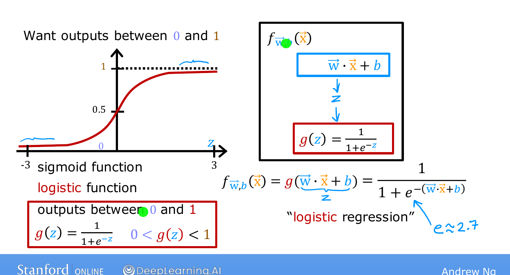
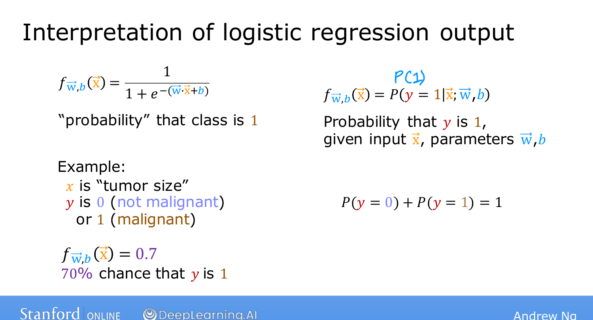

# Logistic Regression

> **Course 1 · Week 3** · _AI-generated study aid — not authoritative; trust the lecture & cited sources._

[← Motivations](../../course-1/week-3/classification-motivations.md){ .md-button }

[Decision Boundary →](../../course-1/week-3/decision-boundary.md){ .md-button }

<iframe src="https://www.youtube-nocookie.com/embed/xuTiAW0OR40" title="Lecture video" loading="lazy" allow="accelerometer; autoplay; clipboard-write; encrypted-media; gyroscope; picture-in-picture" allowfullscreen></iframe>

> 📄 **[Read the full lecture transcript](logistic-regression-transcript.md)**

**Logistic regression** is probably the single most widely used classification algorithm
in the world. Instead of a straight line, it fits an **S-shaped curve** to the data.
`[00:00]`

## The sigmoid function `[01:32]`

The building block is the **sigmoid** (a.k.a. **logistic**) function, which maps any
input $z$ to an output **between 0 and 1**:

$$g(z) = \frac{1}{1 + e^{-z}},$$

where $e \approx 2.7$. Reading off its behaviour:

- **$z$ large positive** → $e^{-z}$ is tiny → $g(z) \approx 1$.
- **$z$ large negative** → $e^{-z}$ is huge → $g(z) \approx 0$.
- **$z = 0$** → $e^{0} = 1$ → $g(z) = \tfrac{1}{1+1} = 0.5$. `[04:05]`

That's the S-shape: it starts near 0, passes through 0.5 at $z=0$, and rises toward 1.
`[04:11]`

{ .slide }
_Andrew Ng's sigmoid slide (Stanford / DeepLearning.AI)._
{ .slide-cap }

_Drag the input $z$ back and forth to see the sigmoid squash it into a 0-to-1 probability, passing through 0.5 at $z=0$._
{ .mlw-caption }

## Building the model `[04:15]`

Two steps. First, compute the familiar linear expression and call it $z$:

$$z = \vec{w}\cdot\vec{x} + b.$$

Then pass $z$ through the sigmoid. Together:

$$f_{\vec{w},b}(\vec{x}) = g(\vec{w}\cdot\vec{x} + b) = \frac{1}{1 + e^{-(\vec{w}\cdot\vec{x} + b)}}.$$

The model takes features $\vec{x}$ and outputs a number between 0 and 1. `[05:31]`

## Interpreting the output `[05:50]`

Think of the output as the **probability that $y = 1$**. If a patient's tumor gives
$f(\vec{x}) = 0.7$, the model thinks there's a **70% chance** the tumor is malignant
($y=1$). Since $y$ is 0 or 1, the chance of $y=0$ is the remaining **30%**. `[07:32]`

(You may see this written $f(\vec{x}) = P(y=1 \mid \vec{x};\, \vec{w}, b)$ — the
semicolon just signals that $\vec{w}, b$ are parameters. You don't need this notation for
the course.) `[08:21]`

{ .slide }
_Andrew Ng's interpreting the output slide (Stanford / DeepLearning.AI)._
{ .slide-cap }
## Try it — implement the sigmoid `[08:21]`

Implement $g(z)$ with NumPy so it works **element-wise** on an array (use `np.exp`).
**Run**, then **Validate**:

{{ IDE('sigmoid_exo') }}

Next: visualizing predictions through the **decision boundary**. `[09:13]`

[← Motivations](../../course-1/week-3/classification-motivations.md){ .md-button }

[Decision Boundary →](../../course-1/week-3/decision-boundary.md){ .md-button }

