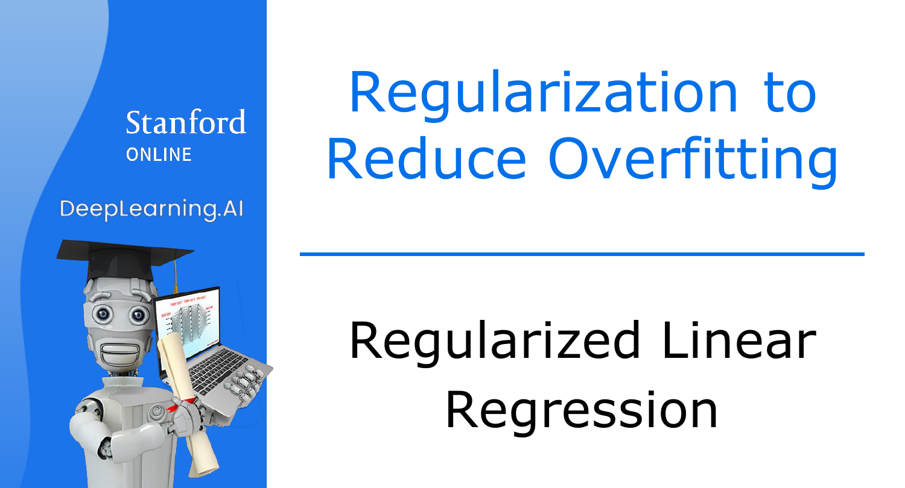
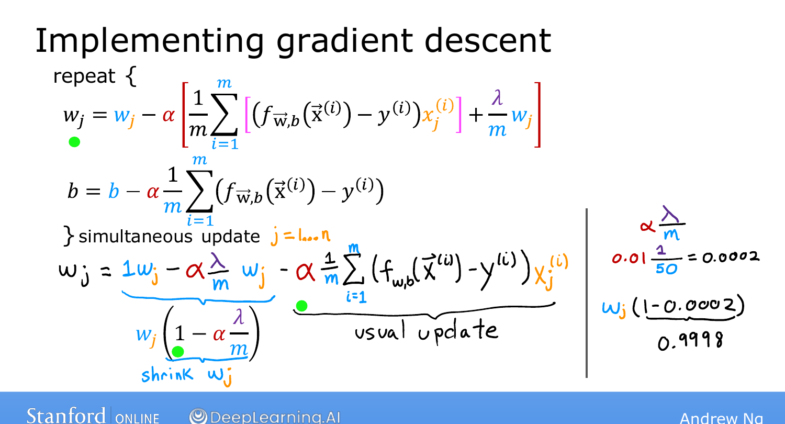

# Regularized Linear Regression

> **Course 1 · Week 3** · _AI-generated study aid — not authoritative; trust the lecture & cited sources._

[← Cost Function with Regularization](../../course-1/week-3/cost-function-with-regularization.md){ .md-button }

[Regularized Logistic Regression →](../../course-1/week-3/regularized-logistic-regression.md){ .md-button }

<iframe src="https://www.youtube-nocookie.com/embed/jhrrw8Iuus0" title="Lecture video" loading="lazy" allow="accelerometer; autoplay; clipboard-write; encrypted-media; gyroscope; picture-in-picture" allowfullscreen></iframe>

> 📄 **[Read the full lecture transcript](regularized-linear-regression-transcript.md)**

How to run gradient descent on the **regularized** linear-regression cost. `[00:01]`

## The update rule `[00:42]`

The gradient descent updates look **identical in form** to before — only the derivative
of $J$ with respect to $w_j$ gains one extra term:

$$w_j := w_j - \alpha\left[\frac{1}{m}\sum_{i=1}^{m}\big(f(\vec{x}^{(i)}) - y^{(i)}\big)x_j^{(i)}
   \;+\; \frac{\lambda}{m}\,w_j\right],$$
$$b := b - \alpha\,\frac{1}{m}\sum_{i=1}^{m}\big(f(\vec{x}^{(i)}) - y^{(i)}\big).$$

The $b$ update is **unchanged** — we don't regularize $b$. Only $w_j$ gets the extra
$\frac{\lambda}{m}w_j$. (Remember to update all parameters **simultaneously**.) `[02:50]`

{ .slide }
_Andrew Ng's the regularised update slide (Stanford / DeepLearning.AI)._
{ .slide-cap }
## Why it shrinks the weights (optional intuition) `[03:31]`

Rearrange the $w_j$ update:

$$w_j := w_j\left(1 - \alpha\frac{\lambda}{m}\right) - \alpha\,\frac{1}{m}\sum_{i=1}^{m}\big(f(\vec{x}^{(i)}) - y^{(i)}\big)x_j^{(i)}.$$

The second part is the **ordinary** (unregularized) update from Week 2. The new piece is
the **multiplier** $\big(1 - \alpha\frac{\lambda}{m}\big)$ on $w_j$. With typical numbers
— $\alpha = 0.01$, $\lambda = 1$, $m = 50$ — that factor is

$$1 - \tfrac{0.01 \times 1}{50} = 1 - 0.0002 = 0.9998,$$

just **slightly less than 1**. So every iteration first **multiplies $w_j$ by ~0.9998**
(shrinking it a touch) and *then* does the usual update. That repeated shrinkage is
exactly how regularization keeps the weights small. `[06:24]`

(The full derivative derivation is optional and not needed for the labs or quizzes.)
`[08:24]`

With this you can reduce overfitting in linear regression whenever you have many features
and limited data. Next, the same idea for **logistic regression**. `[08:49]`

{ .slide }
_Andrew Ng's why weights shrink slide (Stanford / DeepLearning.AI)._
{ .slide-cap }

[← Cost Function with Regularization](../../course-1/week-3/cost-function-with-regularization.md){ .md-button }

[Regularized Logistic Regression →](../../course-1/week-3/regularized-logistic-regression.md){ .md-button }

