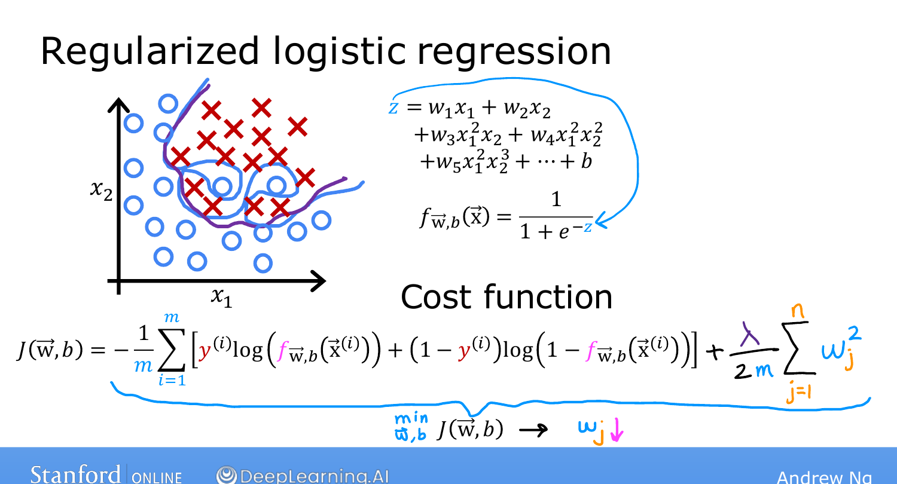
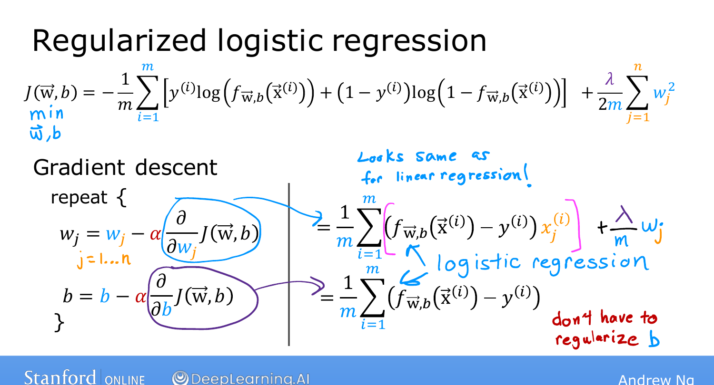

# Regularized Logistic Regression

> **Course 1 · Week 3** · _AI-generated study aid — not authoritative; trust the lecture & cited sources._

[← Regularized Linear Regression](../../course-1/week-3/regularized-linear-regression.md){ .md-button }

[Neurons and the Brain →](../../course-2/week-1/neurons-and-the-brain.md){ .md-button }

<iframe src="https://www.youtube-nocookie.com/embed/NhZXRzH2y-E" title="Lecture video" loading="lazy" allow="accelerometer; autoplay; clipboard-write; encrypted-media; gyroscope; picture-in-picture" allowfullscreen></iframe>

> 📄 **[Read the full lecture transcript](regularized-logistic-regression-transcript.md)**

The final piece: regularizing logistic regression — which, like everything this week,
looks **almost identical** to the linear-regression version. `[00:01]`

## The regularized cost `[01:00]`

Logistic regression with many high-order polynomial features can overfit, producing an
overly contorted decision boundary. To fix it, add the **same penalty term** to the
logistic cost:

$$J(\vec{w},b) = -\frac{1}{m}\sum_{i=1}^{m}\Big[ y^{(i)}\log\big(f(\vec{x}^{(i)})\big)
  + \big(1-y^{(i)}\big)\log\big(1-f(\vec{x}^{(i)})\big)\Big]
  \;+\; \frac{\lambda}{2m}\sum_{j=1}^{n} w_j^2.$$

Minimizing this keeps $w_1 \dots w_n$ from getting too large, so even a high-order
polynomial yields a **reasonable, smoother decision boundary** that generalizes better.
`[02:00]`

{ .slide }
_Andrew Ng's slide — the regularized logistic cost on a high-order-polynomial classifier (Stanford / DeepLearning.AI)._
{ .slide-cap }

## The update rule `[02:30]`

Gradient descent has the **same shape** as regularized linear regression — only the extra
$\frac{\lambda}{m}w_j$ term on the $w_j$ derivative:

$$w_j := w_j - \alpha\left[\frac{1}{m}\sum_{i=1}^{m}\big(f(\vec{x}^{(i)}) - y^{(i)}\big)x_j^{(i)}
   \;+\; \frac{\lambda}{m}\,w_j\right],$$
$$b := b - \alpha\,\frac{1}{m}\sum_{i=1}^{m}\big(f(\vec{x}^{(i)}) - y^{(i)}\big).$$

It's the **exact same equation** as regularized linear regression — the only difference is
that $f$ here is the **sigmoid** $g(\vec{w}\cdot\vec{x}+b)$, not the linear function. As
before, $b$ is **not** regularized. `[03:24]`

{ .slide }
_Andrew Ng's the regularised logistic update slide (Stanford / DeepLearning.AI)._
{ .slide-cap }
## End of Course 1 🎉 `[03:59]`

With just **linear regression** and **logistic regression** — plus knowing **when and how
to reduce overfitting** — you can already build genuinely valuable applications; Ng calls
overfitting-management one of the most valuable real-world skills. `[04:34]`

Course 2 builds on exactly these foundations — **cost functions, gradient descent, and
the sigmoid** — to construct **neural networks**. `[05:21]`

[← Regularized Linear Regression](../../course-1/week-3/regularized-linear-regression.md){ .md-button }

[Neurons and the Brain →](../../course-2/week-1/neurons-and-the-brain.md){ .md-button }

