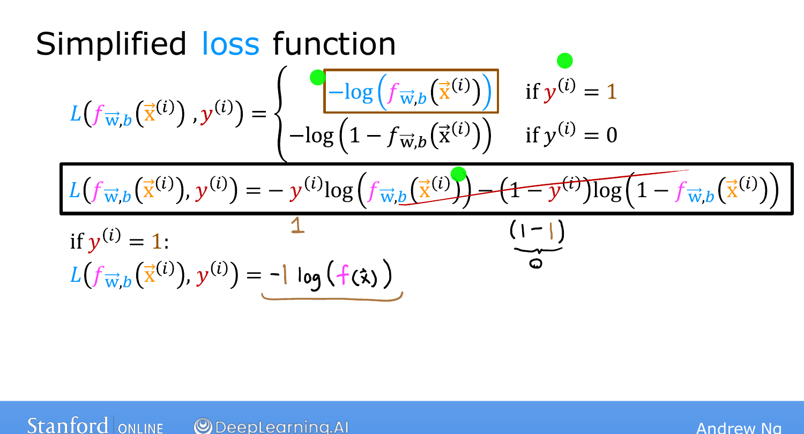
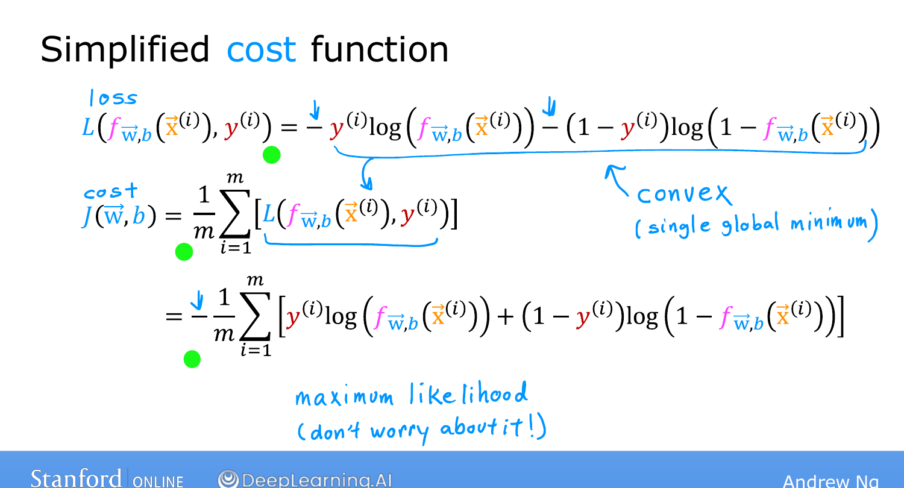

# Simplified Cost Function for Logistic Regression

> **Course 1 · Week 3** · _AI-generated study aid — not authoritative; trust the lecture & cited sources._

[← Cost Function for Logistic Regression](../../course-1/week-3/cost-function-for-logistic-regression.md){ .md-button }

[Gradient Descent Implementation →](../../course-1/week-3/gradient-descent-implementation.md){ .md-button }

<iframe src="https://www.youtube-nocookie.com/embed/YkTcK_LXAxw" title="Lecture video" loading="lazy" allow="accelerometer; autoplay; clipboard-write; encrypted-media; gyroscope; picture-in-picture" allowfullscreen></iframe>

> 📄 **[Read the full lecture transcript](simplified-cost-function-transcript.md)**

The two-case loss from the last topic can be written as a **single line** — which makes
the gradient-descent implementation simpler. `[00:01]`

## Collapsing the two cases `[00:23]`

Because $y$ is **only ever 0 or 1**, you can fold both cases into one expression:

$$L\big(f(\vec{x}), y\big) = -y\,\log\big(f(\vec{x})\big) - (1-y)\,\log\big(1 - f(\vec{x})\big).$$

Check that it reproduces the two cases:

- **$y = 1$:** the second term has $(1-y) = 0$, so it vanishes, leaving $-\log(f)$. ✓
- **$y = 0$:** the first term has $y = 0$, so it vanishes, leaving $-\log(1-f)$. ✓

One formula, no case split. `[03:13]`

{ .slide }
_Andrew Ng's the collapsed loss slide (Stanford / DeepLearning.AI)._
{ .slide-cap }
## The cost function everyone uses `[03:19]`

The cost is the average loss; substituting the one-line loss gives

$$J(\vec{w}, b) = -\frac{1}{m}\sum_{i=1}^{m}
  \Big[\, y^{(i)}\log\big(f(\vec{x}^{(i)})\big)
  + \big(1 - y^{(i)}\big)\log\big(1 - f(\vec{x}^{(i)})\big) \,\Big].$$

This is **the** cost function used to train logistic regression almost everywhere. It
isn't arbitrary: it's derived from statistics via **maximum likelihood estimation**, and
it has the crucial property of being **convex**. (You don't need the MLE details for this
course.) `[04:56]`

{ .slide }
_Andrew Ng's the logistic cost slide (Stanford / DeepLearning.AI)._
{ .slide-cap }
## Try it — implement the logistic cost `[04:56]`

Given predictions `f` (already passed through the sigmoid) and labels `y`, compute the
average logistic cost with the one-line formula above. **Run**, then **Validate**:

{{ IDE('logistic-cost_exo') }}

With the simplified cost in hand, we're ready to apply **gradient descent** to logistic
regression. `[05:34]`

[← Cost Function for Logistic Regression](../../course-1/week-3/cost-function-for-logistic-regression.md){ .md-button }

[Gradient Descent Implementation →](../../course-1/week-3/gradient-descent-implementation.md){ .md-button }

