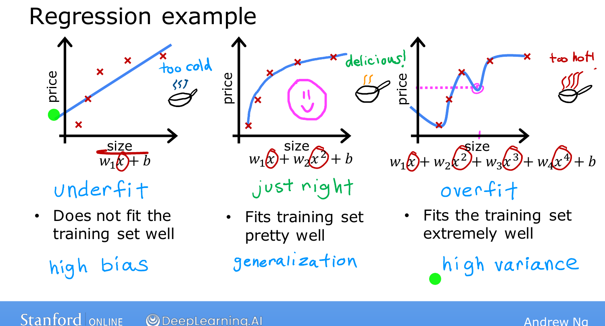
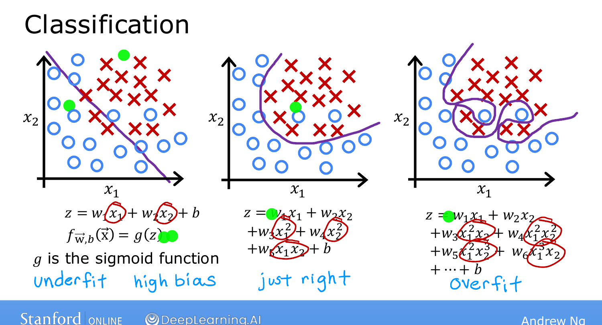

# The Problem of Overfitting

> **Course 1 · Week 3** · _AI-generated study aid — not authoritative; trust the lecture & cited sources._

[← Gradient Descent Implementation](../../course-1/week-3/gradient-descent-implementation.md){ .md-button }

[Addressing Overfitting →](../../course-1/week-3/addressing-overfitting.md){ .md-button }

<iframe src="https://www.youtube-nocookie.com/embed/8upNQi-40Q8" title="Lecture video" loading="lazy" allow="accelerometer; autoplay; clipboard-write; encrypted-media; gyroscope; picture-in-picture" allowfullscreen></iframe>

> 📄 **[Read the full lecture transcript](the-problem-of-overfitting-transcript.md)**

Linear and logistic regression work well for many tasks, but they can hit a problem
called **overfitting** that makes them perform poorly. This topic defines overfitting and
its near-opposite, **underfitting**; the next ones fix it with **regularization**.
`[00:02]`

## Three fits, from too-simple to too-complex `[00:51]`

Predicting house price from size, with five data points:

- **Underfit (high bias).** Fit a straight line. The data clearly curves and flattens,
  so the line fits poorly. We say the model **underfits** / has **high bias** — as if it
  has a strong preconception that price is linear, despite the data. `[02:03]`
- **Just right.** Fit a **quadratic** ($x$ and $x^2$). It tracks the data well *and* would
  predict a new, unseen house sensibly — it **generalizes**. `[04:34]`
- **Overfit (high variance).** Fit a **4th-order polynomial** ($x, x^2, x^3, x^4$). It
  passes through all five points *exactly* (cost = 0!) but is wildly wiggly. It has fit
  the data **too well** and won't generalize. `[06:08]`

{ .slide }
_Andrew Ng's overfitting slide — underfit vs. just-right vs. overfit (Stanford / DeepLearning.AI)._
{ .slide-cap }

## Bias and variance `[06:08]`

- **High bias = underfit:** the model can't even capture the training pattern.
- **High variance = overfit:** the model tries so hard to hit every point that a *slightly*
  different training set would produce a *totally* different fit — hence "high variance."

The goal of machine learning is a model that is **neither** — like Goldilocks' porridge,
*just right*. `[07:42]`

## Overfitting in classification too `[08:47]`

The same three-way story holds for logistic regression on a 2-feature tumor problem:

- a **straight-line** decision boundary underfits (high bias),
- **quadratic features** give an ellipse-ish boundary that's **just right** (it needn't
  classify every point perfectly), and
- a **very high-order polynomial** contorts into an overly complex boundary that overfits
  (high variance). `[11:19]`

{ .slide }
_Andrew Ng's classification-overfitting slide (Stanford / DeepLearning.AI)._
{ .slide-cap }

Next: how to **address** overfitting. `[11:31]`

[← Gradient Descent Implementation](../../course-1/week-3/gradient-descent-implementation.md){ .md-button }

[Addressing Overfitting →](../../course-1/week-3/addressing-overfitting.md){ .md-button }

