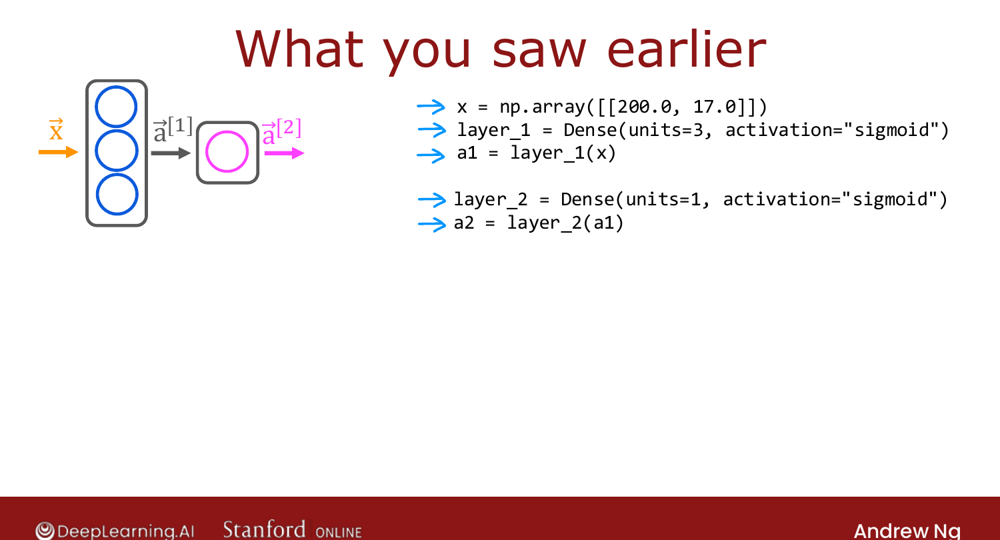
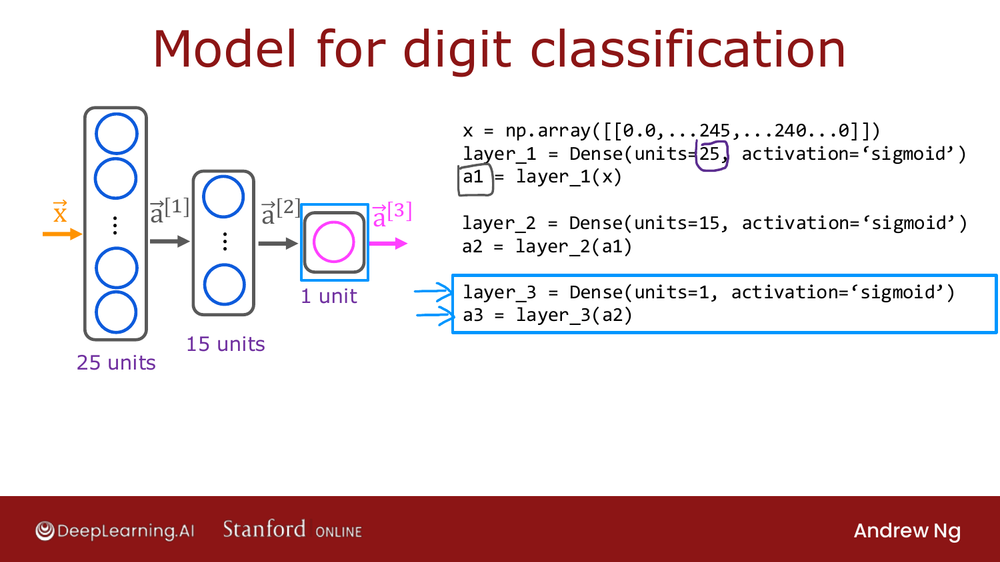
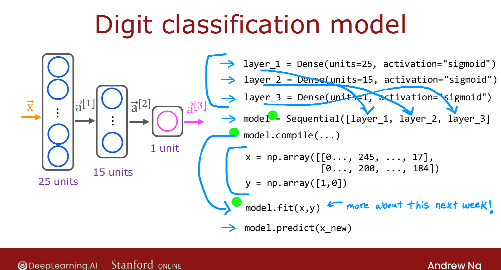

# Building a Neural Network

> **Course 2 · Week 1** · _AI-generated study aid — not authoritative; trust the lecture & cited sources._

<div class="ep-nav" markdown>

[← Data in TensorFlow](../../course-2/week-1/data-in-tensorflow.md){ .md-button }

[Forward Prop in a Single Layer →](../../course-2/week-1/forward-prop-in-a-single-layer.md){ .md-button }

</div>

<div class="video-wrap"><video controls preload="none" playsinline src="https://dyckms5inbsqq.cloudfront.net/dlai/advanced-learning-algorithms/W1/L10-C2W1L03S03-building-a-neural-net/lc-advanced-learning-algorithms-W1-L10-C2W1L03S03-building-a-neural-net-master_360p.mp4?v=1752484660">Your browser can't play this video — <a href="https://dyckms5inbsqq.cloudfront.net/dlai/advanced-learning-algorithms/W1/L10-C2W1L03S03-building-a-neural-net/lc-advanced-learning-algorithms-W1-L10-C2W1L03S03-building-a-neural-net-master_360p.mp4?v=1752484660">download the lecture</a>.</video></div>

> 📄 **[Read the full lecture transcript](building-a-neural-network-transcript.md)**

A simpler way to build a network in TensorFlow — let the framework string the layers
together for you with **`Sequential`**. `[00:01]`

## From manual layers to Sequential

Previously you applied each layer by hand: create `layer_1`, compute `a1`, create
`layer_2`, compute `a2`. Instead, tell TensorFlow to **chain** the layers into one model:

```python
model = Sequential([
    Dense(units=3, activation='sigmoid'),
    Dense(units=1, activation='sigmoid'),
])
```

`Sequential` says "string these layers together into a neural network." That unlocks a lot
of automation. `[01:50]`


{ .slide }
_Official C2 slide — the Sequential model (DeepLearning.AI / Stanford)._
{ .slide-cap }
## Train and predict in a few lines

Store the training data as a matrix `X` (e.g. a 4×2 NumPy array) and labels `y` (a 1-D
array). Then:

```python
model.compile(...)        # details next week
model.fit(X, y)           # trains the network on your data
model.predict(X_new)      # runs forward propagation -> prediction
```

- **`model.fit`** trains the chained network (the `compile`/`fit` details come in Week 2).
- **`model.predict`** carries out forward propagation (inference) for new inputs. `[04:05]`

By convention, people inline the layers directly into `Sequential` rather than naming
`layer_1`, `layer_2` — so most TensorFlow code looks like the compact form above. `[04:59]`

{ .slide }
_Official C2 slide — the same pattern scales to the 25→15→1 digit classifier (DeepLearning.AI / Stanford)._
{ .slide-cap }


{ .slide }
_Official C2 slide — a digit model in TensorFlow (DeepLearning.AI / Stanford)._
{ .slide-cap }
## Don't just call five lines blindly

You can build a "crazy complicated" network in ~5 lines — but Ng's point: **understand
what's under the hood.** Most ML engineers rarely hand-code forward propagation (they use
TensorFlow/PyTorch), but knowing how it works makes you far more effective at **debugging**
when something breaks. So the next videos implement forward propagation **from scratch in
Python**. `[07:01]`


<div class="ep-nav" markdown>

[← Data in TensorFlow](../../course-2/week-1/data-in-tensorflow.md){ .md-button }

[Forward Prop in a Single Layer →](../../course-2/week-1/forward-prop-in-a-single-layer.md){ .md-button }

</div>
