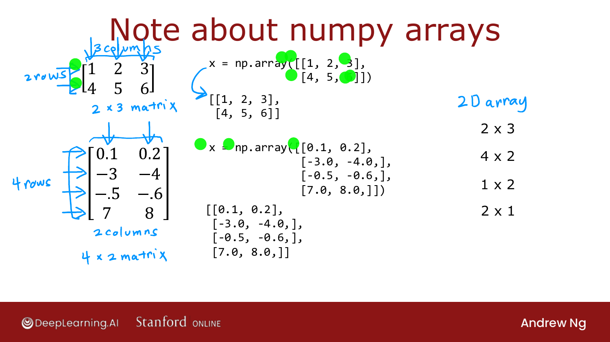
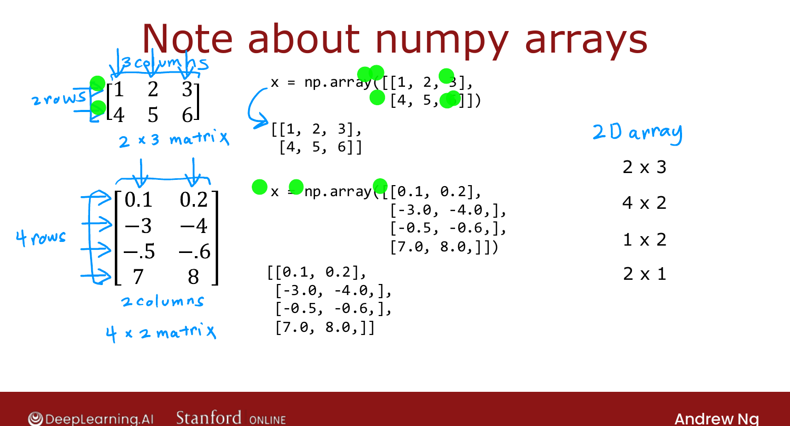
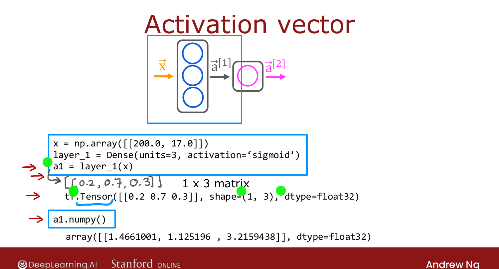

# Data in TensorFlow

> **Course 2 · Week 1** · _AI-generated study aid — not authoritative; trust the lecture & cited sources._

<div class="ep-nav" markdown>

[← Inference in Code (TensorFlow)](../../course-2/week-1/inference-in-code.md){ .md-button }

[Building a Neural Network →](../../course-2/week-1/building-a-neural-network.md){ .md-button }

</div>

<div class="video-wrap"><video controls preload="none" playsinline src="https://dyckms5inbsqq.cloudfront.net/dlai/advanced-learning-algorithms/W1/L9-C2W1L03S02-data-in-tensorflow-L9/lc-advanced-learning-algorithms-W1-L9-C2W1L03S02-data-in-tensorflow-L9-master_360p.mp4?v=1752484660">Your browser can't play this video — <a href="https://dyckms5inbsqq.cloudfront.net/dlai/advanced-learning-algorithms/W1/L9-C2W1L03S02-data-in-tensorflow-L9/lc-advanced-learning-algorithms-W1-L9-C2W1L03S02-data-in-tensorflow-L9-master_360p.mp4?v=1752484660">download the lecture</a>.</video></div>

> 📄 **[Read the full lecture transcript](data-in-tensorflow-transcript.md)**

A consistent mental model for how data is represented in **NumPy** and **TensorFlow** —
because, due to history, the two libraries don't always agree, and getting the shapes
right matters. `[00:02]`

## Matrices are 2-D arrays of numbers

A **matrix** is a grid; its dimension is **rows × columns**. A 2×3 matrix:

```python
x = np.array([[1, 2, 3],
              [4, 5, 6]])     # 2 rows, 3 columns
```

The inner brackets are rows; the outer bracket groups them. `[03:31]`

## Row vectors, column vectors, and 1-D arrays

This is the crux:

- `np.array([[200, 17]])` → a **1×2 matrix** (one row, two columns) — a **row vector**.
- `np.array([[200], [17]])` → a **2×1 matrix** — a **column vector**.
- `np.array([200, 17])` → a **1-D array** — *no* rows or columns, just a list of numbers.

{ .slide }
_Official C2 slide — 2-D matrices vs. a 1-D vector in NumPy (DeepLearning.AI / Stanford)._
{ .slide-cap }

In Course 1 (linear/logistic regression) we used **1-D vectors** for $\vec{x}$. With
TensorFlow the convention is to use **matrices** (the double-bracket form) — that's why
`x = np.array([[200.0, 17.0]])`. TensorFlow uses matrices because it was built for **very
large datasets**, and matrices let it run more efficiently internally. `[06:16]`


{ .slide }
_Official C2 slide — NumPy array shapes (DeepLearning.AI / Stanford)._
{ .slide-cap }
## Tensors

When you compute `a1 = layer_1(x)`, the result is a **`tf.Tensor`**, e.g. a 1×3 tensor of
`float32` values. A **tensor** is TensorFlow's data type for storing and computing on
matrices efficiently — for this course, **just think "matrix."** `[08:15]`

Converting between the two worlds:

```python
a1.numpy()      # tensor  -> NumPy array
```

So the workflow is: load/manipulate data in NumPy → pass to TensorFlow (it converts to its
internal tensor format) → read results back as tensors or convert to NumPy. It's an
artifact of history, but worth being aware of when you write code. `[11:11]`

{ .slide }
_Official C2 slide — the activation tensor (DeepLearning.AI / Stanford)._
{ .slide-cap }


Next: put it all together to actually **build** a neural network. `[11:16]`


<div class="ep-nav" markdown>

[← Inference in Code (TensorFlow)](../../course-2/week-1/inference-in-code.md){ .md-button }

[Building a Neural Network →](../../course-2/week-1/building-a-neural-network.md){ .md-button }

</div>
