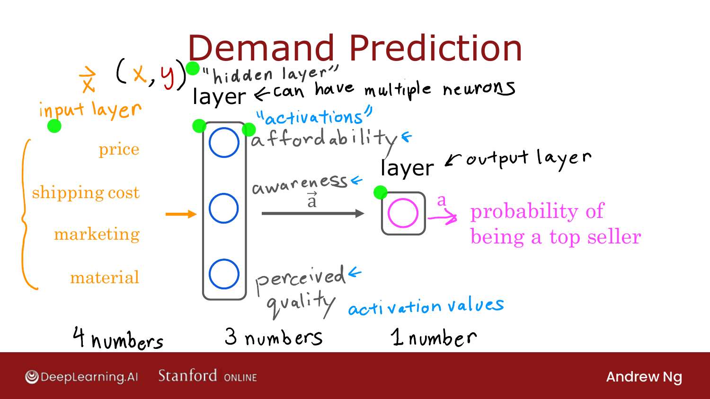
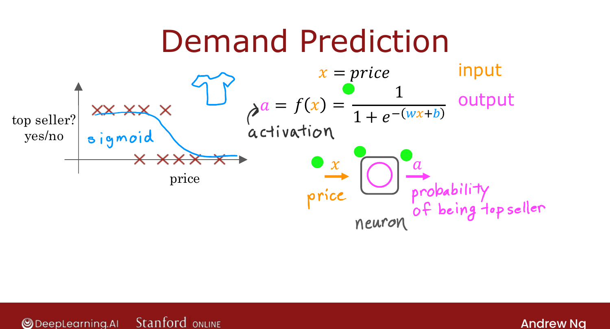
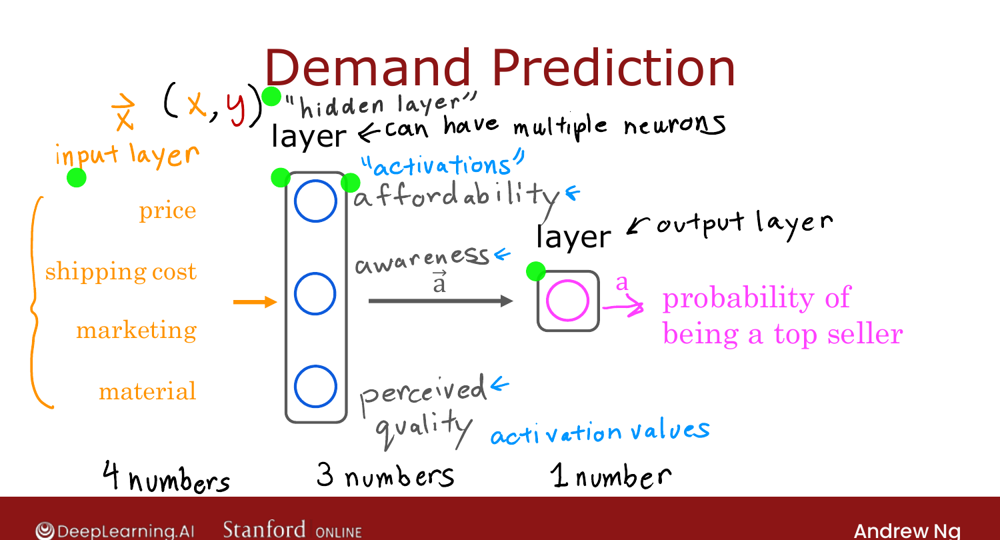

# Demand Prediction

> **Course 2 · Week 1** · _AI-generated study aid — not authoritative; trust the lecture & cited sources._

[← Neurons and the Brain](../../course-2/week-1/neurons-and-the-brain.md){ .md-button }

[Example: Recognizing Images →](../../course-2/week-1/example-recognizing-images.md){ .md-button }

<video controls preload="none" playsinline src="https://dyckms5inbsqq.cloudfront.net/dlai/advanced-learning-algorithms/W1/L3-C2W1L01S03-demand-prediction-L3/lc-advanced-learning-algorithms-W1-L3-C2W1L01S03-demand-prediction-L3-master_360p.mp4?v=1752484659">Your browser can't play this video — <a href="https://dyckms5inbsqq.cloudfront.net/dlai/advanced-learning-algorithms/W1/L3-C2W1L01S03-demand-prediction-L3/lc-advanced-learning-algorithms-W1-L3-C2W1L01S03-demand-prediction-L3-master_360p.mp4?v=1752484659">download the lecture</a>.</video>

> 📄 **[Read the full lecture transcript](demand-prediction-transcript.md)**

A worked example that introduces **all the core neural-network vocabulary** in one
picture: layers, neurons, activations.

## From logistic regression to a neuron

Predict whether a T-shirt will be a **top seller** from its **price** $x$. In Course 1
you'd fit logistic regression: $a = g(wx+b) = \tfrac{1}{1+e^{-(wx+b)}}$. Think of that
single computation as **one neuron**: it takes an input $x$, and outputs the
**activation** $a$ — the probability of being a top seller. ("Activation" is a
neuroscience term for how much a neuron sends to downstream neurons.)

## Wiring neurons into a network

Now use **four** input features — price, shipping cost, marketing, material. Instead of
one neuron, use a small group:

- A **layer** of three neurons each look at the inputs and compute an intermediate
  quantity — you might interpret them as **affordability**, **awareness**, and
  **perceived quality**.
- Those three numbers form an **activation vector $\vec{a}$**, which feeds a final
  **output neuron** that produces the probability of being a top seller.

{ .slide }
_Official C2 slide — input layer, hidden layer, and output layer (DeepLearning.AI / Stanford)._
{ .slide-cap }

{ .slide }
_Official C2 slide — a layer of neurons (DeepLearning.AI / Stanford)._
{ .slide-cap }
## The vocabulary

- **Input layer:** the vector of features $\vec{x}$ (here, 4 numbers).
- **Hidden layer:** the middle layer of neurons (3 numbers). "Hidden" because the
  training data shows you the inputs and the final output, but **not** the correct values
  of these middle activations.
- **Output layer:** the final neuron producing $a$ (1 number).
- Each layer takes a vector of numbers and outputs a vector of numbers.

A key practical point: **every neuron in a layer has access to every feature** from the
previous layer. You don't hand-wire which neuron sees which input — the network learns
its own "affordability/awareness/quality"-like features during training. That automatic
**feature learning** is the superpower neural networks have over hand-engineered features.

## Multiple hidden layers

You can stack several hidden layers — the output activations of one layer become the
inputs of the next. The number of layers and neurons-per-layer is the network's
**architecture**, a design choice we'll return to. A network with multiple hidden layers
is what people mean by **deep learning**.

{ .slide }
_Official C2 slide — input, hidden, and output layers (DeepLearning.AI / Stanford)._
{ .slide-cap }

Next: the same idea applied to **images** — face and car recognition.

[← Neurons and the Brain](../../course-2/week-1/neurons-and-the-brain.md){ .md-button }

[Example: Recognizing Images →](../../course-2/week-1/example-recognizing-images.md){ .md-button }

