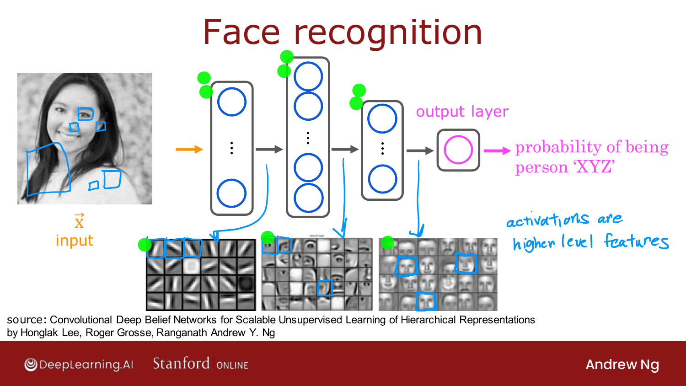
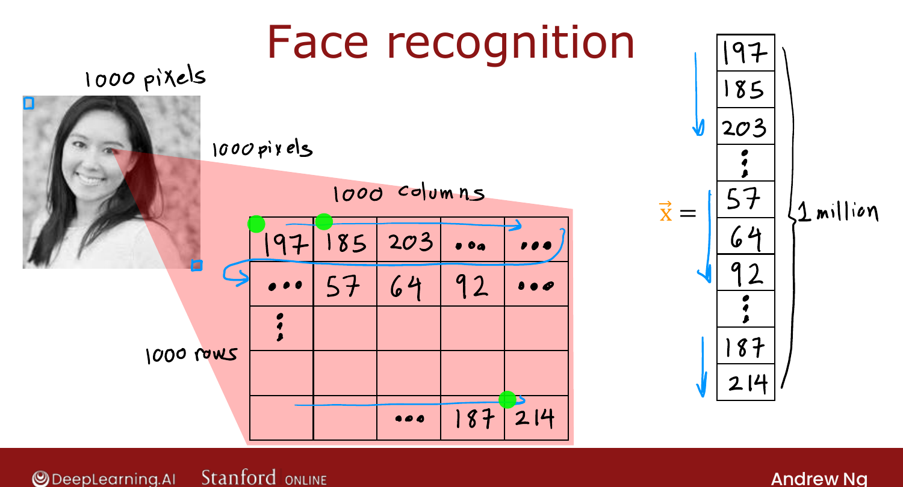
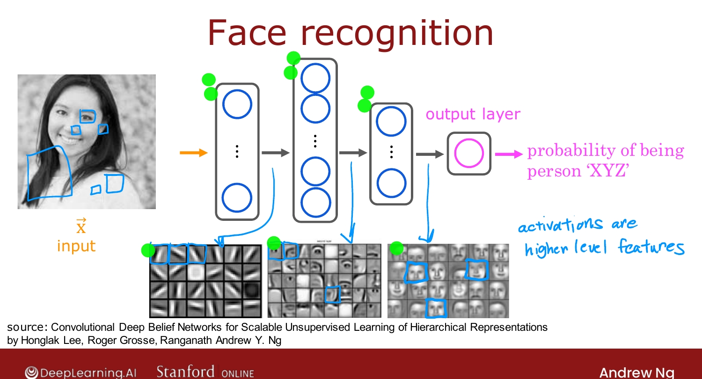

# Example: Recognizing Images

> **Course 2 · Week 1** · _AI-generated study aid — not authoritative; trust the lecture & cited sources._

[← Demand Prediction](../../course-2/week-1/demand-prediction.md){ .md-button }

[Neural Network Layer →](../../course-2/week-1/neural-network-layer.md){ .md-button }

<video controls preload="none" playsinline src="https://dyckms5inbsqq.cloudfront.net/dlai/advanced-learning-algorithms/W1/L4-C2W1L01S04-recognizing-images-L4/lc-advanced-learning-algorithms-W1-L4-C2W1L01S04-recognizing-images-L4-master_360p.mp4?v=1752484659">Your browser can't play this video — <a href="https://dyckms5inbsqq.cloudfront.net/dlai/advanced-learning-algorithms/W1/L4-C2W1L01S04-recognizing-images-L4/lc-advanced-learning-algorithms-W1-L4-C2W1L01S04-recognizing-images-L4-master_360p.mp4?v=1752484659">download the lecture</a>.</video>

> 📄 **[Read the full lecture transcript](example-recognizing-images-transcript.md)**

The demand-prediction idea scales straight to **computer vision**, and it reveals what the
hidden layers are really doing.

## A face-recognition network

The input is a **picture** — say a $1000 \times 1000$ pixel image. Unrolled, that's a
**million pixel-brightness numbers** in the input vector $\vec{x}$. Feed that through
several hidden layers to an output that gives the **probability the photo is person
"XYZ."**

{ .slide }
_Official C2 slide — hidden layers learn increasingly high-level features (DeepLearning.AI / Stanford). Source: Lee, Grosse, Ranganath & Ng, "Convolutional Deep Belief Networks."_
{ .slide-cap }

## Hidden layers learn a hierarchy of features

If you visualize what each hidden layer responds to, a striking pattern emerges — and the
network **learns it on its own**, without being told:

- **First hidden layer** → tiny **edges** and short lines at various orientations.
- **Middle hidden layer** → **parts of faces** (an eye, a nose, a corner of a mouth) built
  from those edges.
- **Later hidden layer** → **whole face shapes**, built from the parts.

So activations become **higher-level features** the deeper you go — pixels → edges →
parts → objects. The output neuron then decides identity from those high-level features.

{ .slide }
_Official C2 slide — a hierarchy of learned features (DeepLearning.AI / Stanford)._
{ .slide-cap }
## The same network, different data

Train the **identical architecture** on **cars** instead of faces, and the layers
re-learn an analogous hierarchy: edges → car parts → whole cars. Nobody hand-codes "look
for edges, then parts" — feeding different data makes the network discover the right
features for that task. That automatic, hierarchical **feature learning** is the heart of
why deep networks are so powerful.

{ .slide }
_Official C2 slide — same network, car data (DeepLearning.AI / Stanford)._
{ .slide-cap }

Next: the math of a single **neural network layer** — how a layer actually turns its
input vector into its output vector.

[← Demand Prediction](../../course-2/week-1/demand-prediction.md){ .md-button }

[Neural Network Layer →](../../course-2/week-1/neural-network-layer.md){ .md-button }

