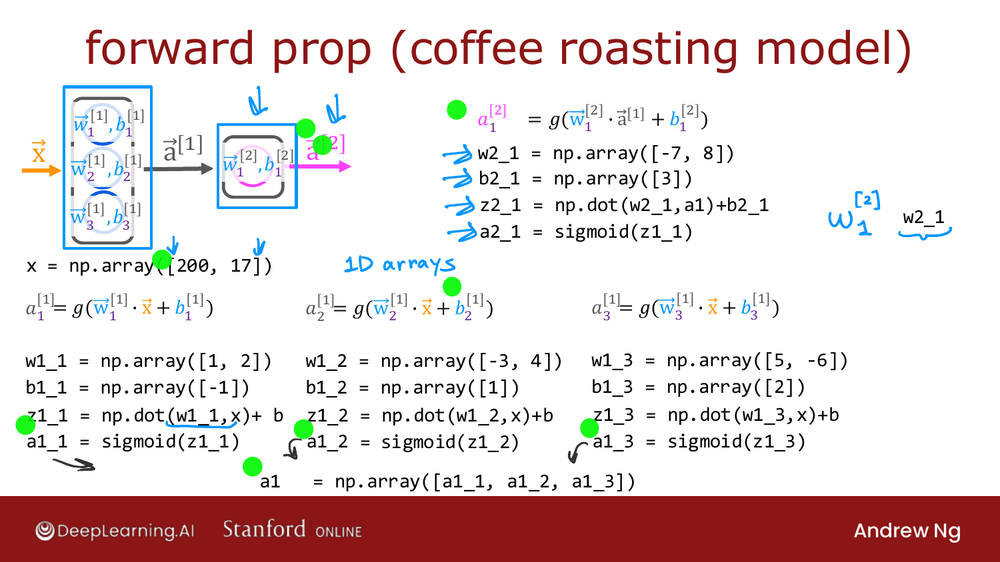

# Forward Prop in a Single Layer

> **Course 2 · Week 1** · _AI-generated study aid — not authoritative; trust the lecture & cited sources._

<div class="ep-nav" markdown>

[← Building a Neural Network](../../course-2/week-1/building-a-neural-network.md){ .md-button }

[General Implementation of Forward Propagation →](../../course-2/week-1/general-implementation-of-forward-propagation.md){ .md-button }

</div>

<div class="video-wrap"><video controls preload="none" playsinline src="https://dyckms5inbsqq.cloudfront.net/dlai/advanced-learning-algorithms/W1/L11-C2W1L04S01_v3-L11/lc-advanced-learning-algorithms-W1-L11-C2W1L04S01_v3-L11-master_360p.mp4?v=1752484661">Your browser can't play this video — <a href="https://dyckms5inbsqq.cloudfront.net/dlai/advanced-learning-algorithms/W1/L11-C2W1L04S01_v3-L11/lc-advanced-learning-algorithms-W1-L11-C2W1L04S01_v3-L11-master_360p.mp4?v=1752484661">download the lecture</a>.</video></div>

> 📄 **[Read the full lecture transcript](forward-prop-in-a-single-layer-transcript.md)**

How to implement forward propagation **from scratch in Python** — no TensorFlow — so you
understand what the libraries do under the hood. `[00:02]`

> You'll see this code again in the labs — no need to memorize it, just be able to **read
> it and understand what it does**. `[01:18]`

## Computing each activation by hand

Using the coffee model with **1-D arrays** (single square brackets) for the vectors. The
notation convention on the slide: a variable `w2_1` means $\vec{w}^{[2]}_1$ (superscript
layer 2, subscript unit 1). `[01:51]`

For the first unit of layer 1, with parameters $\vec{w}^{[1]}_1$ and $b^{[1]}_1$:

```python
w1_1 = np.array([1, 2]);  b1_1 = np.array([-1])
z1_1 = np.dot(w1_1, x) + b1_1
a1_1 = sigmoid(z1_1)
```

Repeat for `a1_2` and `a1_3` (each with its own `w`, `b`), then group the three numbers
into the layer-1 output:

```python
a1 = np.array([a1_1, a1_2, a1_3])
```

{ .slide }
_Official C2 slide — forward prop in NumPy, one neuron at a time (DeepLearning.AI / Stanford)._
{ .slide-cap }

## The output layer

Layer 2 (one unit) takes `a1` as its input:

```python
w2_1 = np.array([-7, 8]);  b2_1 = np.array([3])
z2_1 = np.dot(w2_1, a1) + b2_1
a2_1 = sigmoid(z2_1)
```

That's forward propagation in pure Python + NumPy. `[04:44]`

This **hard-codes every neuron**, which is tedious. Next: a **general** implementation
that works for any layer size. `[04:54]`


<div class="ep-nav" markdown>

[← Building a Neural Network](../../course-2/week-1/building-a-neural-network.md){ .md-button }

[General Implementation of Forward Propagation →](../../course-2/week-1/general-implementation-of-forward-propagation.md){ .md-button }

</div>
