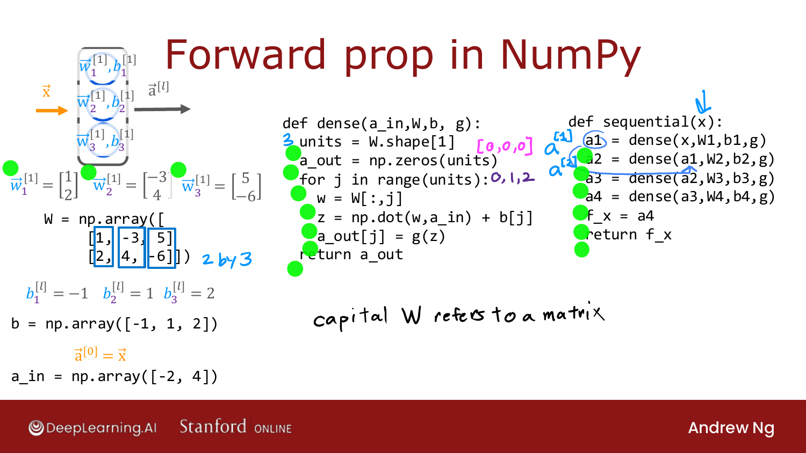
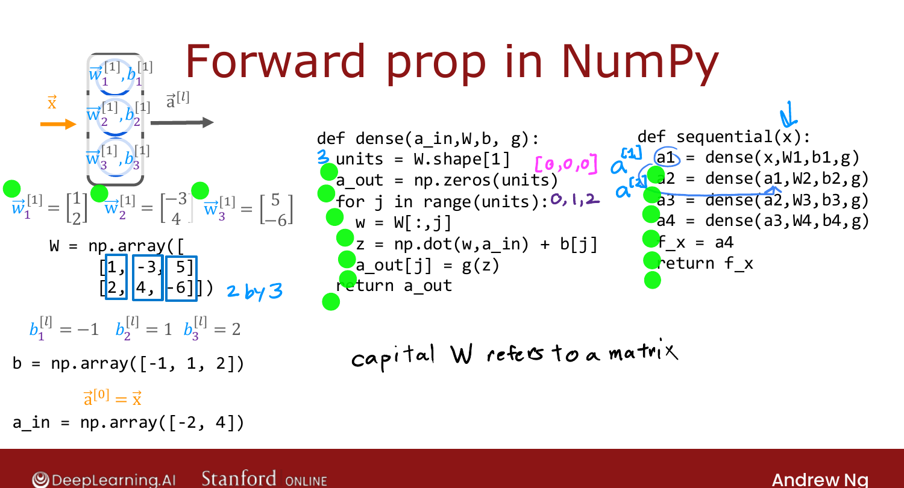

# General Implementation of Forward Propagation

> **Course 2 · Week 1** · _AI-generated study aid — not authoritative; trust the lecture & cited sources._

<div class="ep-nav" markdown>

[← Forward Prop in a Single Layer](../../course-2/week-1/forward-prop-in-a-single-layer.md){ .md-button }

[Is There a Path to AGI? →](../../course-2/week-1/is-there-a-path-to-agi.md){ .md-button }

</div>

<div class="video-wrap"><video controls preload="none" playsinline src="https://dyckms5inbsqq.cloudfront.net/dlai/advanced-learning-algorithms/W1/L12-C2W1L04S02-general-implementatio/lc-advanced-learning-algorithms-W1-L12-C2W1L04S02-general-implementatio-master_360p.mp4?v=1752484661">Your browser can't play this video — <a href="https://dyckms5inbsqq.cloudfront.net/dlai/advanced-learning-algorithms/W1/L12-C2W1L04S02-general-implementatio/lc-advanced-learning-algorithms-W1-L12-C2W1L04S02-general-implementatio-master_360p.mp4?v=1752484661">download the lecture</a>.</video></div>

> 📄 **[Read the full lecture transcript](general-implementation-of-forward-propagation-transcript.md)**

A **general** `dense` function that works for any layer size, instead of hard-coding each
neuron. `[00:02]`

## A `dense` layer function

Stack a layer's weight vectors as the **columns** of a matrix `W` (capital, by linear-
algebra convention for matrices), and its biases into a 1-D array `b`. For a 3-unit layer,
`W` is 2×3. The function takes the previous layer's activations `a_in` and returns this
layer's activations:

```python
def dense(a_in, W, b, g):
    units = W.shape[1]            # number of columns = number of units
    a_out = np.zeros(units)
    for j in range(units):
        w = W[:, j]               # j-th column = j-th unit's weights
        z = np.dot(w, a_in) + b[j]
        a_out[j] = g(z)           # g = sigmoid (the activation function)
    return a_out
```

{ .slide }
_Official C2 slide — a general `dense` layer and `sequential` chaining in NumPy (DeepLearning.AI / Stanford)._
{ .slide-cap }

The loop pulls out the `j`-th column of `W` (the `j`-th unit's weights), computes
$z = \vec{w}\cdot\vec{a}_{\text{in}} + b_j$, applies the activation, and stores the result.
`[04:39]`

## Stringing layers together

Chain `dense` calls to build the whole network:

```python
def sequential(x):
    a1 = dense(x,  W1, b1, g)
    a2 = dense(a1, W2, b2, g)
    a3 = dense(a2, W3, b3, g)
    a4 = dense(a3, W4, b4, g)
    return a4                     # f(x)
```

So `dense` inputs the previous layer's activations + this layer's parameters and outputs
the next activations; `sequential` chains them to the final output $f(\vec{x})$. `[05:49]`


{ .slide }
_Official C2 slide — general forward propagation (DeepLearning.AI / Stanford)._
{ .slide-cap }
## Why bother, if libraries exist?

Even using TensorFlow/PyTorch, knowing the internals makes you a better **debugger** — ML
code often *doesn't* work the first time, and understanding what's actually happening is
key to fixing it. `[06:41]`

That's the last code video of the week. Next, a fun aside: are neural networks a path to
**AGI**? `[07:11]`


<div class="ep-nav" markdown>

[← Forward Prop in a Single Layer](../../course-2/week-1/forward-prop-in-a-single-layer.md){ .md-button }

[Is There a Path to AGI? →](../../course-2/week-1/is-there-a-path-to-agi.md){ .md-button }

</div>
