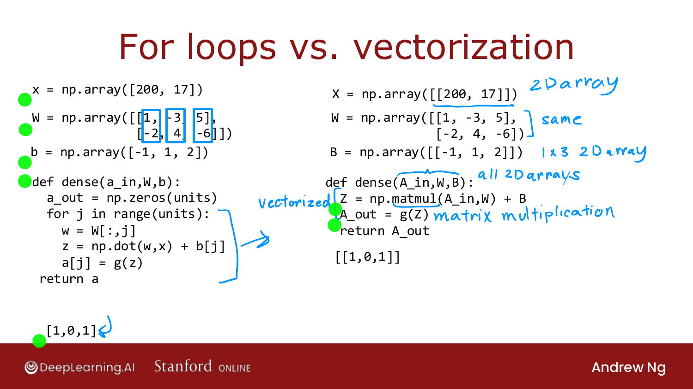

# How Neural Networks are Implemented Efficiently

> **Course 2 · Week 1** · _AI-generated study aid — not authoritative; trust the lecture & cited sources._

<div class="ep-nav" markdown>

[← Is There a Path to AGI?](../../course-2/week-1/is-there-a-path-to-agi.md){ .md-button }

[Matrix Multiplication →](../../course-2/week-1/matrix-multiplication.md){ .md-button }

</div>

<div class="video-wrap"><video controls preload="none" playsinline src="https://dyckms5inbsqq.cloudfront.net/dlai/advanced-learning-algorithms/W1/L14-C2W1L06S01-How-neural-networks-a/lc-advanced-learning-algorithms-W1-L14-C2W1L06S01-How-neural-networks-a-master_360p.mp4?v=1752484661">Your browser can't play this video — <a href="https://dyckms5inbsqq.cloudfront.net/dlai/advanced-learning-algorithms/W1/L14-C2W1L06S01-How-neural-networks-a/lc-advanced-learning-algorithms-W1-L14-C2W1L06S01-How-neural-networks-a-master_360p.mp4?v=1752484661">download the lecture</a>.</video></div>

> 📄 **[Read the full lecture transcript](how-neural-networks-are-implemented-efficiently-transcript.md)**

A big reason deep learning scaled over the last decade: neural networks can be
**vectorized** — implemented with **matrix multiplications**, which parallel hardware
(GPUs, and some CPU paths) does extremely fast. `[00:01]`

## From a `for` loop to `matmul`

The hand-written `dense` function used a `for` loop over units. The **vectorized** version
replaces the whole loop with a couple of lines:

```python
X = np.array([[200, 17]])          # 2-D array (note double brackets)
W = np.array([[1, -3, 5],
              [-2, 4, -6]])
B = np.array([[-1, 1, 2]])         # 1×3 2-D array

def dense(A_in, W, B):
    Z = np.matmul(A_in, W) + B     # matrix multiplication
    A_out = g(Z)                   # sigmoid, element-wise
    return A_out
```

{ .slide }
_Official C2 slide — replacing the unit loop with a single matrix multiply (DeepLearning.AI / Stanford)._
{ .slide-cap }

Key points: `np.matmul` is NumPy's **matrix multiplication**; in the vectorized version
**everything** — `X`/`A_in`, `W`, `B`, `Z`, `A_out` — is a **2-D array (matrix)**, and `g`
applies the sigmoid **element-wise** to the matrix `Z`. This is a very efficient way to do
one step of forward prop through a dense layer. `[03:35]`

The next two (optional) videos explain **what `matmul` actually does** — matrix
multiplication — and then how it produces this vectorized forward prop. If you already
know linear algebra, you can skim them. `[04:15]`


<div class="ep-nav" markdown>

[← Is There a Path to AGI?](../../course-2/week-1/is-there-a-path-to-agi.md){ .md-button }

[Matrix Multiplication →](../../course-2/week-1/matrix-multiplication.md){ .md-button }

</div>
