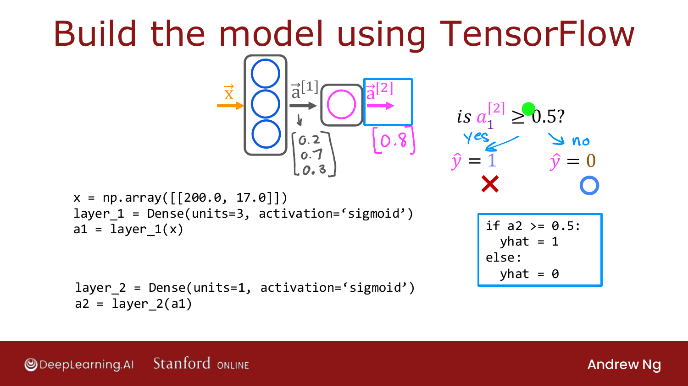
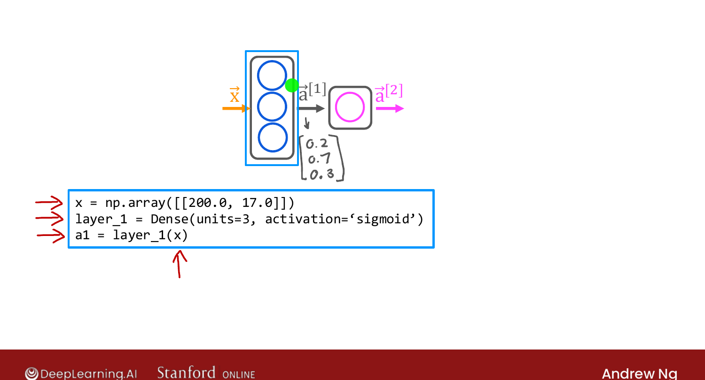

# Inference in Code (TensorFlow)

> **Course 2 · Week 1** · _AI-generated study aid — not authoritative; trust the lecture & cited sources._

<div class="ep-nav" markdown>

[← Inference: Making Predictions (Forward Propagation)](../../course-2/week-1/inference-making-predictions-forward-propagation.md){ .md-button }

[Data in TensorFlow →](../../course-2/week-1/data-in-tensorflow.md){ .md-button }

</div>

<div class="video-wrap"><video controls preload="none" playsinline src="https://dyckms5inbsqq.cloudfront.net/dlai/advanced-learning-algorithms/W1/L8-C2W1L03S01-inference-in-code-L8/lc-advanced-learning-algorithms-W1-L8-C2W1L03S01-inference-in-code-L8-master_360p.mp4?v=1752484660">Your browser can't play this video — <a href="https://dyckms5inbsqq.cloudfront.net/dlai/advanced-learning-algorithms/W1/L8-C2W1L03S01-inference-in-code-L8/lc-advanced-learning-algorithms-W1-L8-C2W1L03S01-inference-in-code-L8-master_360p.mp4?v=1752484660">download the lecture</a>.</video></div>

> 📄 **[Read the full lecture transcript](inference-in-code-transcript.md)**

**TensorFlow** is one of the leading deep-learning frameworks (PyTorch is the other big
one); this specialization uses TensorFlow. Here's how to run inference in code. `[00:01]`

## The coffee-roasting example

A remarkable thing about neural networks: the **same algorithm** applies to wildly
different problems. New example — roasting coffee. Two inputs you control: **temperature**
and **duration**. Label: good coffee ($y=1$) vs. bad ($y=0$). Too low/short → undercooked;
too high/long → burnt; only a little **triangle** of (temp, duration) gives good coffee.
`[02:19]`

## The TensorFlow code

Given a feature vector — say 200 °C for 17 minutes — inference is just a few lines:

```python
x = np.array([[200.0, 17.0]])
layer_1 = Dense(units=3, activation='sigmoid')
a1 = layer_1(x)                      # -> e.g. [0.2, 0.7, 0.3]

layer_2 = Dense(units=1, activation='sigmoid')
a2 = layer_2(a1)                     # -> e.g. 0.8

if a2 >= 0.5:
    yhat = 1
else:
    yhat = 0
```

{ .slide }
_Official C2 slide — inference with `Dense` layers in TensorFlow (DeepLearning.AI / Stanford)._
{ .slide-cap }

The key ideas:

- **`Dense`** is just the name for the layer type you've been learning (later you'll meet
  other layer types). `Dense(units=3, activation='sigmoid')` creates a layer of 3 sigmoid
  units. `[03:48]`
- A layer is a **callable**: `a1 = layer_1(x)` applies the layer to its input.
- Chain layers — `a2 = layer_2(a1)` — and optionally threshold the final activation.
  `[04:51]`

The same pattern scales to the digit classifier: `Dense(25)` → `Dense(15)` → `Dense(1)`,
each applied in turn. (Loading the library and the trained weights $W, b$ is covered in
the lab.) `[06:20]`

One subtlety to get right is **how TensorFlow represents data** (note the *double* square
brackets in `x`) — that's next. `[06:25]`

{ .slide }
_Official C2 slide — the model in TensorFlow (DeepLearning.AI / Stanford)._
{ .slide-cap }


<div class="ep-nav" markdown>

[← Inference: Making Predictions (Forward Propagation)](../../course-2/week-1/inference-making-predictions-forward-propagation.md){ .md-button }

[Data in TensorFlow →](../../course-2/week-1/data-in-tensorflow.md){ .md-button }

</div>
