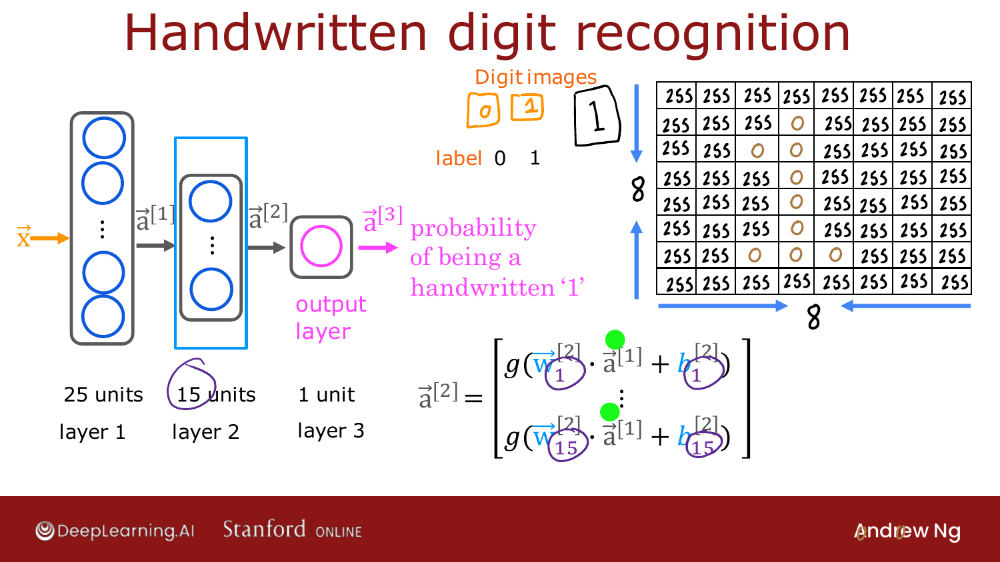
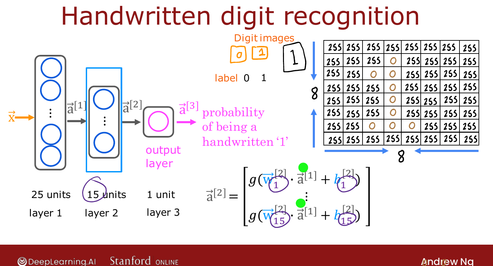
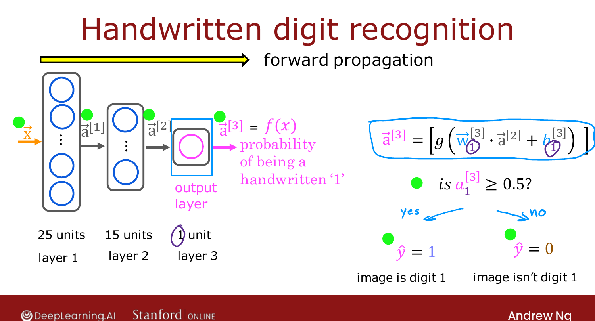

# Inference: Making Predictions (Forward Propagation)

> **Course 2 · Week 1** · _AI-generated study aid — not authoritative; trust the lecture & cited sources._

[← More Complex Neural Networks](../../course-2/week-1/more-complex-neural-networks.md){ .md-button }

[Inference in Code (TensorFlow) →](../../course-2/week-1/inference-in-code.md){ .md-button }

<video controls preload="none" playsinline src="https://dyckms5inbsqq.cloudfront.net/dlai/advanced-learning-algorithms/W1/L7-C2W1L02S03_v2-inference_making-p/lc-advanced-learning-algorithms-W1-L7-C2W1L02S03_v2-inference_making-p-master_360p.mp4?v=1752484660">Your browser can't play this video — <a href="https://dyckms5inbsqq.cloudfront.net/dlai/advanced-learning-algorithms/W1/L7-C2W1L02S03_v2-inference_making-p/lc-advanced-learning-algorithms-W1-L7-C2W1L02S03_v2-inference_making-p-master_360p.mp4?v=1752484660">download the lecture</a>.</video>

> 📄 **[Read the full lecture transcript](inference-making-predictions-forward-propagation-transcript.md)**

Put the layers together into the algorithm a neural network uses to make predictions —
**forward propagation**. `[00:01]`

## The task: handwritten digit recognition

Distinguish a handwritten **0 from a 1**. The input is an **8×8 image** — 64 pixel
intensity values (255 = bright white, 0 = black, in-between = grays). The network has two
hidden layers and one output: `[01:05]`

- **Layer 1:** 25 units
- **Layer 2:** 15 units
- **Layer 3 (output):** 1 unit → probability the digit is 1

{ .slide }
_Official C2 slide — forward propagation through a 25→15→1 network (DeepLearning.AI / Stanford)._
{ .slide-cap }

## The sequence of computations

Starting from $\vec{x}$ (which we also call $\vec{a}^{[0]}$):

$$\vec{a}^{[1]} = g\big(W^{[1]}\!\cdot\vec{a}^{[0]} + \vec{b}^{[1]}\big) \;\;(\text{25 numbers}),$$
$$\vec{a}^{[2]} = g\big(W^{[2]}\!\cdot\vec{a}^{[1]} + \vec{b}^{[2]}\big) \;\;(\text{15 numbers}),$$
$$a^{[3]} = g\big(W^{[3]}\!\cdot\vec{a}^{[2]} + b^{[3]}\big) \;\;(\text{1 number, scalar}).$$

Optionally threshold $a^{[3]}$ at 0.5 for a binary "is it a 1?" answer. `[03:32]`

{ .slide }
_Official C2 slide — the digit-recognition layers (DeepLearning.AI / Stanford)._
{ .slide-cap }
## Why it's called forward propagation

You compute **left to right** — $\vec{x} \to \vec{a}^{[1]} \to \vec{a}^{[2]} \to a^{[3]}$ —
*propagating* the activations forward through the network. The final output is also
written $f(\vec{x})$, just like linear/logistic regression. (This contrasts with
**back-propagation**, used for *learning*, which you meet next week.) `[04:26]`

A common architectural pattern, visible here: **more units in early layers, fewer as you
approach the output**. `[04:50]`

Knowing forward propagation, you could even **download someone else's trained weights**
and run inference on your own data. Next: implementing this in **TensorFlow**. `[05:13]`

{ .slide }
_Official C2 slide — forward propagation (DeepLearning.AI / Stanford)._
{ .slide-cap }

[← More Complex Neural Networks](../../course-2/week-1/more-complex-neural-networks.md){ .md-button }

[Inference in Code (TensorFlow) →](../../course-2/week-1/inference-in-code.md){ .md-button }

