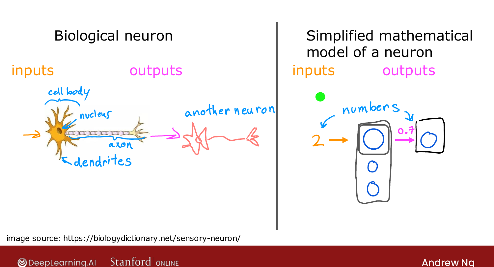
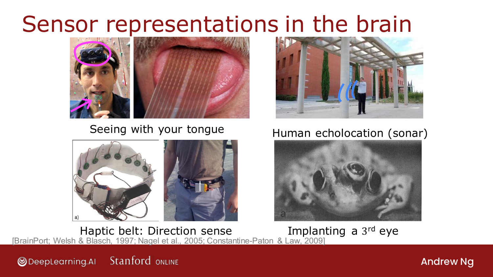
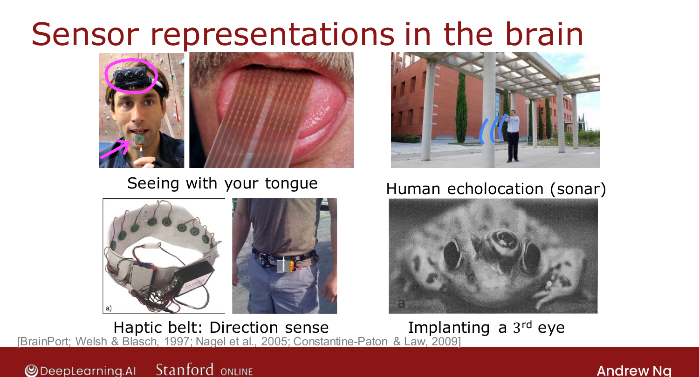

# Is There a Path to AGI?

> **Course 2 · Week 1** · _AI-generated study aid — not authoritative; trust the lecture & cited sources._

[← General Implementation of Forward Propagation](../../course-2/week-1/general-implementation-of-forward-propagation.md){ .md-button }

[How Neural Networks are Implemented Efficiently →](../../course-2/week-1/how-neural-networks-are-implemented-efficiently.md){ .md-button }

<video controls preload="none" playsinline src="https://dyckms5inbsqq.cloudfront.net/dlai/advanced-learning-algorithms/W1/L13-C2W1L05S01-is-there-a-path-to-ag/lc-advanced-learning-algorithms-W1-L13-C2W1L05S01-is-there-a-path-to-ag-master_360p.mp4?v=1752484661">Your browser can't play this video — <a href="https://dyckms5inbsqq.cloudfront.net/dlai/advanced-learning-algorithms/W1/L13-C2W1L05S01-is-there-a-path-to-ag/lc-advanced-learning-algorithms-W1-L13-C2W1L05S01-is-there-a-path-to-ag-master_360p.mp4?v=1752484661">download the lecture</a>.</video>

> 📄 **[Read the full lecture transcript](is-there-a-path-to-agi-transcript.md)**

A fun, speculative aside on a much-hyped topic: are neural networks a path to human-level
intelligence? `[00:02]`

## ANI vs. AGI

A lot of the hype comes from conflating two very different things: `[00:47]`

- **ANI — Artificial Narrow Intelligence:** an AI that does **one** task (smart speaker,
  self-driving car, web search, AI for farming/factories). ANI has made **tremendous**
  progress and creates enormous value. `[01:22]`
- **AGI — Artificial General Intelligence:** a system that could do **anything a typical
  human can do.** Despite ANI's progress, it's unclear we're making much progress toward
  AGI at all. `[02:07]`

The trap: huge progress in ANI ⇒ huge progress in AI (true), which people **incorrectly**
read as huge progress toward AGI. `[02:25]`

{ .slide }
_Official C2 slide — ANI vs. AGI (DeepLearning.AI / Stanford)._
{ .slide-cap }
## Why "just simulate neurons" doesn't get us there

Two reasons the simulate-the-brain hope is harder than it looks: `[03:06]`

1. Our artificial "neuron" (a logistic unit) is **nothing like** a real biological
   neuron — vastly simpler.
2. We **still have almost no idea how the brain actually works** — even basic questions
   about how a neuron maps inputs to outputs are open. `[03:45]`

## The "one learning algorithm" hypothesis

What keeps the hope alive: experiments suggesting **one piece of brain tissue can learn
many different things** depending on the data fed to it. Rewire the **auditory cortex** to
receive images and it **learns to see**; do the same to the **somatosensory (touch)
cortex** and it learns to see too. Maybe much of intelligence is **one (or a few) learning
algorithm(s)** — if we could find it, we might implement it. `[05:01]`

{ .slide }
_Official C2 slide — sensor-substitution experiments supporting the "one learning algorithm" hypothesis (DeepLearning.AI / Stanford)._
{ .slide-cap }

Related demonstrations of the brain's **plasticity** (adaptability): seeing via a grid of
voltages on the **tongue**, learning human **echolocation**, gaining a **direction sense**
from a buzzing belt, even a frog brain adapting to a surgically-added **third eye**.
`[08:11]`

{ .slide }
_Official C2 slide — one-learning-algorithm evidence (DeepLearning.AI / Stanford)._
{ .slide-cap }
## The honest takeaway

AGI remains one of the most fascinating problems in science — but **avoid over-hyping**.
We don't know if the brain is one algorithm, and even if it is, nobody knows what it is.
Meanwhile, **even without AGI**, neural networks are an incredibly powerful, useful tool
for real applications. `[10:04]`

That's the end of the required Week 1 videos. The remaining (optional) ones cover
**efficient vectorized implementations** — next. `[10:21]`

[← General Implementation of Forward Propagation](../../course-2/week-1/general-implementation-of-forward-propagation.md){ .md-button }

[How Neural Networks are Implemented Efficiently →](../../course-2/week-1/how-neural-networks-are-implemented-efficiently.md){ .md-button }

