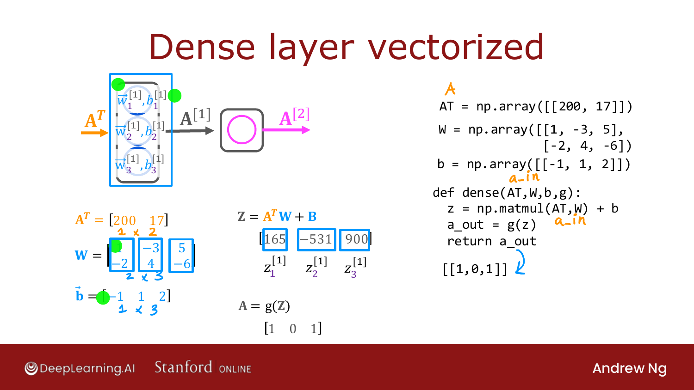
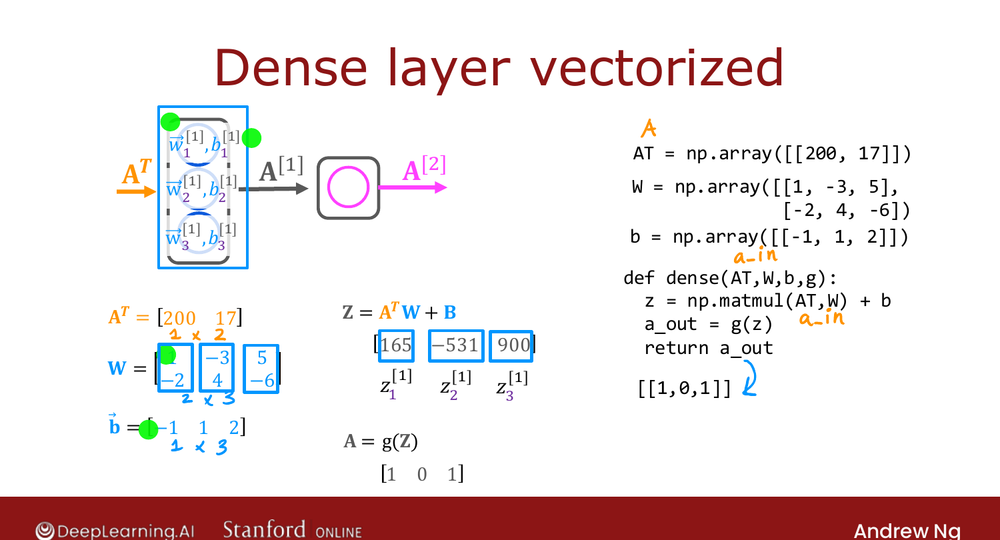

# Matrix Multiplication Code

> **Course 2 · Week 1** · _AI-generated study aid — not authoritative; trust the lecture & cited sources._

<div class="ep-nav" markdown>

[← Matrix Multiplication Rules](../../course-2/week-1/matrix-multiplication-rules.md){ .md-button }

[TensorFlow Implementation →](../../course-2/week-2/tensorflow-implementation.md){ .md-button }

</div>

<div class="video-wrap"><video controls preload="none" playsinline src="https://dyckms5inbsqq.cloudfront.net/dlai/advanced-learning-algorithms/W1/L17-C2W1L06S04-matrix-multiplication/lc-advanced-learning-algorithms-W1-L17-C2W1L06S04-matrix-multiplication-master_360p.mp4?v=1752484662">Your browser can't play this video — <a href="https://dyckms5inbsqq.cloudfront.net/dlai/advanced-learning-algorithms/W1/L17-C2W1L06S04-matrix-multiplication/lc-advanced-learning-algorithms-W1-L17-C2W1L06S04-matrix-multiplication-master_360p.mp4?v=1752484662">download the lecture</a>.</video></div>

> 📄 **[Read the full lecture transcript](matrix-multiplication-code-transcript.md)**

Putting it together: the **vectorized implementation** of a neural-network layer, and why
`matmul` makes forward prop both short and fast. `[00:01]`

## Transpose and matmul in NumPy

Given a matrix `A`, its transpose is `A.T`. To compute $Z = A^T W$:

```python
AT = A.T                    # or build it directly
Z = np.matmul(AT, W)        # matrix multiply
```

(You may also see `AT @ W` — the `@` operator is the same as `matmul`; this course uses
`np.matmul` for clarity.) `[01:43]`

## Vectorized forward prop through a dense layer

```python
AT = np.array([[200, 17]])         # 1×2 input (coffee: 200°C, 17 min)
W  = np.array([[1, -3, 5],
               [-2, 4, -6]])       # weights stacked in columns
b  = np.array([[-1, 1, 2]])        # 1×3

def dense(AT, W, b, g):
    z = np.matmul(AT, W) + b       # -> [165, -531, 900]
    a_out = g(z)                   # sigmoid element-wise -> [1, 0, 1]
    return a_out
```

{ .slide }
_Official C2 slide — the vectorized dense layer (DeepLearning.AI / Stanford)._
{ .slide-cap }

Here $Z = A^T W + B$ gives $[165, -531, 900]$, and the sigmoid maps those to
$\approx[1, 0, 1]$ (since $\sigma(165)\approx1$, $\sigma(-531)\approx0$, $\sigma(900)\approx1$).
`[03:57]`


{ .slide }
_Official C2 slide — vectorized dense layer (DeepLearning.AI / Stanford)._
{ .slide-cap }
## A note on TensorFlow's convention

TensorFlow lays out **individual examples in rows** of the matrix `X` (rather than in
`X^T`), so library code calls the input `A_in` and works with `X` directly — but it's the
same computation. The upshot: **a few lines of code** implement forward prop, and modern
hardware runs `matmul` extremely efficiently. `[05:35]`

That wraps **Week 1** — you now know neural-network **inference (forward propagation)**.
Next week: how to **train** a neural network. `[06:22]`

## Try it in the browser

**Try it — implement a vectorized dense layer** — edit the code, then hit **Validate** for instant ✓/✗ (runs real Python via Pyodide, no setup):

{{ IDE('dense_forward_exo') }}


<div class="ep-nav" markdown>

[← Matrix Multiplication Rules](../../course-2/week-1/matrix-multiplication-rules.md){ .md-button }

[TensorFlow Implementation →](../../course-2/week-2/tensorflow-implementation.md){ .md-button }

</div>
