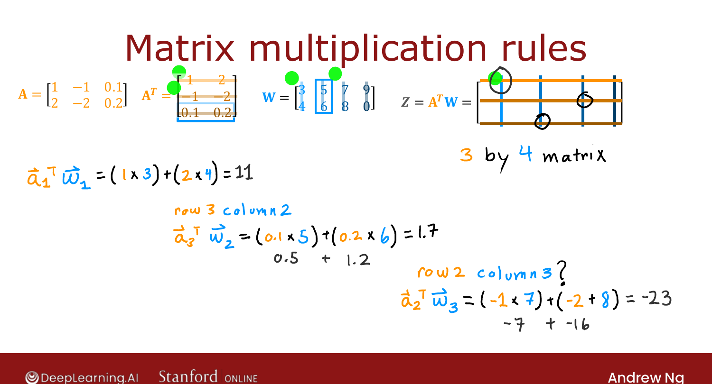

# Matrix Multiplication Rules

> **Course 2 · Week 1** · _AI-generated study aid — not authoritative; trust the lecture & cited sources._

[← Matrix Multiplication](../../course-2/week-1/matrix-multiplication.md){ .md-button }

[Matrix Multiplication Code →](../../course-2/week-1/matrix-multiplication-code.md){ .md-button }

<video controls preload="none" playsinline src="https://dyckms5inbsqq.cloudfront.net/dlai/advanced-learning-algorithms/W1/L16-C2W1L06S03-matrix-multiplication/lc-advanced-learning-algorithms-W1-L16-C2W1L06S03-matrix-multiplication-master_360p.mp4?v=1752484662">Your browser can't play this video — <a href="https://dyckms5inbsqq.cloudfront.net/dlai/advanced-learning-algorithms/W1/L16-C2W1L06S03-matrix-multiplication/lc-advanced-learning-algorithms-W1-L16-C2W1L06S03-matrix-multiplication-master_360p.mp4?v=1752484662">download the lecture</a>.</video>

> 📄 **[Read the full lecture transcript](matrix-multiplication-rules-transcript.md)**

The general rule for multiplying two matrices — then we apply it to vectorized neural
networks. `[00:02]`

## Computing every entry of $Z = A^T W$

Think of $A$'s columns as vectors $\vec{a}_1, \vec{a}_2, \vec{a}_3$ (so the **rows of
$A^T$** are $\vec{a}_1^T, \vec{a}_2^T, \dots$), and $W$'s columns as $\vec{w}_1, \vec{w}_2,
\dots$. Then **the entry of $Z$ in row $i$, column $j$** is the dot product of **row $i$ of
$A^T$** with **column $j$ of $W$**:

$$Z_{ij} = \vec{a}_i^T \vec{w}_j.$$

![Matrix multiplication rules: each Z[i,j] = (row i of Aᵀ) · (column j of W), colour-coded across a 3×4 result](matmul-rules.png){ .slide }
_Official C2 slide — every element of Z is one dot product (DeepLearning.AI / Stanford)._
{ .slide-cap }

Worked entries from the slide:

- row 1, col 1: $\vec{a}_1^T \vec{w}_1 = 1\cdot3 + 2\cdot4 = 11$,
- row 3, col 2: $\vec{a}_3^T \vec{w}_2 = 0.1\cdot5 + 0.2\cdot6 = 1.7$,
- row 2, col 3: $\vec{a}_2^T \vec{w}_3 = (-1)\cdot7 + (-2)\cdot8 = -23$.

{ .slide }
_Official C2 slide — computing each entry (DeepLearning.AI / Stanford)._
{ .slide-cap }
## Two requirements to remember

1. **Inner dimensions must match.** To multiply $A^T$ ($3\times2$) by $W$ ($2\times4$),
   the **columns of $A^T$ must equal the rows of $W$** — because you can only dot-product
   vectors of the **same length**. `[07:41]`
2. **Output shape** = (rows of $A^T$) × (columns of $W$). Here $3\times4$. `[08:31]`

Now back to the payoff: applying this to the **vectorized neural network**. (Ng's aside:
the first time he implemented neural nets the vectorized way, it ran *blazingly* faster.)
`[09:28]`

[← Matrix Multiplication](../../course-2/week-1/matrix-multiplication.md){ .md-button }

[Matrix Multiplication Code →](../../course-2/week-1/matrix-multiplication-code.md){ .md-button }

