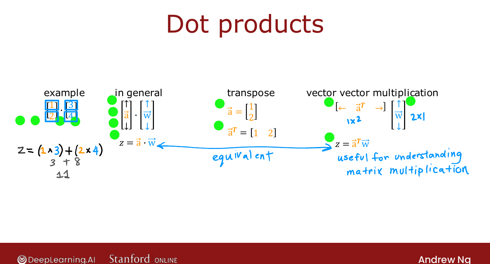
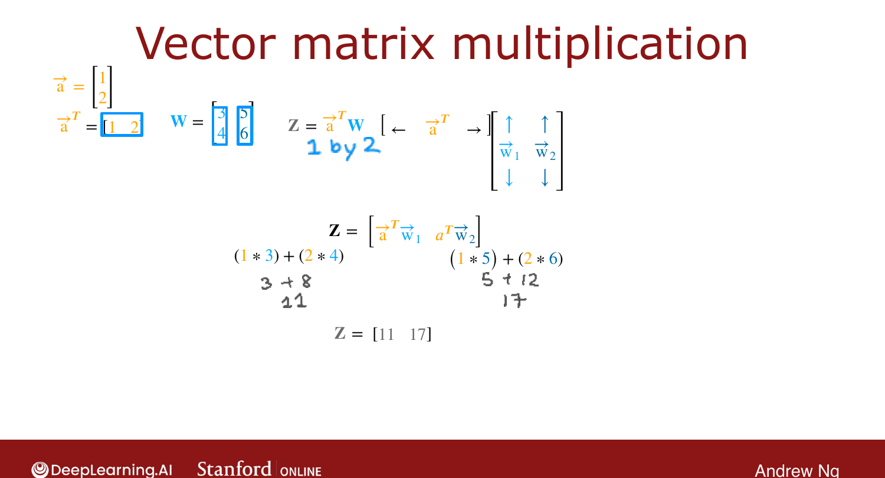
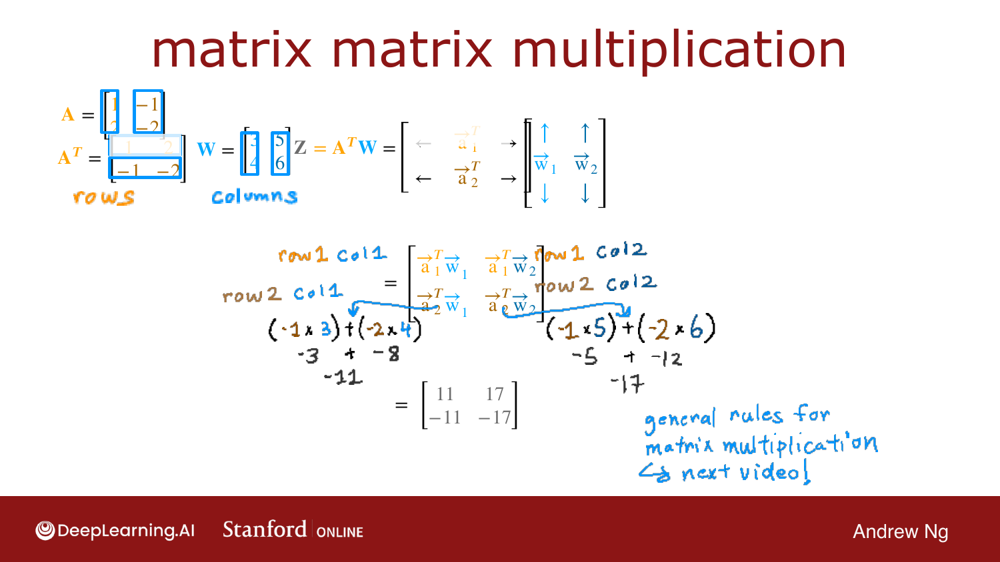

# Matrix Multiplication

> **Course 2 · Week 1** · _AI-generated study aid — not authoritative; trust the lecture & cited sources._

[← How Neural Networks are Implemented Efficiently](../../course-2/week-1/how-neural-networks-are-implemented-efficiently.md){ .md-button }

[Matrix Multiplication Rules →](../../course-2/week-1/matrix-multiplication-rules.md){ .md-button }

<video controls preload="none" playsinline src="https://dyckms5inbsqq.cloudfront.net/dlai/advanced-learning-algorithms/W1/L15-C2W1L06S02-matrix-multiplication/lc-advanced-learning-algorithms-W1-L15-C2W1L06S02-matrix-multiplication-master_360p.mp4?v=1752484661">Your browser can't play this video — <a href="https://dyckms5inbsqq.cloudfront.net/dlai/advanced-learning-algorithms/W1/L15-C2W1L06S02-matrix-multiplication/lc-advanced-learning-algorithms-W1-L15-C2W1L06S02-matrix-multiplication-master_360p.mp4?v=1752484661">download the lecture</a>.</video>

> 📄 **[Read the full lecture transcript](matrix-multiplication-transcript.md)**

What it actually means to multiply two matrices — built up from the dot product. `[00:02]`

## Dot products, two ways

The dot product of $\vec{a} = [1, 2]$ and $\vec{w} = [3, 4]$ is
$z = 1\cdot3 + 2\cdot4 = 11$ — multiply matching elements and sum. `[00:50]`

An equivalent way to write it uses the **transpose**. Laying the column vector $\vec{a}$
on its side makes the row vector $\vec{a}^T$ (a $1\times2$ matrix). Then

$$z = \vec{a}^T \vec{w} = \vec{a}\cdot\vec{w}.$$

Two notations, same computation — and this framing is what makes matrix multiplication
click. `[02:25]`

{ .slide }
_Official C2 slide — the dot product (DeepLearning.AI / Stanford)._
{ .slide-cap }
## Vector × matrix

Take $\vec{a}^T = [1, 2]$ and a $2\times2$ matrix $W = \begin{bmatrix}3 & 5\\ 4 & 6\end{bmatrix}$.
Then $Z = \vec{a}^T W$ is a $1\times2$ matrix, computed **column by column**:

- first entry: $\vec{a}^T \cdot (\text{column 1}) = 1\cdot3 + 2\cdot4 = 11$,
- second entry: $\vec{a}^T \cdot (\text{column 2}) = 1\cdot5 + 2\cdot6 = 17$,

so $Z = [11, 17]$. `[04:28]`

{ .slide }
_Official C2 slide — vector × matrix (DeepLearning.AI / Stanford)._
{ .slide-cap }
## Matrix × matrix

When $A$ is a matrix, think of it as **columns stacked side by side**, and $A^T$ as those
columns **laid on their sides as rows**. A useful mental model: *a matrix → think of its
columns; a transposed matrix → think of its rows.* `[06:22]`

{ .slide }
_Official C2 slide — building Z = AᵀW from dot products (DeepLearning.AI / Stanford)._
{ .slide-cap }

To compute $Z = A^T W$, each entry is the dot product of a **row of $A^T$** with a
**column of $W$**: row 1 of $A^T$ with $W$ gives row 1 of $Z$, row 2 gives row 2, and so
on — one element at a time. `[08:51]`

Next: the **general rules** for matrix multiplication. `[09:25]`

[← How Neural Networks are Implemented Efficiently](../../course-2/week-1/how-neural-networks-are-implemented-efficiently.md){ .md-button }

[Matrix Multiplication Rules →](../../course-2/week-1/matrix-multiplication-rules.md){ .md-button }

